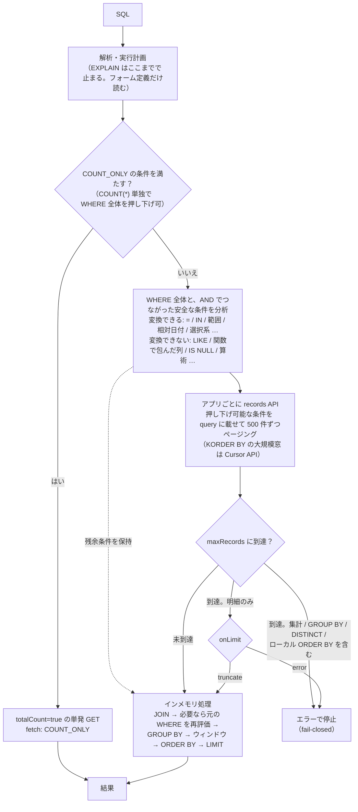

<!-- タイトル案: 【kSQL 実践 #0】kintone を SQL で扱う前に知る、標準 SQL との差分と実行モデル -->
<!-- 投稿時タグ案: kintone, SQL, kintoneカスタマイズ, CLI, MCP -->

> **結論（3 行）**
>
> - kintone に JOIN・GROUP BY・ウィンドウ関数・一括更新を SQL で持ち込めます。REST の 500 件ページングも SQL の裏に隠れます
> - ただし kintone は SQL データベースではありません。**JOIN は等式 1 本、LIKE は JavaScript、数値は比較だけ 10 進厳密、トランザクション無し**——差分は方言として明示されています
> - この記事は SQL を書ける人向けに、その差分の早見表と、SQL が kintone の REST API にどう翻訳されるか（`EXPLAIN`）を 30 分で読める形にまとめたものです


## この記事の前提

対象は **SQL を書ける開発者**です。kintone のカスタマイズやプラグイン、データ連携、運用スクリプトを書いていて、次のどれかで困ったことがある人を想定しています。

- 複数アプリをまたぐ集計を、REST で全件取ってから自前で突き合わせている
- レコードの一括更新に dry-run が無く、本番前の確認が「目視」しかない
- 「月別推移」「上位 N 社」「案件の無い顧客」のような集計を、kintone の一覧とグラフで作り切れない

逆に、`SELECT` や `GROUP BY` の意味は書きません。書くのは**標準 SQL との差分**と**実行の仕組み**だけです。

題材は kintone 公式のサンプルアプリ「SFA（営業支援）パック」（顧客管理・担当者管理・案件管理・活動履歴の 4 アプリ）です。
アプリストアから「サンプルデータを含める」をオンにして追加すると、そのまま使えます。
記事中のアプリ番号（顧客管理 `APP4148`、案件管理 `APP4149`）は私の環境のものなので、読み替えてください。
なお、件数や取得回数の実測は、第 6 回で扱う手順（CSV を IMPORT で流し込む）で顧客管理を 215 件に増やした環境で取っています。素のパック（顧客 9 件・案件 20 件）でも SQL はすべてそのまま動きます。

私は kintone を SQL 風の構文で操作する
[`kintone-sql-tools`](https://github.com/rex0220/kintone-sql-tools)（kSQL）を開発しています。
以下は v3.77.0 時点の内容です。なお kSQL は Apache Kafka の ksqlDB とは無関係の別ツールです。

## 1. 実行モデル — SQL は REST API の呼び出し計画に翻訳される

kintone にはクエリエンジンがありません。kSQL がやっているのはこれです。

1. SQL を解析し、**kintone のクエリ文字列に変換できる条件**を選り分ける
2. アプリごとに records API を呼ぶ（通常は `GET /k/v1/records.json` のページング。`KORDER BY` の大規模窓では Cursor API）。変換できた条件はクエリに載せ、サーバー側で絞る（**押し下げ**）
3. 返ってきたレコードを**インメモリ**で JOIN・集計・並べ替えする
4. 集計・`GROUP BY`・`DISTINCT`・ローカル並べ替えのように**完全な入力が要るクエリ**は、上限（`maxRecords`）に達したら部分結果を返さず**エラーで止まる**（fail-closed）。単純な明細だけが `onLimit` の設定に従う

流れを 1 枚にするとこうなります。



`fetch summary` は、この分析と取得計画の結果です。`WHERE` 全体を kintone のクエリへ忠実に変換できれば `EXACT`、
全体は変換できなくても `AND` でつながった安全な条件を一部押し下げられれば `PREFILTERED`（押し下げとインメモリ再評価の両方が働く）、
押し下げられる条件が無ければ `ALL`（それでも records API で全件取る）です。
JOIN や UNION ではソースごとに `fetch` が決まり、`fetch summary` はそれらを要約した値です。
JOIN ではさらに、先に取れた側の結合キーで相手アプリを絞る最適化が INNER JOIN にだけ加わります（第 1 回）。

つまり性能と安全性は「何が押し下がり、何件取りに行くか」で決まります。それを実行前に見せるのが `EXPLAIN` です。
取得量を知るには先頭の `fetch summary` 行、途中で止まる可能性まで見るなら `complete input` 行を読みます。

| `fetch` | 意味 |
| :--- | :--- |
| `COUNT_ONLY` | 件数だけ。全件を走査せず、`limit 1` で最大 1 件だけ取得し、1 リクエストで `totalCount` を得る |
| `EXACT` | WHERE 全体が kintone 側へ渡った。レコード取得を伴う方式の中では、最も絞り込みが効いている |
| `PREFILTERED` | 一部だけ kintone 側で絞り、残りをインメモリで評価 |
| `ALL` | 全件取得。上限に注意 |
| `NONE` | kintone から取るソースが無い（一時テーブルや生成系列だけ）。構造化された計画上の値で、テキスト表示では `fetch summary` 行自体が出ないことがある |

以下の 3 例は、プラグインの実行画面に SQL を貼って EXPLAIN ボタンを押した出力です（`EXPLAIN` を SQL の先頭に付けても同じ計画が出ます）。

### 例 1: 件数だけなら `COUNT_ONLY`

```sql
SELECT COUNT(*) FROM APP4149 WHERE 商談フェーズ IN ('受注')
```

```text
fetch summary: COUNT_ONLY
metadata API: form definition APP4149
mode: COUNT_TOTAL_COUNT
app: APP4149 (4149)
kintone query: 商談フェーズ in ("受注") limit 1
fetch: COUNT_ONLY (limit 1)
fields: $id
fetch API: GET records.json (totalCount=true)
REST execution: single GET
record limit: maxRecords/onLimitReached not applied
fallback: full record scan when totalCount is missing or invalid
search abort: fail-closed (SearchAbortedError)
```


`totalCount=true` の 1 リクエストで終わり、全件分のページングは発生しません。転送されるレコードは `limit 1` の最大 1 件（フィールドは `$id` だけ）で、`maxRecords` の影響も受けません。
件数に比例したレコード取得やページングが発生しないので、総件数の KPI は `maxRecords` を気にせず書けます。
ただし条件は狭く、**物理アプリに対する `SELECT COUNT(*)` で、JOIN・サブテーブル・CTE・`GROUP BY`・`HAVING`・`DISTINCT`・`LIMIT` / `OFFSET` が無く、WHERE 全体を押し下げられる**場合だけです。

### 例 2: 同じ WHERE でも GROUP BY を足すと取りに行く（`EXACT`）

```sql
SELECT 商談フェーズ, COUNT(*) AS 件数, SUM(売上) AS 売上合計
FROM APP4149
WHERE 商談フェーズ IN ('受注')
GROUP BY 商談フェーズ
```

```text
fetch summary: EXACT
metadata API: form definition APP4149
mode: FULL_SCAN
group key 商談フェーズ: PHYSICAL (source=0, field=商談フェーズ)
complete input: required (onLimit=truncate disabled)
complete input reason: GROUP_BY, AGGREGATE
onLimit=truncate: disabled
reason: GROUP BY あり, 集計関数（COUNT / SUM 等）あり
app: APP4149 AS APP4149 (4149)
kintone query: 商談フェーズ in ("受注")
fetch: EXACT
pushdown applied: 商談フェーズ in ("受注")
relation: exact
fields: 商談フェーズ, 売上
```


集計はインメモリなので `mode: FULL_SCAN` になりますが、WHERE は丸ごと押し下がっているので（`fetch: EXACT`）、取ってくるのは受注フェーズの行だけです。
`fields` 行にも注目してください。この SQL の評価に必要なフィールドだけを取得します。必要な列は `SELECT` だけでなく `WHERE`・`JOIN`・`GROUP BY`・`HAVING`・`ORDER BY` から決まります。
`complete input: required` は「集計は入力が欠けると値が誤るので、上限に達したら打ち切りではなくエラーにする」という宣言です。

### 例 3: フィールドを関数で包むと押し下がらない（`ALL`）

```sql
SELECT 案件名, 売上 FROM APP4149 WHERE DATE_FORMAT(受注予定日, '%Y-%m') = '2026-08'
```

```text
fetch summary: ALL
metadata API: form definition APP4149
mode: FULL_SCAN
reason: WHERE 句に JS 評価が必要な式, WHERE_EXPRESSION_LOCAL_ONLY
app: APP4149 AS APP4149 (4149)
kintone query: (全件取得)
fetch: ALL
fields: 案件名, 売上, 受注予定日
```


`DATE_FORMAT(受注予定日, …)` は kintone のクエリ構文に無いので、全件取ってからインメモリで評価します。
同じ意図なら `WHERE 受注予定日 >= '2026-08-01' AND 受注予定日 <= '2026-08-31'` か、相対日付関数 `WHERE 受注予定日 = THIS_MONTH()` と書けば `EXACT` になります。
**「WHERE に書く日付」と「SELECT で整形する日付」は別物**、というのが第 2 回の主題の一つです。

### 上限は fail-closed

取得上限は CLI 既定 500 件・MCP 既定 500 件・プラグイン既定 3,000 件・エンジン既定 10,000 件です。
上限に達したとき、集計・GROUP BY・DISTINCT・ローカル ORDER BY を含むクエリは**部分結果を返さずエラー**になります（誤った合計や誤った上位 N を返さないため）。
素の明細は `onLimit=truncate` を指定した場合だけ打ち切り表示します。
「動いていたのにデータが増えたら突然エラーになった」は、たいてい `fetch: ALL` のクエリが上限に当たったものです。`EXPLAIN` を見れば事前に分かります。

## 2. 標準 SQL との差分早見表

MySQL / PostgreSQL の感覚で書いて引っかかる点を、引っかかる順に並べました。★は「エラーにならず静かに違う結果になる」ものです。

| 項目 | 標準 SQL の感覚 | kSQL | 備考 |
| :--- | :--- | :--- | :--- |
| テーブル名 | `orders` | `APP4149`。サブテーブルは `APP4149$明細` の仮想テーブル | CLI は `APP4149`、またはプロファイル指定で `APP4149@prod`、論理名 `LAPP_案件管理` も可 |
| 識別子 | 英数字 | 日本語フィールドコードをそのまま書ける。空白や予約語はバッククォート | **ラベル≠フィールドコード**。「〒」のコードは `郵便番号`。`DESCRIBE APP4148` で確認 |
| JOIN | 任意の条件 | **`ON` はフィールド同士の等式 1 本だけ**。`ON a.顧客No = b.顧客No_` は可、`ON a.x = b.x AND a.y = b.y` と `ON a.日付 BETWEEN b.開始 AND b.終了` は不可。`ON` に式や関数も書けない。INNER / LEFT / RIGHT / CROSS。FULL OUTER 無し | 複合キーは kintone の計算フィールド、CTE、一時テーブルのどれかで `CONCAT(a, '::', b)` の連結キー列を先に作り、その列同士を結ぶ。区切り文字が元データに現れないことを保証する（`'A::'`+`'B'` と `'A'`+`'::B'` は衝突する）。CTE 化すると取得計画が変わるので `EXPLAIN` で確認。今回使う SFA パックでは、ルックアップのコピー先フィールドが結合キーになる |
| 派生テーブル | `FROM (SELECT …) t` | **不可**。`WITH`（CTE）か `CREATE TEMP TABLE #t AS SELECT …` | 一時テーブルはバッチ（`;` 区切り）内で有効、既定 10,000 行まで |
| サブクエリ | 相関可 | 非相関の `IN` / `EXISTS` / スカラーのみ。**相関サブクエリ不可** | DML の WHERE には `IN (SELECT …)` を書けない（第 5 回） |
| `LIKE` ★ | DB の照合順序 | **JavaScript の文字列意味論**で評価し、`LIKE` 自体は押し下げない。単独なら `ALL`、押し下がる条件と `AND` で組めば `PREFILTERED` | kintone の全文検索が欲しいときは別演算子 `KLIKE`（10 万件で打ち切りあり） |
| `ORDER BY` ★ | 照合順序 | 型ごとの正準順。**テキストは Unicode コードポイント順**（日本語の辞書順ではない） | kintone の REST と同じ並びが要るときは `KORDER BY` |
| 数値 ★ | DECIMAL / DOUBLE | **比較は最大 30 桁の 10 進厳密**（`1.10 = 1.1`）。**算術・`SUM` / `AVG` は IEEE 754 倍精度**（`3000 * 1.1` = `3300.0000000000005`） | 精度が要る計算は kintone の計算フィールドに寄せる |
| 空セル ★ | NULL | 未設定値は空文字として扱う。**数値の空セルは算術では 0**、型付き比較と並べ替えでは最小側 | `WHERE 金額 != ''` で除外（押し下がる）。`IS NULL` / `IS NOT NULL` 自体は押し下がらず、その条件単独では `ALL`、押し下がる条件と `AND` で組めば `PREFILTERED`（v3.77.0 で実測）。選択系の未選択は `IN ('')` なら押し下がる |
| 選択系の比較 | `=` | ドロップダウン・ラジオ・ステータスは `=` でよい（`IN` に正規化して押し下げ）。**チェックボックス・複数選択・ユーザー選択は `IN` / `NOT IN` 必須** | 定義に無い値との `=` は正規化されず、その条件単独なら全件取得のうえ 0 行 |
| 日付の条件 | `date >= '…'` | リテラル比較は押し下がる。**相対日付関数**（`TODAY()` / `THIS_MONTH()` / `FROM_TODAY(n, unit)` …）も押し下がるが **WHERE 専用** | `DATE_FORMAT` / `YEAR()` で包むと押し下がらない（例 3）。`DATE_ADD(列, n, 'MONTH')` の引数順に注意、`DATE_SUB` と `INTERVAL` は無い |
| 集計とウィンドウ | 同じ SELECT に書ける | **同じ SELECT に書けない**。CTE で段を分ける | `GROUP BY` にはエイリアスも書ける |
| 結果列名 | そのまま | **英字は小文字に正規化**される（`AS ランクA` → `ランクa`） | ダッシュボードの列設定で参照するときに効く |
| トランザクション | BEGIN / ROLLBACK | **無し**。バッチは非アトミック、常に fail-fast。書き込み API は自動リトライしない | 代わりに `VALIDATE ONLY`・`ASSERT`・`ON ERROR SKIP` で事前検証と早期停止（第 5 回） |
| 静的検証 | パーサ + カタログ | MCP の `ksql_validate`（第 9 回）は**構文と静的検査だけ**。フォーム定義は読まないので、存在しないフィールドコードでも `ok` になりうる | 最後に確かめるのは実行結果 |
| 文字列リテラル | `'it''s'` | 同じ。シングルクォート、`''` でエスケープ | ダブルクォートは識別子ではなく使えない |

★は、エラーにはならないものの、DB で期待した意味と異なる可能性がある項目です。値が返ってくるぶんエラーより厄介です。
特に数値は「比較は 10 進厳密、算術は倍精度」、空セルは「算術では 0、比較では最小側」と、**操作によって意味が変わります**。第 4 回で「静かに間違う」例をまとめて扱います。

## 3. 道具の使い分けと準備

| 面 | 向いていること | 書き込み | 接続・認証設定 |
| :--- | :--- | :--- | :--- |
| **kintone プラグイン** | 画面内で書いて実行し、その場で見る。EXPLAIN ボタン・履歴・表表示・フィルタ・`;` 区切りのバッチ・一時テーブル・IMPORT（ファイル選択） | 文ごとの確認ダイアログ | **不要**（ログイン中のユーザー権限で動く） |
| CLI `ksql` | スクリプト・CI・スケジューラ。`-f file.sql`、`--format json\|csv`、CSV export、profile で環境切替 | `--allow-dml` で可（確認プロンプトあり） | 設定ファイルと API トークン |
| MCP サーバー | Claude などの AI クライアントから。read-only ツールと mutate ツールが分離 | `ksql_mutate` のみ | 同上 |
| 無償版 Dashboard プラグイン | 集計 SQL を表と棒グラフのペインにして一覧画面に置く | 不可（read-only） | 不要（ログイン中の権限） |
| engine ライブラリ | 自作プラグイン・カスタマイズに read-only エンジンを組み込む | 不可 | 組み込み側からクライアントを渡す |

このシリーズは第 6 回まで**プラグイン**で進めます。接続設定が要らず、EXPLAIN もバッチも一括更新も画面内で試せるからです。
このシリーズで CLI が必要になるのは「ファイルに書き出す」「別環境で同じ SQL を使う」「自動で回す」の 3 つで、その必要が出る第 7 回で導入します。

SFA パックを追加したら、kSQL 側の準備は 2 つの zip だけです。[v3.77.0 の release フォルダ](https://github.com/rex0220/kintone-sql-tools/tree/v3.77.0/release) から
`ksql-plugin-v3.77.0.zip` を kintone のプラグイン画面で読み込み（kintone のシステム管理権限が要ります）、
`ksql-app-template-v1.11.0.zip` からテンプレートで専用アプリを作ります。
専用アプリは設定済みなので追加設定はありません。使い方の詳細は [rex0220 kSQL プラグイン](https://qiita.com/rex0220/items/ed9e101cb28b0ed40869) にあります。
第 5 回以降はレコードを書き換えるので、本番アプリではなく、サンプルデータを入れた検証環境で進めてください。

最初の 1 本を専用アプリの実行画面に貼って実行し、続けて同じ SQL のまま **EXPLAIN ボタン**を押してください。

```sql
SELECT 商談フェーズ, COUNT(*) AS 件数
FROM APP4149
GROUP BY 商談フェーズ
ORDER BY 件数 DESC
```

EXPLAIN は `fetch summary: ALL` になります。WHERE が無いので当然ですが、`complete input reason: GROUP_BY, LOCAL_ORDER, AGGREGATE` の行に、
集計と `ORDER BY 件数` がどちらもインメモリで、入力が欠けたら止まる、という宣言が出ています。20 件のアプリでは何も起きませんが、
この行が出るクエリは、データが増えたときに上限の対象になる、と覚えておいてください。
プラグインの上限は「⚙ オプション → 取得」の「最大取得件数」（既定 3,000 件。下の画像の環境では 500 に下げてあります）で、以降の回ではこれを意図的に下げて fail-closed を実演します。


他の面の導入は、必要になる回で扱います。

- CLI（第 7 回）: [CLI チュートリアル](https://github.com/rex0220/kintone-sql-tools/blob/v3.77.0/docs/ksql_cli_tutorial.md)
- MCP（第 9 回・Claude Desktop）: [kSQL MCPB Claude Desktop インストール手順](https://qiita.com/rex0220/items/f3942613edf943593270)
- Dashboard（各回の出口）: [kSQL Dashboard プラグイン](https://qiita.com/rex0220/items/9cc28b6d52913a533360)
- 言語仕様の正本: [言語リファレンス](https://github.com/rex0220/kintone-sql-tools/blob/v3.77.0/docs/ksql_language_reference.md)（§22 制限事項・§24 EXPLAIN）

## 4. シリーズの構成

以降は業務課題 1 つにつき 1 本、「課題 → 標準 SQL ならこう書く → kSQL ではこう → `EXPLAIN` で仕組み → 落とし穴 → 運用に載せる」の型で進めます。

| 回 | 課題 | 主な差分・機能 |
| :-: | :--- | :--- |
| [1](https://qiita.com/rex0220/items/eaa0888697f17131b056) | アプリをまたいで集計する | INNER JOIN・押し下げの 2 種（WHERE 述語と結合キー）・LEFT JOIN の上限 |
| [2](https://qiita.com/rex0220/items/8261e9aaab9eef3a0fb5) | 期間で集計する | 相対日付・`GENERATE_SERIES` で無い月を 0 埋め・`LAG` 前月比 |
| [3](https://qiita.com/rex0220/items/d417ba52766f73cb965d) | ABC 分析 | ウィンドウ関数（順位・構成比・累積）・`ROLLUP` |
| [番外編](https://qiita.com/rex0220/items/4e395383cfc9ea6cdbe3) | Claude に ABC 分析の SQL を書かせて検証する | validate・explain を通って実行で止まる／通って静かに間違う・作り方のルール |
| [4](https://qiita.com/rex0220/items/90e7f766b27bb4c429a0) | データ品質を監査する | `VALIDATE APPn INTO #err`・重複・文字列の罠（コードポイント順・サロゲートペア） |
| [5](https://qiita.com/rex0220/items/b315ad3bbe0c4986f206) | 安全に一括更新する | 一時テーブルで確保・`ASSERT`・`UPSERT`・`VALIDATE ONLY`・`ON ERROR SKIP`・冪等性 |
| [6](https://qiita.com/rex0220/items/301ce2e655461188ba81) | CSV を IMPORT して検証環境を大きくする | `IMPORT CSV/JSON`（プラグインのファイル選択）・テストデータ増量 |
| [7](https://qiita.com/rex0220/items/c0dc73f3ac40daba9ace) | CLI を導入して定期運用に載せる | CSV export（Shift_JIS）・`--format json`・`DECLARE @param`・profile と `LAPP_`・スケジューラ |
| [8](https://qiita.com/rex0220/items/3a3066a21b7814057bb4) | kSQL Flow へ載せる | dialect 1・`ASSERT` / `EXIT` ゲート・as-of・再実行 |
| [9](https://qiita.com/rex0220/items/33280e22599957b2331d) | AI に書かせて人間がレビューする | MCP・構文カタログ・`EXPLAIN` をレビューに使う |

### Claude に頼むなら（MCP 導入済みの読者向け・任意）

第 1 回と第 2 回の末尾に、同じ課題を Claude に頼むときの依頼文を置きます。第 3 回以降の依頼文は、書かせた SQL の検証とあわせて第 9 回と番外編でまとめて扱います。
kSQL MCP は第 9 回で導入します。すでに導入済みなら次の依頼文を試せます。未導入ならここは飛ばしてください。

```text
kSQL MCP で、APP4149（案件管理）のうち受注予定日が今年の案件について、商談フェーズ別の件数と売上合計を出す SQL を書いてください。
日付条件には THIS_YEAR() を使い、YEAR() や DATE_FORMAT() は使わないでください。
ksql_validate で検証したうえで、ksql_explain の fetch summary 行が EXACT になっていることを確認してください。実行はしないでください。
```

次回は[第 1 回「アプリをまたいで集計する」](https://qiita.com/rex0220/items/eaa0888697f17131b056)です。顧客管理と案件管理をルックアップのキーで結合し、`EXPLAIN` の「pushdown applied」と「join key prefilter」を別々に読みます。

---

リポジトリ・ドキュメント:

- https://github.com/rex0220/kintone-sql-tools
- npm: `@rex0220/kintone-sql-tools`（CLI / プラグイン / MCP サーバー同梱）
