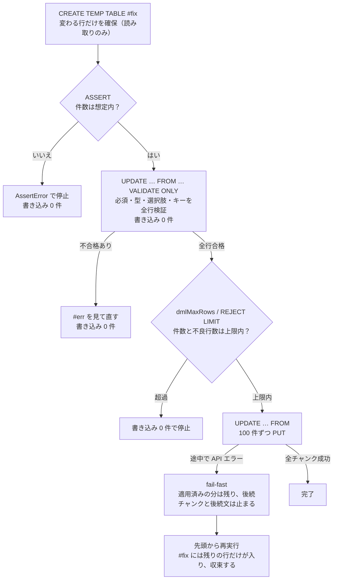
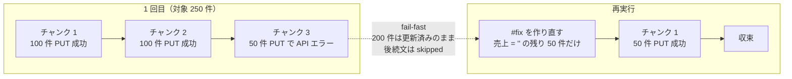

<!-- タイトル案: 【kSQL 実践 #5】安全に一括更新する — ロールバックの無い kintone での事前検証・fail-fast・冪等 -->
<!-- 投稿時タグ案: kintone, SQL, kintoneカスタマイズ, 一括更新, 冪等性 -->

> **結論（3 行）**
>
> - kintone にトランザクションはありません。kSQL の一括更新は **1 文が複数の API 呼び出し**になり、途中で失敗すれば部分適用が残ります。これはプラットフォームの前提で、SQL で消せる制約ではありません
> - だから守り方を SQL の中に書きます。**書き込み前**に `VALIDATE ONLY`・`ASSERT`・`dmlMaxRows`・`REJECT LIMIT` で止め、**書き込み開始後**は fail-fast で被害を広げず、**設計**を冪等にして再実行で収束させる
> - 親 DML の `WHERE` には `IN (SELECT …)` も関数も書けません。対象は**一時テーブルに確保してから `UPDATE … FROM`** で書く。これが kSQL の一括更新の基本形です

前回（[第 4 回: データ品質を監査する](https://qiita.com/rex0220/items/90e7f766b27bb4c429a0)）で見つけた「未入力」「表記ゆれ」を、今回は書き戻します。
書き込みなので、この回の SQL は**本番アプリで試さないでください**。SFA パックを複製した検証用アプリか、記事と同じように検証用のレコードだけを対象にしてください。

## 課題

案件管理（`APP4149`）で売上が未入力の案件に 0 を入れたい。数十件〜数千件を一括で直し、**途中で落ちても、もう一度流せば正しい状態に収束する**形にしたい。

## 標準 SQL ならこう書く

```sql
BEGIN;
UPDATE deals SET amount = 0 WHERE amount IS NULL;
COMMIT;   -- 失敗したら ROLLBACK
```

守っているのはトランザクションです。全部成功するか、全部無かったことになるか。kSQL にはこれがありません。

## kintone にはロールバックが無い — 4 段で守る

kintone の REST API には複数リクエストをまたぐロールバックがありません。kSQL の `UPDATE` は内部で 100 件ずつの PUT に分かれ、3 チャンク目で失敗すれば 200 件は更新済みのまま残ります。
書き込み API は**自動リトライもしません**。応答が失われたとき、実は成功していた書き込みをもう一度送ると二重実行になるからです（読み取り系だけ 408/429/502/503/504 でリトライします）。

kSQL はこの前提を「書き込む前に全部確かめ、書き始めたら最初の失敗で止め、再実行で収束する設計にする」の 4 段で割り切っています。

| 段階 | 手段 | 何を守るか |
| :--- | :--- | :--- |
| 計画・検証 | `EXPLAIN`、`VALIDATE ONLY`、`ASSERT` | 実行計画、値、対象件数を書き込み 0 回で確かめる |
| 書き込み直前 | `dmlMaxRows`、`REJECT LIMIT` | 更新件数が上限を超えた場合、または不良行数が許容値を超えた場合に、書き込み 0 件のまま止める（許容値以内なら不良行を除いた合格行を書く） |
| 書き込み開始後 | fail-fast | 最初の API エラーで後続チャンクと後続文を止める。適用済みの分は戻らない |
| 再実行 | 冪等な式、差分更新、一意キー、ステータス駆動 | 部分適用から正しい状態へ収束させる |

4 段を、この回で作るバッチの流れに重ねるとこうなります。



左の 3 つの停止は書き込み 0 件です。書き込みが始まったあとに止まるのは右下の 1 か所だけで、そこから戻るのが再実行です。

## kSQL ではこう書く — 一時テーブルに確保してから `UPDATE … FROM`

```sql
CREATE TEMP TABLE #fix AS
SELECT $id AS 対象id, 0 AS 新売上 FROM APP4149 WHERE 売上 = '';

ASSERT (SELECT COUNT(*) FROM #fix) BETWEEN 0 AND 10;

UPDATE APP4149 SET 売上 = f.新売上
FROM #fix AS f
WHERE APP4149.$id = f.対象id
```

手元の実行結果です（対象は検証用レコード 1 件）。

```text
CREATE TEMP TABLE #fix  … rowCount: 1
ASSERT                  … success
UPDATE                  … updatedCount: 1
```

3 文の役割はこうです。

1. **`#fix` に「変わる行だけ」を確保する。** `WHERE 売上 = ''` は押し下がるので、対象以外は取得しません。SELECT の `WHERE` には関数も `IN (SELECT …)` も書けるので、対象の判定はここで済ませます
2. **`ASSERT` で件数を止める。** 上限を超えたら `AssertError` でバッチが止まり、以降の文は実行されません。差分 0 件を正常とするなら `BETWEEN 0 AND …`、異常として検知したいなら `BETWEEN 1 AND …`
3. **`UPDATE … FROM` で一時テーブルの値を転記する。** 結合は `$id`、または文字列（1 行）か数値の業務キー 1 本の等値です

### なぜ `UPDATE APP4149 SET 売上 = 0 WHERE 売上 = ''` と書かないのか

書けます。今回の例ならそれで十分です。一時テーブルを挟む理由は 2 つあります。

- **親 DML の `WHERE` には `IN (SELECT …)` も関数も書けません。** `UPDATE … WHERE $id IN (SELECT … FROM #t)` は `ksql_validate` を通りますが、実行時に `IN (SELECT ...) は kintone クエリに変換できません` で失敗します。対象を別のアプリや計算で決めるなら、SELECT 側で決めて一時テーブルに置くしかありません
- **「変わる行だけ」に絞れます。** 直接 `UPDATE` は WHERE に当たる全行へ PUT します。値が同じでも更新 API が呼ばれれば更新扱いになり、更新日時と変更履歴が変わり、設定によって通知や Webhook が動きます（画面のカスタマイズ JavaScript は REST API 更新では実行されません）。**値は冪等でも、更新 API に伴う副作用は冪等とは限らない**。一時テーブルで「変換すると値が変わる行」だけを選べば、再実行で副作用も止まります

### 再実行すると 0 件で完走する（冪等性）

同じバッチをもう一度流します。

```text
CREATE TEMP TABLE #fix  … rowCount: 0
ASSERT                  … success
UPDATE                  … updatedCount: 0
```

`売上 = ''` の行がもう無いので、`#fix` は 0 行、`UPDATE … FROM` は書き込み API を呼ばずに完走します。**途中で落ちたら先頭から流し直す**、が成立する形です。
`UPDATE … FROM` は対象 0 件でも no-op で完走します。`UPSERT … SELECT` も同じです。

途中で落ちた場合も同じ理屈です。対象 250 件を例にすると、3 チャンク目で API エラーになれば 200 件は更新済みのまま残りますが、再実行の `#fix` には `売上 = ''` の残り 50 件しか入りません。



## 事前検証 — 書き込み 0 回で確かめる

### `VALIDATE ONLY`: 値の妥当性

DML の末尾に `VALIDATE ONLY` を付けると、必須・型・範囲・文字数・選択肢・UPSERT キーを全行検証して、**1 件も書きません**。read-only 扱いなので、プラグインでは確認ダイアログ無しで実行でき、MCP では照会用ツールから実行できます。

```sql
UPDATE APP4149 SET 商談フェーズ = '成約' WHERE $id = 338 VALIDATE ONLY
```

```text
operation: UPDATE  validatedRows: 1  validRows: 0  invalidRows: 1
$id  $err_field    $err_code            $err_message
338  商談フェーズ  ERR_CHOICE_INVALID   商談フェーズ に定義外の選択肢があります
```

「成約」はドロップダウンに無い値なので、本実行なら kintone が `CB_VA01` で拒否するところを、送信前に捕まえました。

`UPSERT` でも同じです。バッチなら `INTO #err` で一時テーブルに受けて、キー単位にまとめられます。

```sql
CREATE TEMP TABLE #incoming AS
  SELECT '株式会社サイボウズ商事' AS 会社名, 'A' AS 顧客ランク
  UNION ALL SELECT '新規テスト商会', 'Z'
  UNION ALL SELECT '', 'B';

UPSERT INTO APP4148 (会社名, 顧客ランク)
SELECT 会社名, 顧客ランク FROM #incoming
ON DUPLICATE (会社名)
VALIDATE ONLY INTO #err;

SELECT 会社名, $err_field, $err_code, $err_message FROM #err
```

| 会社名 | $err_field | $err_code | $err_message |
| :--- | :--- | :--- | :--- |
| 新規テスト商会 | 顧客ランク | ERR_CHOICE_INVALID | 顧客ランク に定義外の選択肢があります |
| （空） | 会社名 | ERR_KEY_EMPTY | UPSERT キー 会社名 は空にできません |

3 行のうち 1 行が合格、2 行が不合格と分かりました。`UPSERT` のキー（`ON DUPLICATE`）は**アプリ側の書き込み可能なフィールド**で、`$id` は使えません。キーが空の行は登録も更新もできないので、ここで落ちます。

`UPDATE … FROM` の本番形にも付けられます。

```sql
CREATE TEMP TABLE #fix AS
SELECT $id AS 対象id, 0 AS 新売上 FROM APP4149 WHERE 売上 = '';

UPDATE APP4149 SET 売上 = f.新売上 FROM #fix AS f WHERE APP4149.$id = f.対象id
VALIDATE ONLY INTO #err;

SELECT COUNT(*) AS エラー行数 FROM #err   -- 0
```

`VALIDATE ONLY` の通過は書き込み成功を保証しません。権限、リビジョン競合、ユーザー・組織の存在、既存レコードとの重複禁止制約、ルックアップ先の不在など、API を呼ぶまで確定しないエラーがあります。

### `ASSERT`: 件数

```sql
CREATE TEMP TABLE #tgt AS SELECT 顧客No, 会社名 FROM APP4148 WHERE 顧客ランク IN ('A');
ASSERT (SELECT COUNT(*) FROM #tgt) BETWEEN 1 AND 10;
SELECT COUNT(*) AS 件数 FROM #tgt
```

```text
AssertError: assertion failed: (SELECT COUNT(*) FROM #tgt) BETWEEN 1 AND 10 (actual: 59).
```

想定外の件数（ここでは 59 件）で止まり、3 文目は `skipped`。`ASSERT` は `AND` / `OR` の複合条件を書けないので、条件が 2 つなら `ASSERT` を 2 文に分けます。

### `EXPLAIN`: 何が kintone に飛ぶか

```text
CREATE TEMP TABLE #fix
  fetch summary: EXACT
    kintone query: 売上 = ""
ASSERT (SELECT COUNT(*) FROM #fix) BETWEEN 0 AND 10
  check: 実行時に条件評価（不成立は AssertError でバッチ停止、以降の文は skipped）
UPDATE
  source: temp table #fix
  records API: none（EXPLAIN 中はレコード取得・書き込み API を実行しない）
```

`EXPLAIN` は書き込み API を呼びません。取得側が押し下がっているか（`売上 = ""` は押し下がる）と、どの文で止まりうるかを実行前に読めます。

## 書き込み直前と実行中に止める

### `dmlMaxRows`: 1 文あたりの更新件数の上限

```sql
UPDATE APP4149 SET 商談フェーズ = '内示' WHERE 商談フェーズ IN ('内示')
```

この文を上限 1 件で実行すると、対象が 2 件なので**書き込む前に**止まります。

```text
ArgumentError: UPDATE affected rows (2) exceed dmlMaxRows (1).
```

CLI は `--dml-max-rows`（既定 100）、MCP は `ksql_mutate` の引数、プラグインは実行前の確認ダイアログに件数が表示されるだけで、件数の上限は掛かりません。「対象が想定より多い」を機械的に止める最後の壁は CLI と MCP にあり、プラグインではその役を `ASSERT` が担います。`UPSERT` では inserts + updates を数えます。ソースの読み取り件数は制限しないので、取得側は取得上限（`maxRecords`）で別に守ります。

### fail-fast と `ON ERROR SKIP`

DML を含むバッチは**常に fail-fast**で、1 文が失敗した以降の文は実行されません。1 件の不良データで夜間バッチ全体が止まるのが嫌なら、`ON ERROR SKIP INTO #err` で不良行だけを隔離して合格行を書けます。`REJECT LIMIT n` を付けると、隔離が n 行を超えたときに**全行を検証したうえで書き込み 0 で停止**します。

さっきの `#incoming`（3 行中 2 行が不良）を `REJECT LIMIT 0` で流すと、こうなります。

```text
UPSERT_SELECT … RejectLimitExceededError: rejected rows (2) exceed REJECT LIMIT (0).
SELECT        … skipped (fail-fast)
```

合格していた 1 行も書かれません。診断行は、エラーになった `UPSERT_SELECT` 文の結果に含まれます。fail-fast により後続の `SELECT … FROM #err` は実行されないので、後続文で参照するのではなく、失敗した文の診断結果として取得してログに残します。「不良が大量＝上流の異常」を検知するゲートとして使います。
隔離できるのは kSQL が送信前にローカルで判定できるエラー（必須・型・範囲・文字数・選択肢・キー）だけで、kintone API の実行時エラー（権限・競合・一意制約の衝突など）は従来どおり fail-fast です。

### プラグインの確認ダイアログ

プラグインの実行画面で DML を含むバッチを実行すると、**文ごとに**対象件数を表示して確認を求めます。`VALIDATE ONLY` はダイアログ無しで通ります。

![#fix のバッチをプラグインで実行したときの確認ダイアログ。[3/3] UPDATE APP4149、1 件のレコードを更新します](https://qiita-image-store.s3.ap-northeast-1.amazonaws.com/0/100572/0857a765-fd50-4f4b-9433-a85d56828ed7.png)

## 冪等性 — 「もう一度流せば直る」を設計で保証する

「途中で落ちても再実行できる」は、機能ではなく設計です。守ることは 5 つです。

- **`UPSERT` のキーは、ソースとアプリの両方で一意にする。** 通常の親 `UPSERT … SELECT` を事前検証なしで実行すると、ソース内で重複した新規キーが複数レコードとして登録される場合があります。`VALIDATE ONLY` はソース内重複を `ERR_KEY_DUP_SOURCE`（`UPSERT ソース内でキーが重複しています`）として検出するので、本実行前に必ず通します。実測では、同じキー 2 行を `VALIDATE ONLY` に掛けると両行がこのコードで返りました。通常経路には同じソース重複検査が適用されないため、事前検証なしでは複数登録される可能性があります。さらに `ASSERT (SELECT COUNT(*) FROM #tgt) = (SELECT COUNT(DISTINCT キー) FROM #tgt)` を置いておくと、意図が SQL 上でも明確になります
- **`UPDATE` の式自体を冪等にする。** `SET 売上 = 0` や `SET 電話番号 = REPLACE(電話番号, '-', '')` は何度流しても同じ値に収束します。`SET 件数 = 件数 + 1` は流すたびに増えます
- **「変わる行だけ」を対象にする。** 一時テーブルで `WHERE 会社名 <> TRANSLATE(会社名, …)` のように「変換すると値が変わる行」を選べば、2 回目は 0 件になり、副作用（更新日時・通知）も止まります
- **同じ入力を再投入しても結果が収束することを、再実行で確かめる。** 上の `#fix` のように、1 回目 `updatedCount: 1`、2 回目 `0` になれば合格です
- **kSQL 単体には「どこまで進んだか」を覚える仕組みが無い。** 応答喪失時に自動リトライしないのもこのためで、再開位置の永続管理・実行履歴・チェックポイントが要るなら kSQL Flow の領域です（第 8 回）

数千件を日次で処理するなら、対象に「未処理 → 処理中 → 処理済」のステータスを持たせ、冒頭で「処理中」の取り残しを回収し、バッチ ID で確保してから本処理、最後に完了へ、という**ステータス駆動**の形にします。リポジトリの[バッチ設計レシピ集](https://github.com/rex0220/kintone-sql-tools/blob/v3.77.0/docs/ksql_batch_recipes.md) R1 がその完成形です。

## 差分と落とし穴

- **親 DML の `WHERE` に `IN (SELECT …)` と関数は書けない。** 対象は SELECT 側で決めて一時テーブルへ。`ksql_validate` は通るので静的検査では気づけない
- **`UPDATE … FROM` の結合は `$id` か、文字列（1 行）／数値の業務キー 1 本の等値。** ソース側で複数行がマッチすると実行前エラー。業務キーで結ぶなら `GROUP BY` で 1 行化してから
- **`SET` にフィールド参照を単独で書けない。** `SET 売上 = 売上` は ParseError（実測）。同値更新が要る場面は、そもそも対象を絞る
- **選択系フィールドの `WHERE` は `IN`。** `SET` は `=` のまま
- **`UPSERT` のキーは書き込み可能フィールド。** `$id` は不可。キーがルックアップだとマスタに無い値の書き込みで失敗する
- **`VALIDATE ONLY` は完全入力が必要。** 取得上限の `truncate` は無効化される
- **書き込み直後の確認に `KLIKE` を使わない。** 検索索引の反映が遅れ、更新前の値がヒットしうる（第 4 回）
- **DML の `CHECK WHEN` は更新前の値を見る。** 更新後の値を検査するなら `SET` の式を `CHECK` に再掲する（`SET 売上 = 売上 * 1.1 … CHECK WHEN 売上 * 1.1 > 100000`）。第 4 回の `VALIDATE` の `CHECK` と同じ構文だが、評価する値が違う
- **サブテーブルの書き込み（サブテーブル更新構文 `APPLY`）は MCP では常に拒否。** 削除内訳を対話で承認できないため。プラグインか CLI で行う
- **プロセス管理のステータス・作業者は `UPDATE` できない。** 別 API が必要なため対象外

## 運用に載せる

プラグインの専用アプリに、`#fix` の 3 文をバッチとして保存します。実行のたびに確認ダイアログが出るので、手動運用の安全装置として十分です。
下の図は、`ASSERT` の条件を `= 0` に変えて意図的に止めたときの画面です。2 文目で止まり、3 文目の `UPDATE` は実行されません。
自動実行は CLI の役割です。まず `--dry-run` で実行計画を確認し、値は `VALIDATE ONLY` で検証します。本実行では `--allow-dml --yes` を使い、終了コードで成否を検知します。第 7 回で扱います。

![ASSERT の条件を = 0 に変えた #fix のバッチが 2 文目で止まった画面。[2] AssertError: assertion failed (actual: 1)](https://qiita-image-store.s3.ap-northeast-1.amazonaws.com/0/100572/f1221c52-4b60-4506-8cd8-858ceb2dc7bc.png)

次回は第 6 回「CSV を IMPORT して検証環境を大きくする」です。CSV を `IMPORT` して検証用アプリのデータを増やし、第 1〜5 回の SQL を実データ規模で流し直します。

---

リポジトリ・ドキュメント:

- https://github.com/rex0220/kintone-sql-tools
- npm: `@rex0220/kintone-sql-tools`（CLI / プラグイン / MCP サーバー同梱）
