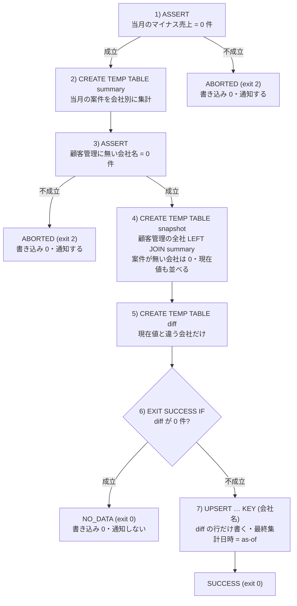
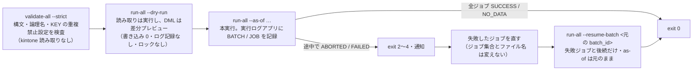
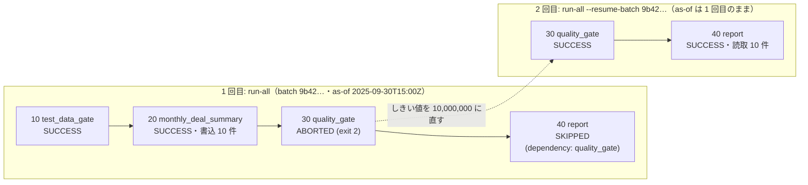

<!-- タイトル案: 【kSQL 実践 #8】kSQL Flow へ載せる — dialect 1・ゲート・as-of・再実行 -->
<!-- 投稿時タグ案: kintone, SQL, バッチ, 自動化, DataOps -->
> **結論（3 行）**
>
> - 第 7 回の `.sql` と終了コードで足りないのは、**途中で止まったらどこから再開するか**、**実行履歴をどこに残すか**、**月次の基準日をどう固定するか**の 3 つです。kSQL Flow はこれを SQL の方言（dialect 1）とランナー（`ksql-flow`）で持ちます
> - dialect 1 は `-- @ksql dialect: 1` を書いたときだけ有効です。`ASSERT …, 'msg'`（異常＝止める・通知）と `EXIT SUCCESS IF …, 'msg'`（対象なし・差分なし＝成功・通知しない）を分け、`@MONTH_START()` などの `@` 付き関数で基準日を固定し、`UPSERT … KEY (キー)` で同じキーを重複させずに書き戻します
> - ランナーは `validate-all` → `run-all --dry-run` → `run-all` の順に使います。途中で止まったら `run-all --resume-batch <元の batch_id>` が、**失敗したジョブとその後続だけを元の基準日のまま**再開します（実測）。`--resume` は直近バッチを対象にする簡易形です

前回（[第 7 回: CLI を導入して定期運用に載せる](https://qiita.com/rex0220/items/c0dc73f3ac40daba9ace)）で、1 本の `.sql` をスケジューラから流して終了コードで検知する形を作りました。今回は複数のジョブを、履歴と再開つきで回します。

## 課題

1. 「当月の案件を会社別に集計して顧客管理へ書き戻す」月次処理は、ゲート → 集計 → 書き込み → 検査 と段階があります。途中で止まると、どこまで書けたかを人がレコードを見て調べていました
2. 月初に対象が 0 件で `ASSERT` が落ち、毎月同じ誤アラートが飛びます。「異常」と「対象なし」を分けたい。一方で、案件が無い月・無い会社には**当月の値として 0** を置きたい（前月の値が残ると「当月」の列名と矛盾します）
3. 月末の実行が翌日にまたがると `THIS_MONTH()` の月が変わります。先月分をやり直したいときも、同じ SQL をそのまま使いたい

使うアプリは第 6 回で作った**検証用の SFA パック**です。書き込み先になる顧客管理に、次の 3 フィールドを追加しておきます（フィールドコードも同じ名前にします）。

| フィールド | 型 |
| :--- | :--- |
| 当月案件件数 | 数値 |
| 当月売上合計 | 数値 |
| 最終集計日時 | 日時 |

SFA パックの顧客管理は `会社名` が「値の重複を禁止する」設定です（`DESCRIBE` の重複禁止列で確認できます）。案件管理の `会社名` はルックアップで顧客管理からコピーされる値なので、この 2 つを結合キーに使います。

## 1. dialect 1 — 標準 kSQL との差分

Flow dialect 1 は、既存の kSQL バッチ（第 5 回・第 7 回）に対する**opt-in の拡張**です。ファイル先頭に `-- @ksql dialect: 1` を書いたときだけ有効になり、宣言のないスクリプトに専用構文の意味が入り込むことはありません。

| 書き方 | 意味 | 標準 kSQL（dialect 0）では |
| :--- | :--- | :--- |
| `-- @ksql name: …` / `depends_on:` / `timeout:` / `dialect: 1` | ジョブのヘッダ（連続するコメント行） | 無視される |
| `ASSERT <条件>, 'メッセージ'` | 不成立なら**メッセージ付きで中断**。後続は skip | `ASSERT <条件>` のみ（第 5 回） |
| `ASSERT WARN <条件>, 'メッセージ'` | 不成立でも**警告を記録して続行** | 無い |
| `EXIT SUCCESS IF <条件>, 'メッセージ'` | 成立したら**正常終了**。後続は `skipped reason=exit` | 無い |
| `CREATE TEMP TABLE summary AS …` | 一時テーブルを**裸名**で書ける（`#summary` と同じもの） | `#` が必須 |
| `UPSERT … SELECT … KEY (会社名)` | `ON DUPLICATE (会社名)` と同じ | `ON DUPLICATE` |
| `MERGE INTO … WHEN MATCHED … WHEN NOT MATCHED …` | UPSERT へ正規化される | 無い |
| `@NOW()` / `@TODAY()` / `@MONTH_START()` / `@NEXT_MONTH_START()` | **スクリプト全体で 1 つの基準時刻**から導出 | `TODAY()` 等は kintone サーバーの時計 |

宣言を忘れると、その場で止まります。

```text
この構文には -- @ksql dialect: 1 の宣言が必要です（位置 72、トークン: 「EXIT」）
```

dialect 1 の構文は CLI（`-f`）・MCP・プラグイン・公式 Flow API のどこでも使えます。ただし、この記事のジョブは `LAPP_` で論理名参照するので、そのまま実行できるのは論理アプリ設定を渡せる CLI・MCP・Flow API です。プラグインでは `APPn` に置き換えます（第 7 回と同じ制約）。ランナーが足すのは、排他・実行履歴・再開・通知であって、SQL の意味ではありません。

## 2. 最初のジョブ — ゲート・集計・書き込み

`jobs/20_monthly_deal_summary.sql` です。アプリは第 7 回と同じ仕組みの論理名で参照します。第 7 回の `LAPP_ANKEN` は CLI 設定の `logicalApps` で解決しましたが、ここではランナーの設定ファイルの `apps` が `案件管理` → アプリ番号に解決し、日本語の論理名もそのまま使えます。

```sql
-- @ksql name: monthly_deal_summary
-- @ksql depends_on: test_data_gate
-- @ksql timeout: 600
-- @ksql dialect: 1

-- 当月（as-of の月）の案件を会社別に集計し、顧客管理の全社に
-- 当月案件件数・当月売上合計 のスナップショットを書き戻す（案件が無い会社は 0）。
-- 現在値と同じ会社は書かない（差分だけ UPSERT）。

-- 1) 業務異常ゲート: マイナス売上があれば何も書かずに中断（通知対象）
ASSERT (
  SELECT COUNT(*) FROM LAPP_案件管理
  WHERE 受注予定日 >= @MONTH_START() AND 受注予定日 < @NEXT_MONTH_START()
    AND 売上 < 0
) = 0, '【異常中断】当月受注予定の案件にマイナスの売上があります';

-- 2) 会社別に集計（一時テーブルは裸名で書ける）
CREATE TEMP TABLE summary AS
SELECT 会社名,
       COUNT(*) AS 件数,
       SUM(売上) AS 合計
FROM LAPP_案件管理
WHERE 受注予定日 >= @MONTH_START() AND 受注予定日 < @NEXT_MONTH_START()
GROUP BY 会社名;

-- 3) 顧客管理に無い会社名が案件にあれば中断（次の LEFT JOIN で静かに落ちるのを防ぐ）
ASSERT (
  SELECT COUNT(*) FROM summary
  WHERE 会社名 NOT IN (SELECT 会社名 FROM LAPP_顧客管理)
) = 0, '【異常中断】顧客管理に存在しない会社名が案件にあります';

-- 4) 顧客管理の全社を起点に当月値を作る（案件が無い会社は 0）。現在値も並べて持つ
CREATE TEMP TABLE snapshot AS
SELECT c.会社名,
       COALESCE(s.件数, 0) AS 当月案件件数,
       COALESCE(s.合計, 0) AS 当月売上合計,
       c.当月案件件数 AS 現在_件数,
       c.当月売上合計 AS 現在_合計
FROM LAPP_顧客管理 AS c
LEFT JOIN summary AS s ON c.会社名 = s.会社名;

-- 5) 現在値と違う会社だけを書き込み対象にする
CREATE TEMP TABLE diff AS
SELECT 会社名, 当月案件件数, 当月売上合計
FROM snapshot
WHERE 当月案件件数 != 現在_件数 OR 当月売上合計 != 現在_合計;

-- 6) 差分 0 件なら正常スキップ（通知しない・書き込み API を呼ばない）
EXIT SUCCESS IF (SELECT COUNT(*) FROM diff) = 0,
  '当月の集計値に変更が無いためスキップ';

-- 7) 会社名（重複禁止）をキーに差分だけ UPSERT
UPSERT INTO LAPP_顧客管理 (会社名, 当月案件件数, 当月売上合計, 最終集計日時)
SELECT 会社名, 当月案件件数, 当月売上合計, @NOW()
FROM diff
KEY (会社名);
```

7 文の流れと、止まる場所は 3 つです。`ASSERT` の 2 つは異常（通知する）、`EXIT SUCCESS IF` は対象なし（通知しない）で、どちらも書き込み API を呼ぶ前に止まります。



### スナップショットにする理由

案件がある会社だけを書く形にすると、案件が無くなった月にその会社の前月値が残ります。「当月案件件数」を名乗る列としては誤りです。そこで **顧客管理の全社を起点に** 案件集計を `LEFT JOIN` し、案件が無い会社は `COALESCE(…, 0)` で 0 にします（第 2 回の 0 埋めと同じ考え方）。案件が 0 件の月でも、前月の値を持つ会社は 0 に書き換わります（実測。案件が無い月を基準にすると `書込 2 件`）。

そのうえで、現在値と同じ会社は書きません。`snapshot` に現在値を並べておき、`diff` に違う行だけを残します。空の数値フィールドは比較で最小側に寄るので、初回は全社が差分になり（`'' != 0`）、2 回目からは変わった会社だけになります。`EXIT SUCCESS IF` の判定は「案件が 0 件か」ではなく「**差分が 0 件か**」です。差分が無ければ書き込み API を呼ばずに `NO_DATA` で終わります（実測。同じ基準日で 2 回目を流すと `NO_DATA … 書込 0 件`）。

### `ASSERT` と `EXIT SUCCESS IF` の書き分け

| 構文 | 意味 | ジョブの状態 | 失敗通知 | 終了コード |
| :--- | :--- | :--- | :--- | :--- |
| `ASSERT <条件>, 'msg'` | 業務異常。書き込みをせず中断 | `ABORTED` | する | 2 |
| `ASSERT WARN <条件>, 'msg'` | 警告。記録して続行 | 続行 | しない | — |
| `EXIT SUCCESS IF <条件>, 'msg'` | 正常な早期終了 | `NO_DATA` | しない | 0 |

「対象 0 件」を `ASSERT` で止めると、月初や休日のたびに通知が飛び、やがて誰も見なくなります。**異常は `ASSERT`、対象なしは `EXIT SUCCESS IF`** と語彙を分けるのが dialect 1 の設計です。`NO_DATA` は成功扱いなので、後続の依存ジョブは通常どおり実行されます。

### `KEY (会社名)` の条件と、冪等性の範囲

キーに使えるのは**「値の重複を禁止する」設定済みの文字列（1 行）または数値フィールド**だけです。満たさないと `validate` の段階で止まります（実測。`顧客ランク`（ラジオボタン）をキーにした場合）。

```text
v_key_bad.sql: NG (エラー 2 件 / 警告 0 件)
  v_key_bad.sql:4:1 error KSQL1302 UPSERT / MERGE のキー「顧客ランク」の型 RADIO_BUTTON は使用できません。重複禁止を設定した文字列（1行）または数値フィールドをキーにしてください。
  v_key_bad.sql:4:1 error KSQL1303 UPSERT / MERGE のキー「顧客ランク」は重複禁止ではありません。アプリのフィールド設定で「値の重複を禁止する」を有効にしてください。
```

素の `INSERT` は再実行で行が重複するので、警告 `KSQL1305` が出ます。`validate --strict` ではエラーになります（実測）。定期実行するジョブの書き込みは `UPSERT … KEY` か `MERGE` に寄せます。

`KEY` が保証するのは**重複防止**と、**同一入力・同一 as-of に対する値の収束**です。同じ値の UPSERT でも更新 API は呼ばれ、更新日時・変更履歴・通知といった副作用（第 5 回）は繰り返され得ます。副作用まで止めたいから、このジョブは現在値と違う行だけを `diff` に入れています。

その結果、`@NOW()` は `diff` に残った行だけへ書かれます。集計値に変更がなければ更新 API は呼ばれず、`最終集計日時` は**最後に値を書き換えたときの基準日時**のままです。「いつ集計ジョブが走ったか」の履歴は実行ログアプリを正とします。同じ数値が 2 か月続いても「どの月の結果か」をレコード単体で判別したいなら、日付フィールド `集計対象月` を足して `@MONTH_START()` を書き込み、`diff` の条件にも `集計対象月 != 現在_対象月` を加えます。

### CLI で先に動かす

ランナーを入れる前に、第 7 回の CLI で本線の読み取り部分を確かめられます。上のジョブの `LAPP_` を検証用パックの `APPn` に置き換え、最後の `UPSERT` だけを `SELECT * FROM diff ORDER BY 当月売上合計 DESC, 会社名` に差し替えた読み取り専用版を `-f` で流します（3 フィールドを追加した直後、まだ何も書き込んでいない状態）。

```text
[1] ASSERT success
[2] CREATE_TEMP_TABLE success temp=#summary rows=0
[3] ASSERT success
[4] CREATE_TEMP_TABLE success temp=#snapshot rows=10
[5] CREATE_TEMP_TABLE success temp=#diff rows=10
[6] EXIT success
[7] SELECT success rowCount=10
会社名	当月案件件数	当月売上合計
KSQL-FLOW-TEST-C1	0	0
平川ファイナンスサービス株式会社	0	0
…
```

6 文目の `EXIT success` は「`EXIT` 文の条件評価に成功した」という表示です。条件自体は不成立（`diff` が 10 件）なので早期終了せず、7 文目の `SELECT` へ進んでいます。手元の 9 月は案件が 0 件（`#summary rows=0`）ですが、`diff` は 10 件です。3 フィールドが未入力の会社は 0 との差分になるからで、案件が無い月でも書き戻しが起きます。旧来の「案件が 0 件なら終了」の設計ではこの月は何も書かれず、前月の値が残っていました。裸名で書いた `summary` が `#summary` として扱われていることも分かります。`EXIT` が成立した場合は、後続の文が `skipped reason=exit` になり終了コードは 0 です。

## 3. ランナーを入れる — ksql-flow

[ksql-flow](https://github.com/rex0220/ksql-flow) は `/flow` 公式 API を使うバッチランナーです。SQL の解析・実行はすべてエンジン（`@rex0220/kintone-sql-tools`）側で、ランナーは排他・実行履歴・再開・通知を受け持ちます。本記事は 0.9.0（エンジン `^3.77.0`）です。ランナー自体の紹介は [【kSQL Flow #1】kintone のバッチ処理を SQL 1 本で書けるランナーの紹介](https://qiita.com/rex0220/items/893ab4016a5aaf595642) にまとめてあり、本記事はそのうち「ゲート・as-of・再開」を kSQL 実践の文脈で扱います。

使う順は次のとおりです。書き込みが起きるのは `run-all` だけで、その前の 2 段は kintone に何も書きません。



本記事のコマンドと出力は ksql-flow 0.9.0 とエンジン v3.77.0 で取りました。エンジンはその後 v3.85.0 まで進んでいますが、0.9.0 の要求 `^3.77.0` を満たし、この記事の範囲（dialect 1・ゲート・as-of・再開）は変わっていません。

ジョブ用のディレクトリを 1 つ作り、そこへ**プロジェクトローカル**に入れます。版を固定するためです。

```bash
mkdir my-ksql-jobs && cd my-ksql-jobs
npm init -y
npm install --save-exact @rex0220/ksql-flow@0.9.0
node node_modules/@rex0220/ksql-flow/dist/cli.js --help
```

初回に `package-lock.json` をコミットし、配置先（サーバー・CI）では `npm ci` で同じ版を入れます。以下の例は `ksql-flow …` と書きますが、ローカル導入では `npx ksql-flow …` か `node node_modules/@rex0220/ksql-flow/dist/cli.js …` に読み替えてください（グローバルの `npm i -g` は手元の動作確認用と割り切ります）。ランナーの動作条件は Node.js 18 以上ですが、後述のバッチ例で使う `node --env-file` は 20.6 以上が必要です。運用では 22 LTS を勧めます。

### 実行ログアプリ

実行履歴は kintone の「実行ログアプリ」に BATCH / JOB のレコードとして残ります。同梱の[アプリテンプレート](https://github.com/rex0220/ksql-flow/tree/main/template)から作るのが最短です（フィールド・一覧設定済み）。作成後に API トークン（閲覧＋追加＋編集）を発行します。

### 設定ファイル `ksql.config.json`

アプリを**名前**で登録し、トークンは環境変数参照にします。第 7 回の `logicalApps` に相当するのが `apps` で、ジョブの `LAPP_案件管理` はここで解決されます。

```json
{
  "defaultProfile": "prod",
  "profiles": {
    "prod": {
      "baseUrl": "https://example.cybozu.com",
      "timezone": "Asia/Tokyo",
      "auth": { "type": "apiToken" },
      "apps": {
        "案件管理": { "id": 4247, "tokens": ["env:KSQL_TOKEN_DEALS"] },
        "顧客管理": { "id": 4246, "tokens": ["env:KSQL_TOKEN_CUSTOMERS"] },
        "実行ログ": { "id": 4264, "tokens": ["env:KSQL_TOKEN_LOGS"] }
      },
      "logApp": "実行ログ"
    }
  }
}
```

- 案件管理は閲覧トークンだけで足ります。ルックアップでコピー済みの `会社名` を**読む**だけなら参照元のトークンは要りません（実測）。参照元アプリの閲覧トークンを同じ `tokens` に並べるのは、そのアプリの**ルックアップフィールドへ書き込む**ジョブがあるときです。不要なトークンの併記は権限範囲を広げます
- 顧客管理のトークンは閲覧＋編集に加えて**追加**も必要です。`UPSERT` は kintone の native upsert（`updateKey` + `upsert: true`）で実行され、更新しか起きない場合でもレコード追加権限を要求します（ksql-flow 仕様書 §3.4）
- `password` 認証も使えます（`auth: { "type": "password", "username": "env:…", "password": "env:…" }`）。本記事の読み取りだけの実測はこちらで行いました

設定とログアプリの検査から始めます。

```bash
ksql-flow validate --check-logapp --profile prod
# OK: ログアプリ (ID 4264) は 8.2 のフィールド定義を満たしています
```

### validate — 実行せずに検査する

```bash
ksql-flow validate -f jobs/20_monthly_deal_summary.sql --profile prod
# 20_monthly_deal_summary.sql: OK
ksql-flow validate-all jobs --profile prod --strict
```

`validate` は構文に加えて、論理名の解決・`KEY` の重複禁止設定・ヘッダの値を見ます。ヘッダの誤りは行と列つきで出ます（実測）。

```text
v_hdr.sql: NG (エラー 1 件 / 警告 1 件)
  v_hdr.sql:2:17 warning KSQL1001 Unknown @ksql header key "owner" was ignored.
  v_hdr.sql:3:19 error KSQL1005 @ksql timeout must be a positive integer.
```

## 4. `run-all --dry-run` — ジョブ群を書き込まずに見る

`--dry-run` は読み取り文を実際に実行し、DML は**実レコードとの差分プレビュー**に置き換えます。書き込みも、ログアプリへの記録も、ロックもしません。

```bash
ksql-flow run-all jobs --profile prod --dry-run --as-of "2025-10-01T00:00:00+09:00" --sample 3
```

```text
[DRY-RUN] 注意: ジョブ間のデータ依存は再現されません（前段ジョブの書き込みを行わないため、後段は現状データを参照します）
[DRY-RUN] 10_test_data_gate.sql (as-of: 2025-09-30T15:00:00.000Z)
  読み取り        : 0 件（API 2 回）
  書き込み予定    : INSERT 0 件 / UPDATE 0 件 / DELETE 0 件
  => dry-run 完了（kintone 書き込み 0 件）
[DRY-RUN] 20_monthly_deal_summary.sql (as-of: 2025-09-30T15:00:00.000Z)
  読み取り        : 22 件（API 8 回）
  書き込み予定    : LAPP_顧客管理  INSERT 0 件 / UPDATE 10 件 / DELETE 0 件
  実測 API 消費   : 9 回（読取 8 + preview 照合 1）
  変更サンプル（先頭 3 件）:
    LAPP_顧客管理  会社名=株式会社サイボウズ商事  … 当月案件件数:  → 1 / 当月売上合計:  → 5300000 / 最終集計日時:  → 2025-09-30T15:00:00.000Z
    LAPP_顧客管理  会社名=橋本ネットワーク通信株式会社  … 当月案件件数:  → 0 / 当月売上合計:  → 0 / 最終集計日時:  → 2025-09-30T15:00:00.000Z
    LAPP_顧客管理  会社名=株式会社倉本インターナショナル  … 当月案件件数:  → 1 / 当月売上合計:  → 6500000 / 最終集計日時:  → 2025-09-30T15:00:00.000Z
  => dry-run 完了（kintone 書き込み 0 件）
[DRY-RUN] 30_quality_gate.sql (as-of: 2025-09-30T15:00:00.000Z)
  => dry-run 完了（kintone 書き込み 0 件）
[DRY-RUN] 40_report.sql (as-of: 2025-09-30T15:00:00.000Z)
  => dry-run 完了（kintone 書き込み 0 件）
```

`INSERT 0 件 / UPDATE 10 件` で、顧客管理の全社が対象になること、案件が無い会社には 0 が入ることが分かります。`INSERT 0 件` は**現在のデータに対するプレビュー**で、既存顧客 10 件の更新だけが予定されているという意味です。`snapshot` を取ったあと書き込みまでの間に顧客が削除されれば、`UPSERT` はその行を新規挿入に回し得ます。新規作成を絶対に許さないジョブなら、`$id` を持ち回って第 5 回の `UPDATE … FROM` にします。`ASSERT` が落ちる場合は `=> この時点で ABORTED になる: …(exit 2)`、`EXIT` が成立する場合は `=> この時点で NO_DATA になる: …(exit 0)` と表示され、終了コードも本実行と同じです。

冒頭の注意は重要です。`30_quality_gate.sql` は「顧客管理に当月売上合計が上限を超える顧客がいないこと」を検査しますが、dry-run では前段の書き込みが行われないので通ります。本実行では 20 の書き込み後に評価され、結果が変わります（次節）。

## 5. run-all — 依存関係・途中停止・再開

`jobs/` に 4 本を置きます。ファイル名順に実行され、`depends_on` の依存先が `SUCCESS` か `NO_DATA` で終わったときだけ後続が動きます。

| ファイル | `name` | `depends_on` | 内容 |
| :--- | :--- | :--- | :--- |
| `10_test_data_gate.sql` | `test_data_gate` | — | 業務異常ゲート（読み取りのみ） |
| `20_monthly_deal_summary.sql` | `monthly_deal_summary` | `test_data_gate` | 上記。集計と `UPSERT` |
| `30_quality_gate.sql` | `quality_gate` | `monthly_deal_summary` | 集計後の妥当性検査（`ASSERT`） |
| `40_report.sql` | `report` | `quality_gate` | 集計済み顧客の一覧（`EXIT` + `SELECT`） |

10 と 40 は読み取りだけの短いジョブです。10 は検証用コピーに残っているテスト案件（会社名が `KSQL-FLOW-TEST-` で始まる）にマイナス売上が無いことを確かめるゲートで、40 は集計済みの顧客を一覧にします。

```sql
-- @ksql name: test_data_gate
-- @ksql timeout: 60
-- @ksql dialect: 1
ASSERT (
  SELECT COUNT(*) FROM LAPP_案件管理
  WHERE 会社名 LIKE 'KSQL-FLOW-TEST-%' AND 売上 < 0
) = 0, '【異常中断】KSQL-FLOW-TEST 案件にマイナス売上があります';
```

```sql
-- @ksql name: report
-- @ksql depends_on: quality_gate
-- @ksql dialect: 1
CREATE TEMP TABLE report AS
SELECT 会社名, 当月案件件数, 当月売上合計, 最終集計日時 FROM LAPP_顧客管理 WHERE 当月案件件数 != '';
EXIT SUCCESS IF (SELECT COUNT(*) FROM report) = 0, '集計済みの顧客が 0 件のためスキップ';
SELECT * FROM report ORDER BY 当月売上合計 DESC
```

`30_quality_gate.sql` は「1 社の当月売上合計が 5,000,000 を超えたら異常」という、いまとなっては古いしきい値を持っています。

```sql
-- @ksql name: quality_gate
-- @ksql depends_on: monthly_deal_summary
-- @ksql dialect: 1

ASSERT (
  SELECT COUNT(*) FROM LAPP_顧客管理 WHERE 当月売上合計 > 5000000
) = 0, '【異常中断】当月売上合計が上限 5,000,000 を超える顧客があります';
```

本実行です。

```bash
ksql-flow run-all jobs --profile prod --as-of "2025-10-01T00:00:00+09:00"
```

```text
[RUN-ALL] jobs (profile: prod, as-of: 2025-09-30T15:00:00.000Z, batch: 9b429128-8167-4c6d-a29c-35f4266f96ab)
[JOB] 10_test_data_gate.sql
  => SUCCESS (exit 0) 読取 0 件 / 書込 0 件 / API 4 回
[JOB] 20_monthly_deal_summary.sql
  => SUCCESS (exit 0) 読取 22 件 / 書込 10 件 / API 10 回
[JOB] 30_quality_gate.sql
  => ABORTED (exit 2) 読取 2 件 / 書込 0 件 / API 4 回
  エラー内容: AssertError: assertion failed: (SELECT COUNT(*) FROM APP900000000 WHERE 当月売上合計 > 5000000) = 0 (actual: 2). 【異常中断】当月売上合計が上限 5,000,000 を超える顧客があります
[SKIP] 40_report.sql (dependency: quality_gate)
[RESULT] ABORTED (exit 2) — SUCCESS 2 / NO_DATA 0 / FAILED 0 / ABORTED 1 / TIMEOUT 0 / SKIPPED 1
```

エラー文の `APP900000000` は `LAPP_顧客管理` を解決した内部番号で、実アプリ番号ではありません。20 は 10 件書き込んで成功、30 が `ABORTED`、40 は依存先の失敗で `SKIPPED`、バッチ全体の終了コードは 2 です。同じ内容が実行ログアプリに残ります（BATCH 1 件 + JOB 4 件。`as_of`・件数・API 回数・エラー内容つき）。復旧に使う `batch_id` は画面の `batch:` にも、このレコードにもあります。

| record_type | script_name | status | as_of | written_count | api_calls |
| :--- | :--- | :--- | :--- | ---: | ---: |
| BATCH | jobs | ABORTED | 2025-09-30T15:00:00Z | 10 | 25 |
| JOB | 10_test_data_gate.sql | SUCCESS | 2025-09-30T15:00:00Z | 0 | 4 |
| JOB | 20_monthly_deal_summary.sql | SUCCESS | 2025-09-30T15:00:00Z | 10 | 10 |
| JOB | 30_quality_gate.sql | ABORTED | 2025-09-30T15:00:00Z | 0 | 4 |
| JOB | 40_report.sql | SKIPPED | 2025-09-30T15:00:00Z | | |

### 直して `--resume-batch`

しきい値を 10,000,000 に直して、止まったバッチを指定して再開します。

```bash
ksql-flow run-all jobs --profile prod --resume-batch 9b429128-8167-4c6d-a29c-35f4266f96ab
```

```text
  --resume-batch: 元セッションの as-of を引き継ぎます (2025-09-30T15:00:00.000Z)
[RUN-ALL] jobs (profile: prod, as-of: 2025-09-30T15:00:00.000Z, batch: 7acd4518-…)
[JOB] 30_quality_gate.sql
  => SUCCESS (exit 0) 読取 0 件 / 書込 0 件 / API 4 回
[JOB] 40_report.sql
  => SUCCESS (exit 0) 読取 10 件 / 書込 0 件 / API 4 回
[RESULT] SUCCESS (exit 0) — SUCCESS 2 / NO_DATA 0 / FAILED 0 / ABORTED 0 / TIMEOUT 0 / SKIPPED 0
```

成功済みの 10・20 は流れず、失敗した 30 とその後続の 40 だけが動きました。`--as-of` を付けていないのに基準時刻が前回のまま（2025-10-01 JST）なのは、再開が**元セッションの as-of を引き継ぐ**からです。翌日にリランしても「前日の基準で集計した続き」になります。



10・20 は元バッチの JOB レコードが `SUCCESS` なので対象外、30 は `ABORTED`、40 は `SKIPPED` なので対象になります。判定の根拠は実行ログアプリだけです。

`--resume-batch` は再開元を**指定したバッチに固定**し、状態を実行ログアプリだけから読みます（取得できなければ止まり、ローカルの状態ファイルへは落ちません）。同じ ID をもう一度指定すれば同じ選抜（30・40）が再び動きます（実測）。復旧が済んだら通常の `run-all` に戻します。

実行する SQL ファイルは**現在の `jobs/`** にあるものです。復旧中にファイルを追加・改名すると、元バッチに JOB レコードが無いので未着手として実行対象に入ります（実測。`50_added_later.sql` を足して `--resume-batch` すると 30・40 に続いて 50 も動いた）。復旧時の変更は、失敗したジョブの修正に限ります。

`--resume`（ID なし）は「直近バッチ」を再開元にする簡易形です。上の再開が成功したあとで `--resume` を打つと、直近バッチ（30・40 だけ）に JOB レコードが無い 10・20 が**未着手として実行されます**（実測）。元のバッチ ID が分かっている復旧では `--resume-batch` を使うほうが安全です。

## 6. as-of — 基準日を固定し、過去月をやり直す

`@MONTH_START()` などの `@` 付き関数は、バッチ開始時に確定した**1 つの基準時刻（as-of）**から導出されます。日をまたぐ長い実行でも文ごとに月が変わることはなく、`--as-of` で上書きすれば同じスクリプトで過去月を再集計できます。

```bash
ksql-flow run -f jobs/20_monthly_deal_summary.sql --profile prod --as-of "2025-10-01T00:00:00+09:00"
```

- 画面の `as-of: 2025-09-30T15:00:00.000Z` は UTC 表記です。プロファイルの `timezone: Asia/Tokyo` で見ると 2025-10-01 で、`@MONTH_START()` = `2025-10-01`、`@NEXT_MONTH_START()` = `2025-11-01` になります
- 書き込んだ `最終集計日時` も `2025-09-30T15:00:00Z`、つまり as-of です。実行した瞬間の時計ではないので、履歴の `as_of` とレコードの値が一致し、再開時も同じ値に収束します
- 案件が 1 件も無い月を基準にすると、値を持っていた会社が 0 に書き換わります（実測。`--as-of "2026-01-01T00:00:00+09:00"` で `書込 2 件`）。「当月」の列が前月のまま残らないのはスナップショット設計の効果です
- `@` なしの `THIS_MONTH()` や `TODAY()` は kintone サーバーの時計で評価され、as-of の対象になりません。dialect 1 の `WHERE` に書くと `validate` が警告します（実測。`--strict` でもエラーにはなりません）

```text
jobs_warn.sql: OK (警告 1 件)
  jobs_warn.sql:3:1 warning KSQL1306 bare の時刻依存関数は kintone サーバー評価のため as-of の対象外です。再現性が必要なら @ 付き関数を使用してください。
```

ジョブの結果をファイルにするには第 7 回と同じ `--export-csv` が `run` で使えます。SFA パック本体（3 フィールドを追加していない、読み取りのみ）で 2026-08-01 を基準にした例です。ジョブは書き込みの無い 4 文で、`@TODAY()` を列に出しています。

```sql
-- @ksql name: monthly_pipeline_check
-- @ksql timeout: 300
-- @ksql dialect: 1
ASSERT (
  SELECT COUNT(*) FROM LAPP_案件管理
  WHERE 受注予定日 >= @MONTH_START() AND 受注予定日 < @NEXT_MONTH_START() AND 売上 < 0
) = 0, '【異常中断】マイナスの売上があります';
CREATE TEMP TABLE summary AS
SELECT 会社名, COUNT(*) AS 件数, SUM(売上) AS 予定額, @TODAY() AS 集計日
FROM LAPP_案件管理
WHERE 受注予定日 >= @MONTH_START() AND 受注予定日 < @NEXT_MONTH_START()
GROUP BY 会社名;
EXIT SUCCESS IF (SELECT COUNT(*) FROM summary) = 0, '今月の受注予定が 0 件のためスキップ';
SELECT * FROM summary ORDER BY 予定額 DESC
```

```bash
ksql-flow run -f jobs/monthly_pipeline_check.sql --as-of "2026-08-01T00:00:00+09:00" --export-csv summary=summary_2026-08.csv
```

```text
会社名,件数,予定額,集計日
株式会社サイボウズ商事,1,5200000,2026-08-01
篠村食品株式会社,1,4850000,2026-08-01
株式会社キントーンシステムズ,1,6250000,2026-08-01
株式会社倉本インターナショナル,1,7100000,2026-08-01
```

`集計日` は `@TODAY()` の値で、as-of の暦日になっています。

## 7. 多重起動と終了コード

同じ作業ディレクトリ・同じプロファイルで実行中に 2 つ目を起動すると、実行せずに終了コード 5 で止まります（実測。2 秒差で起動）。

```text
エラー: ローカルロックが存在します: …\.ksql\lock-prod.json (pid=30856, host=Laptop5, 開始=…)。前回実行が完了していないか、ハング中の可能性があります（ksql-flow unlock または --force-unlock で解除）
```

ロックは対象ごとに違います（ksql-flow 仕様書 §5.5）。

| 衝突の形 | 止める仕組み |
| :--- | :--- |
| 同じ作業ディレクトリ・同じプロファイル | ローカルロックファイル `.ksql/lock-<profile>.json`（全実行） |
| 別ホストからの `run-all` 同士 | 実行ログアプリの `job_key = {profile}:__batch__`（重複禁止フィールド）への先行 INSERT |
| 単発 `run` 同士・`run` と `run-all` 内の同名ジョブ | 同じジョブ名の `job_key = {profile}:{job_name}` |
| 別ホストの、名前が異なる単発ジョブ | 並行できる |

ハングを疑ったら、まず保持しているプロセスが止まっているかを確認します。`ksql-flow unlock` は**同じプロファイルの `RUNNING` レコードをすべて**解除する操作なので、一覧を見てから使います。対象を 1 つに限るなら、読み取り専用の `inspect-lock` で確認してから `force-unlock-job` を使います。

| 終了コード | 意味 | 本記事での実測 |
| :--- | :--- | :--- |
| 0 | 正常終了（`NO_DATA` を含む） | `SUCCESS` / `NO_DATA` |
| 1 | 検証エラー（構文・論理名未解決・`KEY` 制約・設定不備） | `validate` NG、`logApp` 未設定での `run` |
| 2 | `ASSERT` 違反による安全停止 | `30_quality_gate.sql` の `ABORTED` |
| 3 | 実行時エラー（API・認証・タイムアウト・API 上限） | 未実測（仕様書 §10.3） |
| 4 | 部分成功（`--continue-on-error` で一部失敗） | 未実測（同上） |
| 5 | 多重起動検知 | 上記 |

`run-all` は全ジョブ成功なら 0、失敗があれば最重大のコードを返します。番号は第 7 回の CLI（`ASSERT` 不成立 = 1）とは別体系ですが、第 7 回の `.bat` / cron ラッパーは非 0 を失敗として扱うので、そのまま使えます。

## 落とし穴

- **dry-run はジョブ間のデータ依存を再現しません。** 前段の書き込みを行わないので、後段のゲートは現状データで評価されます。5 節の 30 が dry-run では通り、本実行で止まったのがその例です。書き込み後の検査は本実行の結果で確かめます
- **`--resume` の基準は「直近のバッチ」です。** 再開に成功したあとにもう一度 `--resume` を打つと、直近バッチに記録のないジョブが未着手扱いで動きます（5 節）。復旧は `--resume-batch <元の batch_id>` を本線にし、書き込みは差分だけの `UPSERT … KEY` にしておきます
- **再開中はジョブ集合とファイル名を変えません。** `--resume-batch` は現在の `jobs/` と元バッチの JOB レコードを照合します。追加・改名したファイルは未着手扱いで動きます（5 節）
- **`EXIT` より後の文は実行されません。** `--export-csv` の一時テーブルが `EXIT` の後で作られる形だと、ファイルは作られません（実測。`EXIT` の前に作られていれば 0 行でもヘッダだけの CSV ができます）
- **エラー文の `APP900000000`** は `LAPP_` を解決した内部番号です。実アプリ番号ではないので、読み替えてください
- **`UPSERT` には追加権限が要ります。** 更新しか起きない月でも、トークンにレコード追加を含めないと本実行で失敗します
- **1 スクリプトの文数は 20 文まで**、読み取り上限は文ごとに既定 10,000 件です。`limits.maxReadRows` を上げるときは一時テーブルの `limits.maxTempRows` も同じ規模に揃えます。本記事の集計ジョブは 7 文です
- **エンジンとランナーの版は組で管理します。** ksql-flow 0.9.0 はエンジン `^3.77.0` を要求し、SemVer 上は将来の 3.x も受け入れます。dialect 1 は opt-in なので宣言のない既存スクリプトへ専用構文の意味が入り込むことはありませんが、不具合修正や実行計画・診断まで版更新で変わらない保証ではありません。運用では ksql-flow の互換表を確認し、lockfile と `npm ci` で実版を固定し、版を上げたら `validate-all --strict` と dry-run を流し直します。第 9 回の MCP で `ksql_validate` にかける場合、常駐している MCP サーバーの版は再起動するまで変わらない点にも注意してください

## 運用に載せる

第 7 回の週次 CSV と同じく、スケジューラからは 1 行です。ksql-flow のリポジトリに [examples/](https://github.com/rex0220/ksql-flow/tree/main/examples)（GitHub Actions / Windows タスクスケジューラ / cron / Docker / Cloud Run Jobs）があります。Windows の例です。

```bat
@echo off
cd /d %~dp0
node --env-file=.env node_modules\@rex0220\ksql-flow\dist\cli.js run-all .\jobs --profile prod
exit /b %ERRORLEVEL%
```

- `node` を直接呼ぶのは、終了コード 0〜5 をそのままタスクスケジューラの「前回の実行結果」に渡すためです。参照先は 3 節でローカル導入した `node_modules` で、`.env` にはトークンを置きます（`--env-file` は Node.js 20.6 以上）
- タスクの「失敗時に再起動」は**有効にしません**。再実行は `--resume-batch` の仕事で、多重起動はロックが止めます
- 通知は 2 系統です。実行ログアプリの条件通知（`record_type = BATCH` かつ status が `FAILED` / `ABORTED` / `TIMEOUT`、および `record_type = JOB` かつ `parent_batch_id` が空で同じ status）と、設定ファイルの `notifications.onFailure.webhook`。どちらも `NO_DATA` では飛びません
- タスクスケジューラの「操作」は、プログラムに上の `.bat` の絶対パスを指定します（第 7 回と同じ形）

CI で回すなら、`validate-all --strict` と `run-all --dry-run --json` を PR ごとに流します。dry-run の JSON は `formatVersion: 1` の固定形式で、書き込み予定件数とサンプルを機械的に検査できます。

```bash
ksql-flow validate-all jobs --profile stg --strict
ksql-flow run-all jobs --profile stg --dry-run --json > dry-run.json
```

ジョブが 4 本から数十本に増えると、次に困るのは「A が終わってから B」「B が失敗したら C は止める」といった依存の網の運用です。そこから先は [【kSQL-FlowNet #1】kintone のバッチを「ジョブの網」として運用する](https://qiita.com/rex0220/items/24470d6223c1b4ed4031) が扱っています。本記事の `depends_on` と `--resume-batch` は、その入り口です。

次回は最終回、第 9 回「AI に書かせてレビューする」です。kSQL MCP を導入し、ここまでの各回で使った依頼文を共通プロンプトにまとめ、Claude が書いた SQL を `EXPLAIN` と実測でレビューする手順を扱います。

---

リポジトリ・ドキュメント:

- https://github.com/rex0220/kintone-sql-tools（言語リファレンス §27 Flow dialect 1・バッチ設計レシピ R18）
- https://github.com/rex0220/ksql-flow（ランナー・公開仕様書・実行ログアプリのテンプレート・examples）
- https://github.com/rex0220/ksql-flow-template（AI と共同でジョブを書くためのテンプレート）
- npm: `@rex0220/kintone-sql-tools`（エンジン / CLI / MCP）・`@rex0220/ksql-flow`（ランナー）

参考記事:

- [【kSQL Flow #1】kintone のバッチ処理を SQL 1 本で書けるランナーの紹介](https://qiita.com/rex0220/items/893ab4016a5aaf595642) — ランナーの全体像（導入・設定・実行ログ・通知）
- [【kSQL-FlowNet #1】kintone のバッチを「ジョブの網」として運用する](https://qiita.com/rex0220/items/24470d6223c1b4ed4031) — ジョブが増えたあとの依存関係と運用
