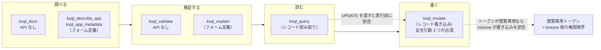
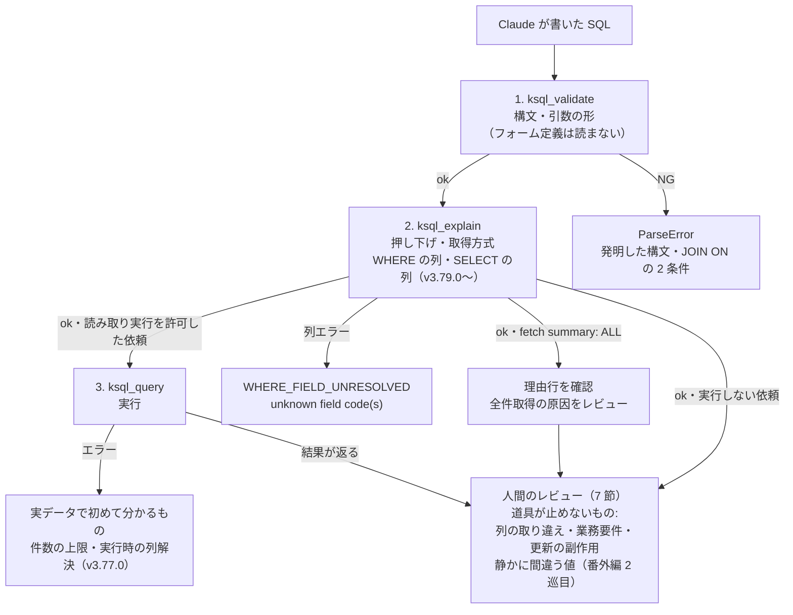
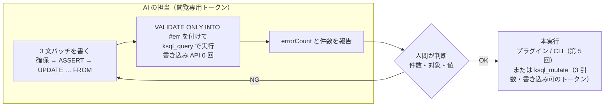
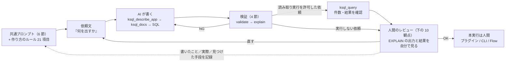

<!-- タイトル案: 【kSQL 実践 #9】AI に書かせて人間がレビューする — MCP・検証の三層・共通プロンプト -->
<!-- 投稿時タグ案: kintone, SQL, MCP, Claude, AI -->
> **結論（3 行）**
>
> - kSQL MCP は、AI が呼べる道具を **調べる・検証する・読む・書く** の 4 段に分けています。書く道具（`ksql_mutate`）は 3 つの安全引数が揃わなければ動かず、読む道具（`ksql_query`）に `UPDATE` を渡すと拒否されます（実測）。ただし安全引数は人間の承認を技術的に保証する仕組みではないので、kintone への書き込みを拒否する境界には**閲覧専用トークン**を使います
> - 検証は最大三層です。`ksql_validate`（構文・静的）→ `ksql_explain`（フォーム定義と押し下げ）までは毎回、`ksql_query`（実行）は人間が許可した読み取り SQL に限ります。**`validate` が通っても動くとは限りません**（実測）。三層はそれぞれ別の失敗を捕まえますが、業務要件や更新の副作用とのずれは通り抜けます。そこが人間のレビューです
> - 会話の最初に貼る共通プロンプトは 5 項目。「`ksql_mutate` を呼ばない」「フィールドコードは `ksql_describe_app` で確認」「構文は `ksql_docs` で確認」「SQL だけのコードブロック + 句ごとの説明 + `EXPLAIN` の要約」「依頼していない句を足さない」。kSQL の**作法**（0 埋めは `CASE`、段を分ける、`RANK()`）は別に 21 項目のルールとして貼ります。MCP の instructions に入れても作法までは変わらなかったので（番外編・3 回実測）、Claude Desktop なら「プロジェクトの指示」、Claude Code なら `CLAUDE.md` と、会話から見える場所に置きます

前回（[第 8 回: kSQL Flow へ載せる](https://qiita.com/rex0220/items/3a3066a21b7814057bb4)）で、SQL を運用に載せるところまで来ました。最終回は、ここまでの各回の末尾に置いてきた「Claude に頼むなら」を本題にします。**Claude に kSQL を書かせて、どこまで信用してよいか**です。

## 課題

1. 第 1〜8 回の SQL を、毎回自分で書くのではなく Claude に書かせたい。ただし kSQL は方言なので、一般的な SQL の知識で「発明」された構文は動かない
2. Claude が書いた SQL が正しいかを、実行して結果を眺める以外の方法で確かめたい。件数が合っていても意味が違うことがある
3. 書き込み（第 5 回）まで頼むなら、AI が勝手に本実行しない仕組みが要る

## 1. 導入 — Claude Desktop と Claude Code

kSQL MCP サーバーは npm パッケージ `@rex0220/kintone-sql-tools` に同梱されています（`ksql-mcp` コマンド）。接続先と API トークンの参照は、第 7 回と同じ `ksql.config.json` です。トークンは環境変数参照にします。

```json
{
  "defaultProfile": "dev",
  "profiles": {
    "dev": {
      "baseUrl": "https://example.cybozu.com",
      "auth": "token",
      "tokenMap": {
        "APP4148": "env:KSQL_TOKEN_KOKYAKU",
        "APP4149": "env:KSQL_TOKEN_ANKEN"
      }
    }
  }
}
```

**Claude Desktop** には拡張機能（MCPB）として入れます。GitHub のリリースから `ksql-mcp.mcpb` を取り、設定 → 拡張機能から読み込み、設定画面で `ksql.config.json` の絶対パスを指定します。Node.js のインストールは要りません（Claude Desktop 側の実行環境を使います）。手順は [kSQL MCPB Claude Desktop インストール手順](https://qiita.com/rex0220/items/f3942613edf943593270) にあります。無料プランでも利用できることを確認しています（2026-09-10 時点）。利用上限とリセットの条件はプランによって異なり、ツールの利用も使用量に影響します。最新の条件は公式ヘルプで確認してください。

**Claude Code** なら 1 コマンドです。

```bash
npm i -g @rex0220/kintone-sql-tools
claude mcp add ksql --env KSQL_CONFIG=/path/to/ksql.config.json -- ksql-mcp
```

動作確認は、kintone の API を呼ばない依頼から始めます。

```text
kSQL MCP の ksql_validate で SELECT 'ok' AS result を検証して
```

`ok: true`・`statementType: SELECT`・`appIds: []` が返れば MCP は動いています。次に `ksql_describe_app` で案件管理（APP4149）のフィールド一覧を出させれば、kintone との接続も確認できます。

## 2. ツール構成 — 調べる・検証する・読む・書く

kSQL MCP のツールは 13 個です。中心となる 8 個が「調べる・検証する・読む・書く」の 4 段で、これとは別に保存クエリを管理・実行する 5 個があります。AI が、まず API を呼ばない道具や取得範囲の小さい道具から使うことを前提に、段ごとに何が分かって何が分からないかを押さえておきます。

| 段 | ツール | 何をするか | kintone API |
| :--- | :--- | :--- | :--- |
| 調べる | `ksql_docs` | 言語リファレンスとレシピ集の索引・本文（27 節 + R1〜R18） | 呼ばない |
| | `ksql_show_apps` | アプリ一覧（大きなドメインでは重い。番号が分かっているなら使わない） | 読む |
| | `ksql_describe_app` | フィールドコード・ラベル・型と、ルックアップ／コピー元／重複禁止／計算式の 4 つの印 | 読む |
| | `ksql_app_metadata` | フォーム定義の生 JSON（選択肢・必須・計算式の中身・関連レコード条件） | 読む |
| 検証する | `ksql_validate` | 構文と静的検査。**フォーム定義を読まない** | 呼ばない |
| | `ksql_explain` | 実行計画（第 0 回の `EXPLAIN`）。フォーム定義を読む。レコードは読まない | 読む |
| 読む | `ksql_query` | 読み取り専用の実行。`VALIDATE`・`VALIDATE ONLY`・`ASSERT`・バッチ可 | 読む |
| 書く | `ksql_mutate` | DML の実行。`allowDml: true`・`confirmText: "yes"`・`dmlMaxRows` が必須 | 書く |
| 保存管理 | `ksql_save_query`・`ksql_list_queries`・`ksql_get_query`・`ksql_delete_query` | ローカルの JSON カタログへの保存・一覧・取得・削除 | 呼ばない |
| 保存実行 | `ksql_run_saved_query` | 保存 SQL を実行。読み取り SQL は `ksql_query` 相当、DML は `ksql_mutate` と同じ安全引数が必要 | SQL によって読む／書く |

`ksql_query` に書き込み文を渡すと、実行前に拒否されます（実測）。

```text
ArgumentError: UPDATE is not allowed by ksql_query. Use ksql_mutate.
```

`ksql_validate` の応答にも `canRunWithQueryTool` / `requiresMutationTool` があり、その SQL がどの段の道具で動くかを AI 自身が読めます。第 5 回の依頼文で「`VALIDATE ONLY` までは `ksql_query`、本実行は `ksql_mutate`」と分けたのは、この構成に沿っています。



左ほど API の消費と影響範囲が小さく、右ほど大きい道具です（`ksql_describe_app` と `ksql_explain` もフォーム定義の API は使います）。AI には左から順に使わせ、右端の `ksql_mutate` は人間が呼びます。3 つの安全引数は誤呼び出しを減らす柵で、kintone への書き込みを止めるのはトークンの側です（5 節）。

### `describe_app` に無いもの

`ksql_describe_app` は SQL を書くための最小情報です。案件管理では `会社名` に「ルックアップ: YES」、`顧客No_` に「コピー元: YES」、`案件名` に「重複禁止: YES」が付きます。顧客管理では `会社名` に「重複禁止: YES」が付きます（実測）。第 1 回の結合キー `顧客No_` と、第 8 回の顧客管理への `KEY (会社名)` は、それぞれこの情報を根拠に選びました。

一方、**選択肢の一覧・必須かどうか・計算式の中身・関連レコード一覧の条件**は出ません。`商談フェーズ IN ('受注')` の `'受注'` が選択肢に実在するか、`売上` が必須かは `ksql_app_metadata`（`resource: "fields"`）で確認します。AI はこれを呼ばずに型から設計を推測しがちで、推測は大抵当たるので気づきにくい、というのが、私自身が別の分析で踏んだ失敗です。

## 3. 「発明」を防ぐ — 構文カタログと `ksql_docs`

一般的な SQL の知識で kSQL を書くと、`ON ERROR SKIP` を `ON CONFLICT` と書く、派生テーブルを書く、`JOIN` の `ON` に 2 条件を書く、といった「発明」が起きます。kSQL MCP は接続時の instructions に**構文カタログ**（文の骨格を `[...]` で示したもの）を載せていて、AI はまずそれを見ます。カタログに載っている構文は必ずパーサを通ることをテストで保証しています（経緯は [構文の教え方](https://qiita.com/rex0220/items/4d9fc0ed48ebd5b32a7b)）。

カタログで足りない細部は `ksql_docs` です。引数なしで呼ぶと索引が返り、節を指定すると本文が返ります。この連載で扱った節はすべて索引にあります。

```text
- [7. JOIN](ksql://language-reference/07-join)
- [10.1 ウィンドウ関数](ksql://language-reference/10-1-window-functions)
- [24. EXPLAIN](ksql://language-reference/24-explain)
- [27. Flow dialect 1](ksql://language-reference/27-flow-dialect-1)
- [R17. 「行の無いもの」を 0 として並べる（マスタ起点の LEFT JOIN）](ksql://recipes/r17)
- [R18. Flow dialect 1 で月次同期ジョブを書く](ksql://recipes/r18)
```

索引の先頭には `kSQL MCP server version 3.85.0 — the resident process that answered this call` と、**いま応答している常駐プロセスの版**が出ます。CLI の `--version` とは別プロセスなので、食い違うことがあります（落とし穴参照）。

依頼文には「構文は `ksql_docs` で確認してから使い、推測で書かない」を入れます。AI が構文を試行錯誤で探る（`ksql_validate` にいろいろ投げて通るものを見つける）のは、通った形が意味まで正しい保証にならないので、禁じます。

## 4. 検証の三層 — validate・explain・query

検証は最大三層です。`ksql_validate` と `ksql_explain` は kintone のレコードを読まないので毎回通します。`ksql_query` による実行確認は、人間が許可した読み取り SQL に限ります（依頼文に「実行はしない」と書いたときは 2 層で止め、実行は人間がプラグインや CLI で行います）。

Claude が書いた SQL について、最初の 2 層で実行前にどこまで確かめられ、最後の実行で何が初めて分かるかを実測しました（v3.77.0）。題材は第 0 回の依頼文（今年の案件を商談フェーズ別に集計）で、`売上` を `売上金額` と書き間違えた SQL です。

```sql
SELECT 商談フェーズ, COUNT(*) AS 件数, SUM(売上金額) AS 売上合計
FROM APP4149 WHERE 受注予定日 = THIS_YEAR() GROUP BY 商談フェーズ
```

| 層 | ツール | 結果（実測） | 分かること |
| :--- | :--- | :--- | :--- |
| 1 | `ksql_validate` | `ok: true`・`validationScope: syntax-and-arguments-only` | 構文と引数の形。フォーム定義は読まない |
| 2 | `ksql_explain` | `ok: true`・`fetch summary: EXACT`・`fields: 商談フェーズ, 売上金額, 受注予定日` | 押し下げと取得方式。**v3.77.0 では SELECT 列の存在を検査しなかった** |
| 3 | `ksql_query` | `ArgumentError: unknown field code(s): 売上金額 (APP4149)` | 実行時にフォーム定義と突き合わせて止まる |

WHERE 側の列は 2 層目で止まります（`WHERE ランク = 'A'` → `ksql_explain` が `WHERE_FIELD_UNRESOLVED`）。v3.77.0 では SELECT 側の列名の誤りは実行まで通り抜けました。この非対称は連載の執筆中に課題として直し、v3.79.0 からは `ksql_explain` も 3 層目と同じ `unknown field code(s): 売上金額 (APP4149)` で止まります（v3.85.0 で再実測）。それでも `ksql_describe_app` の出力と SELECT 列は AI にも突き合わせさせ（共通プロンプト 2 番）、最後は人間が確認します。存在する列を取り違えた誤り（`売上` と `見込売上` など）は、どの層も止めないからです。



`ksql_explain` が効くのは押し下げの確認です。同じ集計を `YEAR(受注予定日) = 2026` と書くと、`validate` は通りますが `explain` は `fetch summary: ALL`・`kintone query: (全件取得)`・`reason: … WHERE 句に JS 評価が必要な式, WHERE_EXPRESSION_LOCAL_ONLY` になります（実測）。第 0 回の依頼文に「`ksql_explain` の fetch summary 行が EXACT になっていることを確認」と入れたのはこのためです。

### 静的検証だけでは防げないもの — 意味・性能・副作用のずれ

三層は同じものを検査しているわけではありません。`EXPLAIN` で初めて見える性能差、実データを使って初めて分かる評価結果、三層をすべて通しても残る業務要件や副作用のずれがあります。この連載の草稿でも Claude（私が書かせた側）は次を間違え、レビューと実測で直しました。

| 書いたこと | 実際 | 見つけた手段 |
| :--- | :--- | :--- |
| `LEFT JOIN` の保持側に WHERE を付ければ押し下がる | 両側とも全件取得（`join pushdown not applied: OUTER_JOIN`） | `EXPLAIN`（第 1 回） |
| `SELECT` に `TODAY()` を書ける | `ParseError`。SELECT では `CURRENT_DATE()` | 実行（第 2 回） |
| `100.0` で割ると整数除算を避けられる | kSQL の算術は倍精度。`7/2` は `3.5` | 言語リファレンス §3（第 3 回） |
| `UPDATE … CHECK WHEN 金額 > 100000` で更新後の値を検査 | `CHECK` は更新前の値を見る。SET 式を再掲する | 実行テスト（[検証ループ](https://qiita.com/rex0220/items/7f229c87a20f2d45777c)） |
| `UPSERT … KEY` で「何度流しても同じ結果」 | 重複防止と値の収束。更新 API は呼ばれる | レビュー（第 8 回） |
| 案件がある会社だけを書き戻す | 案件が無い月に前月値が残る | レビュー（第 8 回） |
| CTE で `c.顧客No AS 顧客No` と別名を付け、次の段から `顧客No` で参照する（Claude Desktop の回答） | 別名の英字は `顧客no` に小文字正規化され、参照は正規化後の名前でしか解決しない。`validate` も `explain` も通り、実行で `unknown field code`。Claude は別名を変えて自力で通したが、原因の説明（RECORD_NUMBER 同名／英字と漢字の混在）は 2 つとも外れ。**v3.78.0 で修正**（元の表記でも解決。結果列名の小文字化は不変） | 実行と切り分け（第 3 回の番外編） |
| `COALESCE(SUM(売上), 0)` で 0 埋めした列で順位・累計・並べ替え（改訂した依頼文への Claude Desktop の回答） | `COALESCE` の結果は型を持たず、`ORDER BY` とウィンドウの並びが文字列順になり、ABC 区分が全部ずれる。`validate` も `explain` も実行も通る。**v3.78.0 で修正**（全引数が数値なら数値順） | 結果を目で見る（第 3 回の番外編） |

共通しているのは、**根拠らしい説明が付いていた**ことです。「保持側は押し下がるはず」「一般的な SQL では整数除算」「リファレンスに『SET 適用後の値を検証』とある（別の機能の記述）」。もっともらしい引用つきの誤りは、人間のレビューでも見逃しやすい形です。対策は、説明を読むのではなく **`EXPLAIN` の出力と実行結果を自分で見る**ことに尽きます。

## 5. 書き込みを頼む — `VALIDATE ONLY` から `ksql_mutate` へ

第 5 回の 3 文バッチを、AI に頼む場合の順です。まず `VALIDATE ONLY INTO #err` を付けた形を `ksql_query` で実行させます。書き込み API は 0 回で、行ごとの検証結果が返ります（実測）。

```sql
CREATE TEMP TABLE #fix AS SELECT $id AS 対象id, 0 AS 新売上 FROM APP4149 WHERE 売上 = '';
ASSERT (SELECT COUNT(*) FROM #fix) BETWEEN 0 AND 10;
UPDATE APP4149 SET 売上 = f.新売上 FROM #fix AS f WHERE APP4149.$id = f.対象id VALIDATE ONLY INTO #err;
SELECT COUNT(*) AS エラー数 FROM #err
```

```json
{"type":"VALIDATION","operation":"UPDATE","validatedRows":1,"validRows":1,"invalidRows":0,"errorCount":0,"errTable":"#err"}
```

本実行は `ksql_mutate` です。`allowDml: true`・`confirmText: "yes"`・`dmlMaxRows` の 3 つを明示的に渡す必要があり、`dmlMaxRows` を超える文は 1 行も書かずに失敗します。`allowDml` と `confirmText` は誤呼び出しを防ぐ意図確認、`dmlMaxRows` は書き込み件数の強制上限です。AI 自身も前者 2 つを指定できるため、人間の承認を強制する境界ではありません。第 5 回の 4 段表（計画・検証／書き込み直前／書き込み開始後／再実行）はそのまま当てはまり、MCP では 3 引数が操作上のガード、次の閲覧専用トークンが kintone 側の権限境界です。前者は誤操作を減らし、後者は書き込みそのものを拒否します。

運用の柵はもう 1 つ、**トークン**です。AI 用の `ksql.config.json` には閲覧のみのトークンを置き、書き込みは人間が別のトークンで（プラグインか CLI で）行う、と分けると `ksql_mutate` を呼ばれても書けません。第 8 回のテンプレート [ksql-flow-template](https://github.com/rex0220/ksql-flow-template) はこの分け方で、AI の担当を「ジョブ SQL の作成・検証・dry-run まで」と `CLAUDE.md` に書いています。



## 6. 共通プロンプト

会話の最初に 1 回貼る前置きです。第 1 回・第 2 回の末尾に置いた「Claude に頼むなら」の依頼文は、この前置きのあとに打つ想定で書いてあります。第 3〜8 回の依頼文は末尾の付録にまとめました。書かせた SQL を検証した記録は[第 3 回の番外編](https://qiita.com/rex0220/items/4e395383cfc9ea6cdbe3)です。

```text
このチャットでは kSQL MCP を使って kintone 用の SQL を書いてもらいます。約束は 5 つです。
1. SQL は書いて ksql_validate と ksql_explain で検証してください。ksql_query は、私が明示的に実行を依頼した場合に限り、読み取り専用バッチ（SELECT・VALIDATE・VALIDATE ONLY・ASSERT）に使ってください。ksql_mutate は呼ばないでください。本実行は私が行います
2. フィールドコードは推測せず、必ず ksql_describe_app で確認してから使ってください。選択肢の値・必須・計算式が関わるときは ksql_app_metadata（resource: fields）も見てください。どちらも app 引数は数値（4149）で渡してください
3. 構文は ksql_docs で確認してから使ってください。推測で書いたり、ksql_validate に試し打ちして通る形を探したりしないでください
4. 完成した SQL は、そのまま貼れるように SQL だけのコードブロックで見せてください。そのあとに各句が何をしているかを 1 行ずつと、ksql_explain の fetch summary と理由行を添えてください
5. 依頼していない列・条件・並べ替えは追加しないでください。できないことは、できないと言ってから代替案を出してください
```

- 1 番は道具の段に合わせ、`ksql_query` を「私が実行を依頼したときだけ」に限っています（6 節の実測で、書かなければ AI は自発的に読み取り実行をしました）。第 5 回の更新のように `VALIDATE ONLY` を `ksql_query` で実行させる依頼文は、依頼文側で実行を頼む形なので、この前置きの範囲内です
- 2 番の後半と 3 番は、2 節と 3 節の実測から足しました
- 4 番の「fetch summary と理由行」は、AI に `EXPLAIN` を解釈させるためではなく、人間が読むための抜粋です。JOIN やバッチでは文ごとに複数出ます
- 5 番は付いてきたら「今回は並べ替えなしで書き直して」と頼みます。「できないと言う」は、相関サブクエリのように kSQL に無い機能を頼んだとき、無理に発明せず `RANK()` などの等価な形へ言い換えさせるためです

### 作り方のルール — 「どう書くか」は会話から見える指示で渡す

共通プロンプトは「何をしてよいか」の約束です。番外編で分かったのは、それだけでは **kSQL の作法**（0 埋めは `CASE`、集計とウィンドウは段を分ける、依頼された列だけ、順位は `RANK()`）までは届かないことでした。作法を 21 項目のルールにして会話の先頭に貼ると、同じ依頼文で 1 回目から第 3 回の表と一致しました（番外編 3 巡目）。

同じ内容の要点 8 行を v3.78.0 で MCP の instructions（接続時に AI へ渡る文）に入れましたが、前置きなしで 3 回試した結果は「エンジン修正で結果は正しくなったが、SQL の形は変わらなかった」でした（番外編 4 節）。会話に見えるルールは効き、接続時に渡る文は作法までは変えない。3 回の実測なので傾向としか言えませんが、**作法は MCP の instructions だけに任せず、会話から見える指示（プロジェクトの指示・`CLAUDE.md`・毎回貼る前置き）で渡す**のが確実です。以下がその全文です（v3.81.0 版。10・14・15 は番外編で見つかった 2 件の修正後、12 はウィンドウ関数を集計と同じ SELECT に書けるようになった v3.81.0 の仕様に直してあります）。

```text
kSQL は標準 SQL と違う点があるので、次のルールで書いてください。

【調べてから書く】
1. フィールドは推測せず ksql_describe_app で確認する（app は数値で渡す）。ラベルではなくフィールドコードを使う。ルックアップ・コピー元・重複禁止の印も見る
2. 構文は ksql_docs で該当の節を読んでから使う。ksql_validate に試し打ちして通る形を探さない

【JOIN】
3. ON はフィールド同士の等式 1 本だけ。結合キーは「コピー元: YES」のフィールドと相手のレコード番号（例: 案件.顧客No_ = 顧客.顧客No）
4. INNER JOIN では、WHERE で絞れる側・件数の少ない側を FROM に書く（結合キーの絞り込みは FROM 側から JOIN 先にしか効かない）。件数が分からなければ WHERE で絞れる側、それも無ければどちらでもよいと書く
5. LEFT / RIGHT JOIN は押し下げが効かず両方全件になる。「無い側も出す」と依頼されたときだけ使い、その場合も絞る側は先に一時テーブルへ実体化する

【WHERE と日付】
6. 選択系（ドロップダウン・ラジオ・チェックボックス）の条件は IN で書く
7. 日付の条件は WHERE に相対日付関数（THIS_MONTH() など）かリテラルの半開区間で書く。WHERE で DATE_FORMAT / YEAR などで列を包まない（全件取得になる）
8. 相対日付関数は WHERE 専用。SELECT で今日が要るときは CURRENT_DATE()、整形は DATE_FORMAT

【空セルと型】
9. kintone に NULL は無く、未設定は空文字 ''。除外は != ''、判定は = ''
10. 0 埋めは CASE WHEN x = '' THEN 0 ELSE x END で書く。COALESCE / ISNULL は全引数が数値のときだけ数値のまま（v3.78.0〜）。文字列が混ざると型を失い、並べ替えが文字列順になる
11. 数値の比較は 10 進厳密、算術と SUM / AVG は倍精度。100.0 は慣習で、整数除算は無い

【集計とウィンドウ】
12. 集計とウィンドウ関数は同じ SELECT に書ける（v3.81.0〜）。OVER の引数・PARTITION BY・ORDER BY で参照できるのはグループキー・集計の別名・集計式・GROUPING() だけで、集計を含まない別名は参照できない。ウィンドウの結果は関数の引数・算術・CASE の中でも使える。WHERE / HAVING では使えない。段ごとに確かめたいときは、集計する段 → ウィンドウを列に出す段 → その列を使う段、と CTE か一時テーブルで分けてもよい
13. 累計は ROWS BETWEEN UNBOUNDED PRECEDING AND CURRENT ROW を明示し、ORDER BY は集約キーまでのタイブレークを付ける
14. 総計で割るときは CASE WHEN 総計 = '' OR 総計 = 0 で先に受ける（LEFT JOIN の不一致側や 0 件の集計は '' になる。ゼロ除算は NaN）

【名前と出力】
15. 列の別名に英字を使うと結果列名は小文字になる（次の段からは元の表記でも小文字でも参照できる・v3.78.0〜）。物理フィールドと同じ名前の別名は列名が変わるので付けない。迷ったら別名は日本語にする
16. 依頼された列だけ出す。依頼に無い列・条件・ORDER BY・LIMIT を足さない。順位は指示が無ければ RANK()（同額は同順位）、割合は小数第 1 位

【取得量】
17. GROUP BY・集計・DISTINCT・ローカル ORDER BY は完全入力が必要で、上限に達すると部分結果ではなくエラーになる。件数の当たりは COUNT(*) で先に付ける

【書き込み】
18. 更新は、対象を一時テーブルに確保 → ASSERT で件数を制限 → UPDATE … FROM か UPSERT … KEY の順。まず VALIDATE ONLY INTO #err を付けた形で検証する。UPDATE の CHECK は更新前の値を見る
19. ksql_mutate は呼ばない。本実行は人間が行う

【検証と説明】
20. 書いたら ksql_validate → ksql_explain の順に通し、fetch summary と理由行を添える。依頼があれば ksql_query で件数だけ確かめる
21. 完成した SQL は SQL だけのコードブロックで示し、各句の説明を 1 行ずつ付ける。根拠は ksql_docs の節名か EXPLAIN の行で示し、推測は推測と書く。できないことはできないと言ってから代替案を出す
```

番外編 3 巡目で効いたと判定したのは 10・15・16・21 です。4 の「件数の少ない側」は実行禁止の依頼では判断できず、Claude は「推測。逆なら入れ替えても結果は同じ」と書きました（21 が効いた形）。その経験から 4 の末尾を足しています。

### 依頼文を AI に作らせる

ここまでで、会話の先頭に貼る文は共通プロンプト 5 項目とルール 21 項目、そのあとに各回の依頼文と、長くなりました。中身は 3 種類です。

| 種類 | 例 | 置き場 |
| :--- | :--- | :--- |
| 約束（何をしてよいか） | `ksql_mutate` を呼ばない・`ksql_describe_app` で確認 | 1 回だけ。Claude Desktop なら「プロジェクトの指示」、Claude Code なら `CLAUDE.md` |
| 作法（どう書くか） | 0 埋めは `CASE`・依頼された列だけ・順位は `RANK()` | 同上。21 項目はここに置けば毎回貼らない |
| 依頼（何を出すか） | 会社別に集計して累積 80% で A/B/C | 毎回変わる。ここだけ AI に下書きさせる |

番外編の実測では、会話に見える文は効き、接続時に渡る instructions は作法まで変えませんでした。プロジェクトの指示や `CLAUDE.md` は会話に見える側なので、約束とルールはそこへ移します（[ksql-flow-template](https://github.com/rex0220/ksql-flow-template) の `CLAUDE.md` がその形です）。

そのうえで、依頼文は AI に下書きさせます。業務の要件を 1 行渡すと「依頼文の案」を返し、確認してから SQL を書く 2 段にします。プロジェクトの指示に次を足します。

```text
依頼は 2 段で進めてください。
1. 私が業務の要件を短く書いたら、まず SQL は書かず、次の形の「依頼文」を提案してください。
   - 対象アプリと結合キー（ksql_describe_app で確認した根拠つき）
   - 出力列（列名・順序・桁）と並び順
   - 条件（期間は半開区間、選択系は IN）
   - 段の分け方（CTE か一時テーブルか、1 段で書けるか）と、境界条件（総計 0・空セル・同額）
   - 検証の範囲（validate → explain まで、または ksql_query で件数まで）と、実行しないこと
   - 私が決めるべき点（判断が要る箇所は質問にする）
2. 私が「OK」または修正を返したら、その依頼文どおりに SQL を書き、validate と explain の結果を添えてください。
```

使うときの入力は 1 行です。

```text
案件の売上を会社別に集計して、累積 80% までを A、95% までを B、残りを C にしたい。
```

返ってくる依頼文の案は、付録の第 3 回の依頼文とほぼ同じ形になります。違いは、「同額の順位は `RANK` か `ROW_NUMBER` か」「案件の無い会社も出すか」のように、**人間が決めるべき点を質問として並べてくる**ことです。第 8 回の依頼文でも Claude は「当月を判定する日付フィールドはどれか」を選択肢で聞いてきました（付録）。人間が最初から依頼文を書くと、決めていないことに気づかないまま依頼してしまいます。質問が先に出るのが、下書きを AI に任せる利点です。

比較のために、**プロジェクトの指示も共通プロンプトも無い**新しい会話で、上の 1 行だけを渡してみました（kSQL MCP v3.85.0・案件アプリが多数ある別のドメイン）。Claude は `ksql_docs` のレシピ R15 を読み、3 段 CTE 版を書いて、**頼んでいないのにそのまま実行**しました。対象アプリは多数の候補から自分で 1 つ選び、完全入力のために `maxRecords` を 10,000 に自分で上げています。結果の値は正しく、末尾には「境界の扱い（80% を跨ぐ行を A に含めるか）」「対象レコード（受注確定分に限るか）」「会社名キー（表記ゆれ。ルックアップの参照先レコード番号で GROUP BY する方が安全）」「件数の多いアプリでは `maxRecords`」と、判断が要る点が 4 つ並んでいました。

つまり、作法の側は MCP の instructions と `ksql_docs` でかなり届いています（3 段・`ROWS` の明示・タイブレーク・依頼した列だけ）。届いていないのは約束の側で、「実行しない」と書かなければ読み取りは走り、アプリの選択も AI が決めます。判断が要る点は、指示が無くても**結果のあとに**列挙されました。2 段の指示は、この列挙を**SQL の前の質問**に変えるためのものです。

次に、プロジェクトの指示に共通プロンプト・ルール 21 項目・上の 2 段の指示を置き、同じ 1 行を渡しました（こちらは連載と同じ SFA パックのドメイン）。今度は SQL を書かず、`ksql_query` も呼ばず、`ksql_describe_app` と `ksql_docs`（R15）を読んだうえで「依頼文（案）」を返しました。案の末尾に、決めてほしい点が 6 つ並びます。

1. 対象アプリ。構成が同じ組が 2 つある（検証用コピーと本体）ので、どちらにするか
2. 会社の切り方。`会社名` で集計して JOIN しないか、`顧客No_` で集計して顧客管理と JOIN するか（社名変更の影響とアプリの取得量の違いを添えて）
3. 売上は全フェーズか、`商談フェーズ IN ('受注')` に絞るか。期間で絞るか
4. `会社名` が空の案件を除外するか
5. 境界の判定。累積が 80 以下なら A（80% を跨ぐ会社は B）か、直前までの累積が 80 未満なら A（跨ぐ会社も A）か
6. 確認用に累積構成比を足すか、最終の `ORDER BY` を付けるか

指示なしのときに結果の後ろに付いていた 4 点が、SQL の前の質問になりました。1 と 5 は、人間が最初から依頼文を書いたら決めずに進んでいた点です。

案の中身は 2 か所だけ直す必要がありました。1 つは説明の誤りで、2 の「`顧客No_` で集計してから顧客管理と JOIN する案は 2 アプリとも全件取得になる」は違います。一時テーブルを FROM に置いた INNER JOIN では結合キーの絞り込みが JOIN 先に効き、顧客 215 件の環境でも `maxRecords` 50 で通ります（実測。第 1 回の「FROM 側から JOIN 先へ」の規則どおり）。もう 1 つは道具の使い方で、`ksql_app_metadata` を SQL と同じ `APP4247` 表記で呼んで入力検証エラーになり、Claude は別の kintone MCP サーバーで選択肢を確認していました。この引数は整数（`4247`）か `LAPP_` 名しか受けず、エラー文からもそれが読めません。AI が最初に書く形で止まる道具側の穴なので、課題として起票しました（[課題台帳](https://github.com/rex0220/kintone-sql-tools/blob/main/docs/ksql_issue_tracker.md) の B194）。直るまでは、共通プロンプト 2 番とルール 1 に「app は数値で渡す」と書いておきます（上の文面には入れてあります）。

2 つの試行を並べると次のとおりです。

| 条件 | SQL を書く前の確認 | 実行 | 結果 |
| :--- | :--- | :--- | :--- |
| 指示なし | なし | 頼んでいない `ksql_query` を実行 | 値は正しいが、判断点 4 つが**結果の後**に出る |
| 共通プロンプト + ルール + 2 段の指示 | 質問 6 つを先に出す | しない（validate・explain のみ） | 答えたあとの SQL が第 3 回と 10 行すべて一致 |

説明の誤りが 1 つ混ざるのは、4 節の表と同じ形です。案を読むときも、「全件取得になる」のような根拠つきの断定は `EXPLAIN` か実測で確かめます。

6 つに答えて（連載の SFA パック、`顧客No_` で集計して顧客管理と JOIN、全フェーズ、境界は a、第 3 回と同じ 8 列と並び）「OK」を返すと、Claude は SQL を書く前に 1 点を指摘しました。「JOIN は INNER」と「`顧客No_` が空の案件も除外しない」は両立しない、今回は明示された INNER で書く、と。そのうえで 4 段 CTE の SQL と、`ksql_validate`・`ksql_explain` の要約、実行時の注意（`顧客No_` が空のグループがあると顧客側は結合キーで絞られず全件取得になる、キーが 300 件を超えると全件取得と警告）を返しました。注意の 2 点は言語リファレンス §7 からの読み取りで、実測していないとも書いてあります。`ksql_query` は呼んでいません。

その SQL をこちらで実行すると、**10 行すべてが第 3 回の表と一致**しました（順位・案件数・売上合計・構成比・累積構成比・区分）。`EXPLAIN` の要約も実機と同じで、JOIN 先の顧客管理は `PREFILTERED (未確定)`・`join key prefilter: runtime candidate` です。依頼文を人間が書かなくても、質問に答えるだけで第 3 回と同じ結果に届いた形です。

注意は 2 つです。依頼文の案にも「実行はしない」を入れさせること（案を作る段階で `ksql_query` を呼ぶことがあります。上の実測がその例です）。作法のルールを依頼文の中に繰り返させないこと（ルールは置き場にあり、依頼文は「何を出すか」だけにします）。

## 7. 人間がレビューすること

依頼から本実行までの 1 往復はこの形です。AI が書き、道具が最大三層で検査し、人間が道具の見ないところを見てから実行します。



道具が見ないところを、順に見ます。第 1〜8 回で出てきた観点の一覧です。

- [ ] **1. 列名**: SELECT の列を `ksql_describe_app` の出力と突き合わせる（4 節。存在しない列は v3.79.0 以降 `explain` でも止まるが、存在する別の列との取り違えは止まらない）
- [ ] **2. 結合キーと向き**: ルックアップ／コピー元の印がある列で結合しているか。`EXPLAIN` で JOIN 先が `PREFILTERED` になる向きか（第 1 回）
- [ ] **3. 押し下げ**: `fetch summary` が `EXACT` か。`ALL` なら理由行に WHERE の関数・`LEFT JOIN`・`DATE_FORMAT` が出ていないか（第 0〜2 回）
- [ ] **4. 完全入力**: `complete input: required` の文が `maxRecords` に収まるか。件数は `COUNT(*)` で先に当たりを付ける（第 0 回の `COUNT_ONLY`・第 1 回の上限実測）
- [ ] **5. 数値と空セル**: 比較は 10 進厳密、算術・`SUM`・`AVG` は倍精度、空セルは算術で 0・比較で最小側。`AVG` の分母に空セルが入っていないか（第 0 回）。`COALESCE` で包んだ集計値は v3.77.0 以前は型を失い並べ替えが文字列順になった（第 3 回の番外編。v3.78.0 で全引数が数値なら数値順）。文字列が混ざる `COALESCE` は今も文字列
- [ ] **6. 文字列**: `LIKE` は JS 評価で大文字小文字を区別、`KLIKE` は kintone 評価。並びはコードポイント順（第 4 回）
- [ ] **7. 日付**: `THIS_MONTH()` などは WHERE 専用、SELECT は `CURRENT_DATE()`。Flow では `@` 付き（第 2 回・第 8 回）
- [ ] **8. 書き込み**: `VALIDATE ONLY` の `errorCount`、`ASSERT` の範囲、`dmlMaxRows`、`CHECK` は更新前の値（第 5 回の落とし穴）
- [ ] **9. 依頼にない句**: `ORDER BY`・`LIMIT`・余分な条件が足されていないか（共通プロンプト 5 番）
- [ ] **10. 説明の根拠**: 「〜のはず」「一般的な SQL では」で始まる説明は、`EXPLAIN` か実行で確かめる（4 節）

10 個すべてを毎回見る必要はありません。1〜4 は `ksql_describe_app`・`ksql_explain`・事前の `COUNT(*)` の結果を見れば数分で確認でき、5〜7 は題材で決まり、8 は書き込みのときだけです。

## 落とし穴

- **`ksql_validate` が通っても動くとは限りません。** 存在しないフィールド名でも `ok: true` です（フォーム定義を読まないため）。`ksql_explain` は WHERE と SELECT の列を検査しますが（SELECT 側は v3.79.0 以降）、存在する列の取り違えは止めません（4 節）。英字を含む別名（`AS 顧客No`・`AS ABC区分`）は結果列名が小文字になります。v3.77.0 以前は次の段から元の大文字で参照すると実行時に解決できませんでした（第 3 回の番外編。v3.78.0 で元の表記でも解決）。それでも結果列名は `顧客no` になるので、物理フィールドと同じ名前の別名は付けず、迷ったら別名は日本語にします
- **`ksql_describe_app` には選択肢・必須・計算式の中身がありません。** 4 つの印（ルックアップ／コピー元／重複禁止／計算式の有無）まで。中身は `ksql_app_metadata`
- **AI は約束を守るとは限りません。** 「実行しない」と前置きしても `ksql_query` を呼ぶことがあります。レコードは変更されませんが、業務データの取得と kintone API の消費は起きます。書き込みについては、`ksql_mutate` の引数と閲覧専用トークンの 2 段で止めます
- **閲覧専用トークンが防ぐのは書き込みだけです。** `ksql_query` や `ksql_describe_app` で読めた業務データは AI の会話コンテキストへ渡ります。AI 用のトークンは対象アプリを必要最小限にし、個人情報や機密を含むアプリを扱うときは、利用プランと組織のデータ取扱方針も確認します
- **常駐 MCP の版は再起動するまで変わりません。** `npm install` で新しい版を入れても、Claude Desktop や Claude Code が起動済みの MCP サーバーは古いままです。`ksql_docs` の先頭行に出る版で確かめ、更新後はクライアントを再起動します
- **使用量にはツールの利用も影響します。** `ksql_show_apps` のような重い呼び出しや、試し打ちの `ksql_validate` 連打は使用量を増やします。1 つの題材を 1 会話に収め、実行はプラグインや CLI 側で行う分担が枠にも優しいです（上限とリセットの条件はプランで異なり、公式ヘルプで確認します）
- **`ksql_query` の既定上限は 500 件**です。集計や `GROUP BY` は完全入力が要るので、超えると fail-closed で止まります（第 0 回）。`maxRecords` 引数で上げられますが、上げる前に `COUNT(*)` で件数を見ます
- **MCP では `IMPORT` の CSV を inline で渡します。** ファイルパスは受け付けません（第 6 回）。大きな CSV はプラグインか CLI で取り込みます

## 運用に載せる

AI と共同で書く運用は、次の 3 点で形になります。

- **トークンを分ける**: AI 用の設定には閲覧のみのトークン。書き込みは人間が別経路で（5 節）
- **規約をリポジトリに置く**: Claude Code なら `CLAUDE.md` に共通プロンプトとルール、依頼文を下書きさせる 2 段の指示（6 節）を書いておけば、毎回貼らずに済みます。[ksql-flow-template](https://github.com/rex0220/ksql-flow-template) の `CLAUDE.md` が例で、手順（`ksql_describe_app` → `ksql_docs` → 下見の `ksql_query` → 生成 → `ksql_validate` → CLI で `validate` → `dry-run`）と規約（`@` 付き時刻関数・`ASSERT` と `EXIT` の分離・`UPSERT … KEY`・書き込み文は最後）を AI 向けに書いてあります
- **レビューの記録を残す**: 4 節の表のように「書いたこと／実際／見つけた手段」を残すと、同じ方言でつまずく場所の地図になります。次に同じ依頼をしたとき、前と同じ誤りが出ないかを同じ依頼文で確かめられます

## シリーズのまとめ

| 回 | 課題 | 持ち帰るもの |
| :-: | :--- | :--- |
| [0](https://qiita.com/rex0220/items/d7db0da75da8c734b46d) | 標準 SQL との差分と実行モデル | 差分早見表・`EXPLAIN` の `fetch summary`・`maxRecords` の fail-closed |
| [1](https://qiita.com/rex0220/items/eaa0888697f17131b056) | アプリ横断集計 | JOIN の押し下げ 2 種と向き・`LEFT JOIN` は一時テーブルで先に絞る |
| [2](https://qiita.com/rex0220/items/8261e9aaab9eef3a0fb5) | 期間集計と 0 埋め | 相対日付は WHERE 専用・`GENERATE_SERIES` + `LEFT JOIN`・`LAG` |
| [3](https://qiita.com/rex0220/items/d417ba52766f73cb965d) | ABC 分析 | 3 段 CTE（v3.81.0 からは 1 段でも可）・`ROWS` フレームとタイブレーク・`ROLLUP` |
| [番外編](https://qiita.com/rex0220/items/4e395383cfc9ea6cdbe3) | Claude に ABC 分析を書かせて検証 | validate・explain を通って実行で止まる／通って静かに間違う・作り方のルール・正本を直す |
| [4](https://qiita.com/rex0220/items/90e7f766b27bb4c429a0) | データ品質監査 | `VALIDATE APPn INTO #err`・`CHECK`・`LIKE` と `KLIKE` |
| [5](https://qiita.com/rex0220/items/b315ad3bbe0c4986f206) | 安全な一括更新 | 一時テーブルで確保・`ASSERT`・`VALIDATE ONLY`・`dmlMaxRows`・4 段の柵 |
| [6](https://qiita.com/rex0220/items/301ce2e655461188ba81) | CSV を IMPORT して検証環境を大きくする | `IMPORT` と検証環境の増量・再測定 |
| [7](https://qiita.com/rex0220/items/c0dc73f3ac40daba9ace) | CLI 定期運用 | `--export-csv`（Shift_JIS）・profile と `LAPP_`・終了コード |
| [8](https://qiita.com/rex0220/items/3a3066a21b7814057bb4) | kSQL Flow | dialect 1・`ASSERT` / `EXIT`・as-of・`--resume-batch` |
| [9](https://qiita.com/rex0220/items/33280e22599957b2331d) | AI に書かせてレビューする（本記事） | 4 段のツール・検証の三層・共通プロンプト・レビュー観点 10 個 |

SQL は、kintone のデータを扱う「読める形」です。読めるから AI に書かせられ、読めるからレビューできます。この連載の SQL はすべて手元の SFA パックで実測したものなので、掲載時点と同じ版・データ・基準日を揃えれば、同じ検証手順を再現できます。

連載中に見つけた kSQL 側の課題は 10 件を v3.78.0〜v3.85.0 で直しました（第 0〜8 回は v3.77.0 で実測。本記事の版表示と第 3 回の注記が最新版の状態です）。読者が自分の環境で試すときは、`ksql_docs` の先頭行に出る版で本文の版と揃っているかを確かめてください。

## 付録 — 第 3〜8 回の依頼文

6 節の共通プロンプトと作り方のルールを貼ったあとに打つ依頼文です。第 1 回・第 2 回の依頼文はそれぞれの回の末尾にあります。いずれも v3.78.0 の MCP で検証しています。

**第 3 回（ABC 分析）** — 番外編の題材です。6 節の 2 段の指示を使う場合は、この依頼文の代わりに「案件の売上を会社別に集計して、累積 80% までを A、95% までを B、残りを C にしたい」の 1 行を渡し、返ってきた質問に答えます（実測では第 3 回と同じ 10 行になりました）。

```text
kSQL MCP で、APP4149（案件管理）の売上を APP4148（顧客管理）の会社別に集計し、
売上の大きい順に順位・構成比・累積構成比を付けて、累積 80% までを A、95% までを B、残りを C に区分する SQL を書いてください。
集計・ウィンドウ・区分の 3 段の CTE に分け、累計のフレームは ROWS BETWEEN UNBOUNDED PRECEDING AND CURRENT ROW を明示し、
ORDER BY は会社名までのタイブレークを付けてください。ksql_validate で検証してください。実行はしないでください。
```

**第 4 回（データ品質監査）**

```text
kSQL MCP で、APP4148（顧客管理）の既存レコードをフォーム制約で監査し、違反をフィールドとエラーコード別に件数集計する SQL を書いてください。
VALIDATE … INTO #err のバッチにし、件数は SUM($err_count) で数えてください。
あわせて APP4149（案件管理）について「商談フェーズが受注なのに受注予定日が空」を CHECK で検出する VALIDATE 文も書いてください。
ksql_validate で検証してください。実行はしないでください。
```

**第 5 回（安全な一括更新）** — `VALIDATE ONLY` までは `ksql_query`、本実行は `ksql_mutate` と、ツールの権限レベルで分かれています。依頼文もその順にします。

```text
kSQL MCP で、APP4149（案件管理）の売上が未入力の案件に 0 を入れる更新を書いてください。
対象を一時テーブルに確保し、ASSERT で件数を 0〜10 件に制限し、UPDATE … FROM で転記する 3 文のバッチにしてください。
まず VALIDATE ONLY INTO #err を付けた形を ksql_query で実行してエラー 0 を確認し、本実行はしないでください。
```

**第 6 回（ファイル入出力）** — MCP では CSV を `importSources` として inline で渡すので、ファイルを開くのは Claude 側の作業です。

```text
kSQL MCP で、次の CSV を APP4148（検証用の顧客管理）へ取り込む IMPORT 文を書いてください。
ヘッダはフィールドコードなので BY NAME で対応させ、会社名をキーに ON DUPLICATE で冪等にしてください。
まず VALIDATE ONLY INTO #err を付けた形を ksql_query で実行してエラー行を見せてください。本実行はしないでください。
（CSV の内容を貼る）
```

**第 7 回（CLI 定期運用）** — CLI 用の `.sql` とコマンドラインを書かせる依頼文です。

```text
kSQL で、顧客ランク別受注額を毎週 CSV に書き出す運用を作ります。
アプリは LAPP_KOKYAKU と LAPP_ANKEN を使い、DECLARE @phase = '受注' を既定値にしてください。
結果は一時テーブル #rankA に入れ、--export-csv rankA=... で Shift_JIS の CSV へ書き出せる形にしてください。
先頭に VALIDATE LAPP_KOKYAKU (会社名, 顧客ランク) INTO #err と
ASSERT (SELECT COUNT(*) FROM #err) = 0 の品質ゲートを置いてください。
失敗は終了コードで検知する前提です。SQL は ksql_validate で検証し、実行はしないでください。
```

**第 8 回（kSQL Flow）** — ジョブの雛形・`CLAUDE.md`・MCP 設定を揃えた [ksql-flow-template](https://github.com/rex0220/ksql-flow-template) があります。`ksql_validate` は dialect 1 の診断も返します（`THIS_MONTH()` に `KSQL1306`、素の `INSERT` に `KSQL1305`）。

```text
kSQL Flow dialect 1 で、当月の案件を会社別に集計して顧客管理へ書き戻す月次ジョブを書いてください。
アプリは LAPP_案件管理 と LAPP_顧客管理、ヘッダに name / timeout / dialect: 1 を付けてください。
月の範囲は @MONTH_START() と @NEXT_MONTH_START() の半開区間で、@ なしの時刻関数は使わないでください。
書き戻しは顧客管理の全社を起点にしたスナップショットにし、案件が無い会社は 0 にしてください。
現在値と違う会社だけを差分の一時テーブルに入れ、差分 0 件は EXIT SUCCESS IF で正常終了、
マイナス売上と顧客管理に無い会社名は ASSERT で異常中断にしてください。
書き込みは UPSERT … KEY (会社名) です。SQL は ksql_validate で検証し、警告があれば直してください。実行はしないでください。
```

---

リポジトリ・ドキュメント:

- https://github.com/rex0220/kintone-sql-tools（言語リファレンス・バッチ設計レシピ集・MCP サーバー仕様・MCPB インストール手順）
- https://github.com/rex0220/ksql-flow ／ https://github.com/rex0220/ksql-flow-template
- 関連記事: [AI エージェント時代の kintone × SQL](https://qiita.com/rex0220/items/fbed33b11251cdf7e31e) ／ [構文の教え方](https://qiita.com/rex0220/items/4d9fc0ed48ebd5b32a7b) ／ [検証ループ](https://qiita.com/rex0220/items/7f229c87a20f2d45777c) ／ [MCPB 導入](https://qiita.com/rex0220/items/f3942613edf943593270)
- npm: `@rex0220/kintone-sql-tools`（CLI / プラグイン / MCP サーバー同梱）
