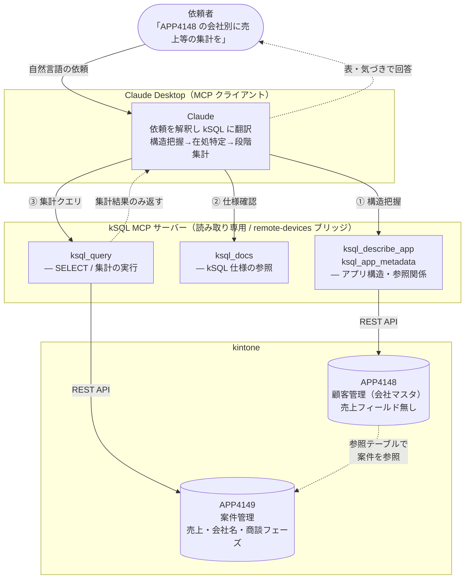

<!-- タイトル: Claude Desktop に「会社別に売上を集計して」と頼むと kSQL MCP は何をするのか — 実際の処理を追う -->

kintone アプリについて、Claude Desktop に **「APP4148 の会社別に売上等の集計を」** とだけ頼んでみます。フィールド名も、売上がどのアプリにあるかも指定していません。

それでも Claude は kSQL MCP サーバーのツールを使って、アプリ構造を調べ → 売上データの在処を突き止め → 段階的に集計まで到達しました。本記事では、その **実際の指示と回答**、そして裏で走った **処理の流れ** をそのまま追います。

自然言語の曖昧な依頼から、AI が自律的にアプリ構造を辿って集計にたどり着く過程の実録です。

リポジトリ:

- https://github.com/rex0220/kintone-sql-tools

# 概要

kSQL は kintone アプリに対して SQL で問い合わせできるツールです。MCP サーバーとして Claude Desktop に接続すると、自然言語の依頼を AI が kSQL に翻訳して実行します。

今回のポイントは、依頼が **アプリ番号ひとつ（APP4148）と「会社別に売上等の集計を」という一言だけ** だったことです。ところが APP4148（顧客マスタ）には売上フィールドがありません。にもかかわらず、Claude は以下を自分で辿りました。

- **結論を先に示すと:**
    - APP4148 に売上が無いことを構造把握で確認し、参照先の **案件アプリ（APP4149）** に売上があると特定した
    - 会社名が案件側に直接あるため **JOIN 不要** と判断した
    - 全体像 → フェーズ別 → 会社別 → 会社×フェーズ、と **粒度を段階的に細かくして** 集計した
    - 表記ゆれ（同一会社と思われる 2 表記）の可能性にも自分で気づいて指摘した

すべて **読み取り専用の kSQL MCP ツール** だけで完結しています。

> **追記（2026-07-23・v3.16.0 / B64）**
>
> 本記事は **v3.15.0 時点** の実録です。その後の **v3.16.0（B64）で集計関数の引数に `CASE` 式を書けるようになり**、本文中で AI が回避した「集計内 `CASE` は不可」という制約（#4・#8・まとめ参照）は解消されました。現在は「受注済み売上」を含めて **1 クエリ** で書けます。
>
> ```sql
> SELECT
>   会社名,
>   COUNT(*) AS 案件数,
>   SUM(売上) AS 売上合計,
>   SUM(CASE WHEN 商談フェーズ = '受注' THEN 売上 ELSE 0 END) AS 受注済み売上,
>   ROUND(AVG(売上)) AS 平均売上
> FROM APP4149
> GROUP BY 会社名
> ORDER BY 売上合計 DESC
> ```
>
> 従来は #7（会社別）と #8（会社×フェーズ別）を分けて統合していましたが、条件付き集計 `SUM(CASE WHEN … END)` で直接まとめられます（実データで #7+#8 統合表と一致を確認）。比較式（`SUM(売上 > 0)`）は kSQL に boolean 型が無いため引き続き非対応で、`CASE` で値を明示します。本文はあくまで **当時の AI の判断過程の記録** としてそのまま残しています。

## 登場人物と関係

依頼者・Claude Desktop・kSQL MCP サーバー・kintone アプリの関係を図にすると、こうなります。依頼者が日本語で頼むと、Claude が kSQL のツールを呼び、MCP サーバーが kintone の REST API を叩いてアプリのデータを取ってくる、という流れです。



ポイントは 2 つです。

- **Claude は kintone を直接触りません。** 必ず kSQL MCP サーバーのツール越しにアクセスし、しかも今回は `ksql_query`（SELECT）と構造把握・仕様参照ツールだけ＝**読み取り専用**です。書き込み（DML）は一切走っていません。
- **APP4148 と APP4149 は参照テーブルでつながっています。** この参照関係を `ksql_app_metadata` で辿れたことが、「売上は案件アプリ側にある」という発見の起点になりました。

## 顧客管理のアプリ関連

題材にした顧客管理まわりのアプリ構成です。

- 顧客管理
    - 担当者管理
    - 案件管理
    - 活動履歴


売上は「顧客管理（APP4148）」ではなく「案件管理（APP4149）」側にあります。依頼者はそれを指定していません。ここを AI がどう辿るかが見どころです。

# Claude Desktop で、kSQL MCP サーバーによる売上集計

## 指示

依頼はこれだけです。

```
APP4148 の会社別に売上等の集計を
```

## Claude の回答

> APP4148 の会社別売上集計ですね。まず kSQL でアプリ構造を確認します。APP4148 は顧客(会社)マスタで、売上そのものは案件アプリ側にありそうです。参照テーブルの関連アプリを確認します。案件アプリ(4149)に売上があります。案件アプリの構造を確認します。案件アプリ(4149)に会社名・売上・商談フェーズ・確度があります。まず件数と全体像を確認します。会社別の集計を取得します。CASE は集計内で使えないようなので、会社別の基本集計と、会社×フェーズの内訳を別々に取得します。APP4149(案件アプリ)を会社名で集計しました。売上は案件アプリ側の「売上」フィールド、会社は「会社名」で、全20件・10社・売上合計 81,800,000円です。

**会社別集計（売上合計の降順）**

| 会社名 | 案件数 | 売上合計 | 受注済み売上 | 平均売上 |
|---|--:|--:|--:|--:|
| 株式会社サイボウズ商事 | 5 | 20,700,000 | 8,100,000 | 4,140,000 |
| 株式会社キントーンシステムズ | 3 | 15,550,000 | 9,300,000 | 5,183,333 |
| 株式会社倉本インターナショナル | 2 | 13,600,000 | 7,100,000 | 6,800,000 |
| 篠村食品株式会社 | 2 | 9,050,000 | 4,200,000 | 4,525,000 |
| 株式会社テクノロジーサービス | 1 | 7,200,000 | 0 | 7,200,000 |
| 株式会社橘川ケミカル | 1 | 6,700,000 | 6,700,000 | 6,700,000 |
| 平川ファイナンスサービス株式会社 | 1 | 5,400,000 | 5,400,000 | 5,400,000 |
| 橋本ネットワーク通信株式会社 | 1 | 3,600,000 | 0 | 3,600,000 |
| サイボウズ物産株式会社 | 3 | 0 | 0 | 0 |
| 株式会社サイボウズ物産 | 1 | 0 | 0 | 0 |
| **合計** | **20** | **81,800,000** | **40,800,000** | — |

> 商談フェーズ別の全体内訳は、受注 8件/40,800,000円、提案中 6件/28,250,000円、内示 2件/12,750,000円、未設定 4件/0円 です。
>
> 気づいた点として、「サイボウズ物産株式会社」(3件) と「株式会社サイボウズ物産」(1件) は表記ゆれの可能性があり、いずれも売上0のテストデータのようです。集計の名寄せをするなら統一しておくと良さそうです。
>
> このあと Excel(会社別シート＋フェーズ内訳)での出力や、顧客マスタ(APP4148)の業種・都道府県・顧客ランクとの掛け合わせ集計もできます。ご希望あれば対応します。

# 売上集計までの手順

回答の裏で走った処理を、段階ごとに表にまとめました。すべて MCP サーバー `kSQL_MCP` のツール呼び出しです。

なお、この手順表そのものも Claude に直接 **「どういう手順で集計したのか教えて」** と聞けば教えてくれます（下表はそうして得たものを整理したものです）。裏で何をしたかがブラックボックスにならないので、レビューや再現に使えます。

| # | 段階 | 目的 | ツール | 引数・SQL | 結果・判明したこと |
|---|---|---|---|---|---|
| 1 | ① 構造把握 | 顧客アプリの中身確認 | `ksql_describe_app` | `app=4148` | 顧客(会社)マスタ。売上フィールドは無し |
| 2 | ① 構造把握 | 関連アプリを特定 | `ksql_app_metadata` | `resource=fields, app=4148` | 参照テーブル「案件一覧」が APP4149 を参照(顧客No = 顧客No_) |
| 3 | ② 在処特定 | 案件アプリの中身確認 | `ksql_describe_app` | `app=4149` | 売上(NUMBER)・会社名・商談フェーズを発見。会社名が案件側にあり **JOIN 不要** |
| 4 | ② 在処特定 | 集計関数の仕様確認 | `ksql_docs` | `section=08-group-by-aggregates` | `SUM(CASE WHEN…)` は不可 → 会社×フェーズ別集計で代替と決定 |
| 5 | ③ 集計 Q1 | 全体像の把握 | `ksql_query` | `SELECT COUNT(*), SUM(売上), COUNT(DISTINCT 会社名) FROM APP4149` | 20件 / 会社名10種類 / 8,180万円 |
| 6 | ③ 集計 Q2 | フェーズ別集計 | `ksql_query` | `SELECT 商談フェーズ, COUNT(*) AS 件数, SUM(売上) AS 売上合計 FROM APP4149 GROUP BY 商談フェーズ` | 受注/提案中/内示/未設定の内訳 |
| 7 | ③ 集計 Q3 | 会社別集計 | `ksql_query` | `SELECT 会社名, COUNT(*) AS 案件数, SUM(売上) AS 売上合計, ROUND(AVG(売上)) AS 平均売上, MAX(売上) AS 最大売上 FROM APP4149 GROUP BY 会社名 ORDER BY 売上合計 DESC` | 会社別の件数・売上合計・平均・最大 |
| 8 | ③ 集計 Q4 | 受注済み売上の算出 | `ksql_query` | `SELECT 会社名, 商談フェーズ, COUNT(*) AS 件数, SUM(売上) AS 売上合計 FROM APP4149 GROUP BY 会社名, 商談フェーズ` | 会社×フェーズ別集計から受注済み売上を抽出 |

流れを 3 段階に整理すると、こうなります。

- **① 構造把握** — APP4148 を調べて「売上が無い → 参照先の案件アプリにある」と辿った（#1〜#2）
- **② 在処特定** — 案件アプリ APP4149 を調べ「会社名が案件側に直接あるので JOIN 不要」と判断し、集計関数の制約（集計内 `CASE` 不可）も先に確認した（#3〜#4）
- **③ 集計** — 全体像 → フェーズ別 → 会社別 → 会社×フェーズ、と **粒度を段階的に細かくして** 積み上げた（#5〜#8）

特に #4 が地味に効いています。`SUM(CASE WHEN 商談フェーズ='受注' THEN 売上 END)` のような書き方を試す前に `ksql_docs` で仕様を確認し、「集計内 CASE は不可」と分かったうえで **会社×フェーズ別集計（#8）から受注済み売上を取り出す** 方針に切り替えています。回答中の「CASE は集計内で使えないようなので…別々に取得します」がこの判断です。（※ この「集計内 CASE 不可」の制約は **v3.16.0 / B64 で解消** されました。詳細は冒頭の追記を参照。）

冒頭の会社別集計表は、この **#7（会社別）と #8（会社×フェーズ別）の結果を統合** して作っています。「受注済み売上」列は #8 のフェーズ＝受注の行から拾った値で、#7 の `最大売上` は最終表では省略しています。また #7 の `ORDER BY 売上合計 DESC` は、`SUM(売上) AS 売上合計` と alias を付けているから参照できています（kSQL では集計値を `ORDER BY` で使うには alias 明示、または `` ORDER BY `SUM(売上)` DESC `` のように合成名を使う必要があります）。

なお MCP はすべて **kSQL_MCP**（remote-devices ブリッジ経由 / device: laptop5 / profile: dev / **読み取り専用**）を使っています。DML は一切実行しておらず、`ksql_query` による参照だけで完結しています。

# まとめ

- **依頼はアプリ番号と一言だけ。** フィールド名も売上の在処も指定していないのに、AI が構造把握から集計まで自力で辿った
- **売上が別アプリにある** ことを参照テーブルのメタデータから特定し、会社名が案件側にあるので **JOIN 不要** と判断した
- **仕様上の制約（集計内 CASE 不可）を事前に確認** し、会社×フェーズ別集計での代替に切り替えた
- **表記ゆれ（同一会社と思われる 2 表記）の可能性** にも気づいて指摘した
- すべて **読み取り専用ツールだけ** で安全に完結した

kSQL MCP は「SQL を書ける AI に kintone を触らせる」ためのツールですが、実際には **AI が自分でアプリ構造を調べ、データの在処を推理し、段階的に集計を組み立てる** という使われ方をします。SQL を 1 本渡すだけでなく、構造把握のためのメタデータ系ツール（`ksql_describe_app` / `ksql_app_metadata`）と仕様参照ツール（`ksql_docs`）が揃っていることが、この自律的な探索を支えています。

関連記事

- [Claude への MCP kSQL 構文の教え方 — AI は独自 SQL の構文を「発明」する](https://qiita.com/rex0220/items/4d9fc0ed48ebd5b32a7b)
- [AI に SQL 方言を使わせる検証ループ — 30 シナリオで見つけた「validate では捕まらない誤り」](https://qiita.com/rex0220/items/7f229c87a20f2d45777c)
- [rex0220 kintone-sql-tools の紹介](https://qiita.com/rex0220/items/b604519f03ad1494f8be)
- [rex0220 kSQL プラグイン](https://qiita.com/rex0220/items/ed9e101cb28b0ed40869)
- [rex0220 kSQL 言語リファレンス](https://qiita.com/rex0220/items/e089fddf4229d74be699)
