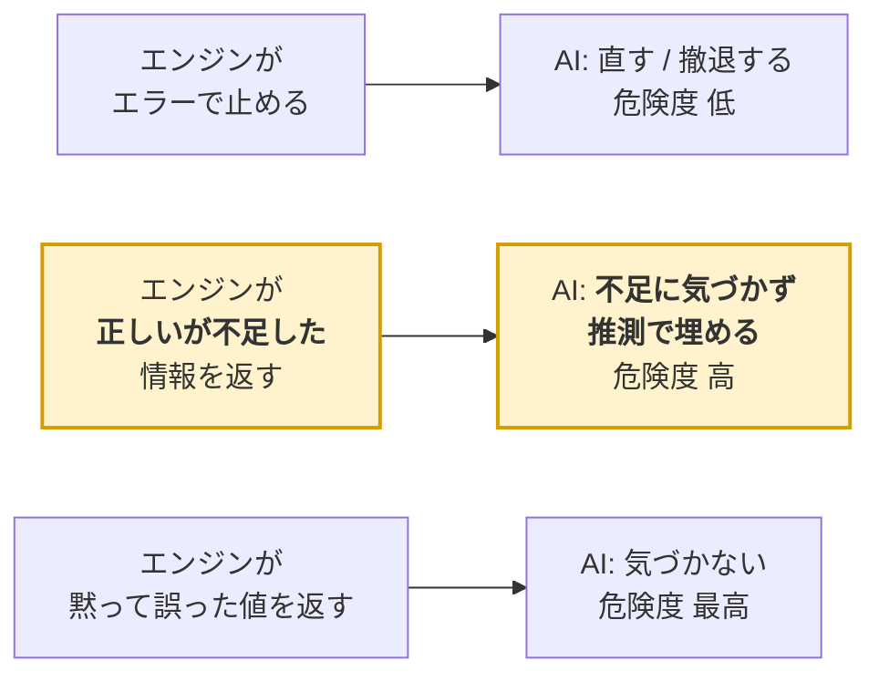

<!-- タイトル: AI が自作 SQL エンジンで誤った 4 箇所を調べたら、バグより「静かに足りない情報」が犯人だった -->

> このファイルは Qiita 投稿用の下書き（`docs/internal/`）です。公開前にアプリ ID・パス・未確定の起票状況を確認してください。

kintone 用の SQL 方言 kSQL を作っています。これまで、**エラーを出さずに誤った値を返す**バグ（v3.44.0 の B119〜B122 など）を潰すことに時間を使ってきました。「静かに間違う」が最悪だからです。

今回、別の記事のために AI（Claude Code）が kSQL で実際の分析を一周した記録が手元にあったので、**エンジンの作者としてその記事の主張を全部裏取り**しました。ソース・言語リファレンス・対象アプリの実設定（`/k/v1/app/form/fields.json`）と突き合わせる作業です。

結果、AI の判断の誤りが 4 件見つかりました。そして**エンジンが返したエラーは、4 件とも正しかった**。誤りの原因は別のところにありました。

リポジトリ:

- https://github.com/rex0220/kintone-sql-tools

関連記事:

- [rex0220 kintone-sql-tools の紹介](https://qiita.com/rex0220/items/b604519f03ad1494f8be)
- [rex0220 kSQL 言語リファレンス](https://qiita.com/rex0220/items/e089fddf4229d74be699)
- [AI に SQL 方言を使わせる検証ループ — 30 シナリオで見つけた「validate では捕まらない誤り」](https://qiita.com/rex0220/items/)（前々回）
- 本記事の題材になった分析記事（前回）

## TL;DR

- AI が誤った 4 箇所を調べたら、**エンジンが返したエラーは 4 件とも正しかった**。止まるべきときに止まっていた
- 誤らせたのは **メタデータツールの分割** と **ドキュメントの索引構造**。どちらもエラーを出さない
- いちばん重いのは `ksql_describe_app` が**フィールドの型しか返さない**こと。`unique` / `lookup` / CALC の式は `ksql_app_metadata` にある。AI は安い方だけを使い、**アプリの設計を誤読したまま記事を 1 本書いた**
- **利用側はエンジンを変えずに直せた。** 分析プロジェクトの規約を「カタログを作るときは `ksql_app_metadata` で取る」に変更。そして測ったら**設計データは 15 フィールドで 2,607 バイト**——**量はまったく問題ではなかった**。見落としの原因はコストではなく、**足りないと気づく手段が無かった**ことだった
- `ksql_docs` のセクション一覧（26 個）に `window-functions` が無く `order-by` に畳まれている。AI は「窓関数は無い」と判断して SQL を諦めた。**判断は正しく、理由が間違っていた**
- 集計算術式の制約（`SUM(a) * 非集計列` は不可）は、パーサが正しく弾くのに**言語リファレンスに 1 行も書いていなかった**
- `EXPLAIN` が通常の `GROUP BY` で落ちる実バグを 1 件特定（B123 として起票）。真因はメタデータ要否の判定に `GROUP BY` が入っていないこと。**`ORDER BY` を 1 つ足すと通る**
- 「静かに間違う」は潰してきたが、その隣に **「静かに足りない」** という帯域があった。**正しいが不足した情報を返すと、AI は不足に気づかずに推測で埋める**

### 検証環境

| | |
|---|---|
| kSQL（kintone-sql-tools） | v3.44.0 |
| 分析を実行した AI | Claude Code / Opus 5（1M context） |
| 裏取りに使った手段 | エンジンのソース、言語リファレンス、`app/form/fields.json`、プロセス管理設定 |
| 題材アプリ | kintone アプリストア「在庫管理パック」（製品マスタ + 入出庫履歴） |

---

## 誤りの帯域: 「静かに間違う」の隣に「静かに足りない」があった

先に結論の形だけ出します。4 件を分類したら、こういう表になりました。

| エンジンの返し方 | AI の挙動 | これまでの対策 |
|---|---|---|
| **エラーで止める** | 直すか、撤退する | 完全入力ガード・ParseError の位置診断・「推測で構文を書かない」鉄則 |
| **正しいが不足した情報を返す** | **不足に気づかず、推測で埋める** | **測っていなかった** |
| 黙って誤った値を返す | 気づかない | B119〜B122 などで継続的に潰している |

一番下の段（静かに間違う）は、ずっと最優先で潰してきました。一番上（止まる）も、止まること自体は設計どおりです。

今回見つかったのは**真ん中の段**です。エンジンは何も間違っていない。返した情報は全部正しい。ただ**足りない**。そして AI は、足りないことに気づく手段を持っていませんでした。



以下、4 件を 1 つずつ書きます。

---

## 1. `describe_app` が型しか返さないことが、記事 1 本を誤らせた

AI は分析の冒頭で `ksql_describe_app` を叩き、2 アプリの構造をカタログに保存しました。その出力はこういう形です。

```json
{"フィールドコード":"製品名","ラベル":"製品名","タイプ":"SINGLE_LINE_TEXT"}
```

そしてこの情報だけを根拠に、記事にこう書きました。

> **結合キーの欠落** — 入出庫履歴に製品番号が無く、**製品名の文字列一致で結合**している。
> 製品名という表示用の文字列が、事実上の主キーになっている。

裏取りのために `app/form/fields.json` を叩いたら、実際はこうでした。

```json
"製品名": {
  "type": "SINGLE_LINE_TEXT",
  "lookup": {
    "relatedApp": { "app": "4229" },
    "relatedKeyField": "製品名",
    "fieldMappings": [ { "field": "仕入先", "relatedField": "仕入先" } ]
  }
}
```

**ルックアップフィールドでした。** さらにマスタ側は `製品名` が `unique: true`（値の重複を禁止）、加えてマスタには関連レコード一覧フィールドがあり、その紐づけ条件も `製品名 = 製品名` です。

```json
"製品名":   { "type": "SINGLE_LINE_TEXT", "unique": true  },
"製品番号": { "type": "SINGLE_LINE_TEXT", "unique": false },
"入出庫履歴": { "type": "REFERENCE_TABLE",
  "referenceTable": { "relatedApp": {"app":"4228"},
                      "condition": {"field":"製品名","relatedField":"製品名"} } }
```

つまりこのテンプレートは「製品名を一意キーにして、ルックアップと関連レコード一覧で親子を結ぶ」という設計を**明示的に選んでいます**。キーが欠落しているのではありません。AI が書いた「表示用の文字列」は誤りで、正しくは「一意制約付きの業務キー」です。

面白いのは、**AI の結論（改称すると在庫が静かに割れる）は正しかった**ことです。理由だけが違いました。kintone のルックアップは**参照ではなくコピー**なので、マスタの製品名を改称しても過去の履歴は旧名のまま残ります。マスタ側の `unique` 制約はこれを検出しません。結果として在庫が 2 つに割れ、どちらもエラーを出さない——AI が指摘した危険はそのまま存在し、しかも一段深いところにありました。

同じ経路でもう 1 件。CALC フィールドの式も `describe_app` には出ません。

```json
"個数_在庫計算用": { "type": "CALC",
  "expression": "IF ( 入出庫区分 = \"出庫\" , -個数 , 個数 )" }
```

AI は「入庫なら +個数、出庫なら −個数」と正しく推測して書きましたが、**正確には「出庫以外はすべて +」**です。区分が必須の 2 択なので実害はありません。ただしこれは推測が当たっただけで、外れる形（3 値目が足された、区分が任意になった）は簡単に作れます。

### なぜこうなったか

`ksql_describe_app` は「SQL を書くための最小情報」に最適化してあります。フィールドコードとラベルと型。**列挙には最適ですが、設計の読解には足りません。** そして足りないことは出力からは分かりません。

しかも、ツールの説明文にはこう書いてあります。

> Return kSQL's compact field list (field code, label, and type). For complete raw field constraints, layout, settings, ... use `ksql_app_metadata`.

**書いてあったのに読まれませんでした。** それどころか AI は同じ記事のコスト分析の節で、`ksql_app_metadata` を「一度も使わなかった。この 1 つ分のスキーマが丸ごと無駄だった」と書いています。**唯一「無駄」と切り捨てたツールが、記事の最大の主張を誤らせた原因**でした。

ここから引ける教訓は 2 つあります。

1. **ツールを分割すると、AI は安い方だけを使って済ませる。** 分割の境界に設計情報を置くと、その情報は読まれません
2. **「別のツールを使え」と説明文に書くのは対策として弱い。** 説明文は「使う前に読むもの」ですが、AI が困るのは**使った後、出力が十分だと思ったとき**です。そのとき説明文はもう視野にありません

### まず測った: 量は問題ではなかった

最初は「`describe_app` に設計情報を足すと常駐コンテキストが増えるので、**増やす量と誤読の確率の交換**になる」と考えていました。測ったら、その前提が外れました。

```
> ksql_app_metadata { app: 4229, resource: "fields" }
responseBytes: 2607
```

**15 フィールドのアプリで 2,607 バイト。** この記事の題材になったセッションは常駐コンテキストが 9 万トークンまで育っていたので、その中では誤差です。しかも設計情報が要るのは**カタログを作る 1 回だけ**で、以後のセッションはカタログ（要約した Markdown）を読みます。

つまり**節約になっていませんでした**。AI が `app_metadata` を呼ばなかったのは、高いからではありません。**呼ぶ必要があると気づかなかった**からです。

### 対策の見立て

コストの問題でないなら、対策も変わります。

**案 1: `describe_app` の出力に設計上の注意を足す。** 型の隣に括弧書きするイメージ。

```
製品名   | 製品名   | SINGLE_LINE_TEXT (lookup→APP4229.製品名)
製品番号 | 製品番号 | SINGLE_LINE_TEXT
個数_在庫計算用 | 個数（在庫計算用） | CALC (IF ( 入出庫区分 = "出庫" , -個数 , 個数 ))
```

**案 2: 出力の末尾に 1 行だけ足す。**

```
note: この出力に lookup / unique / CALC 式 / 選択肢定義は含まれません。
      設計を確認するなら ksql_app_metadata (resource: "fields")。
```

**案 2 のほうが本質的**だと思っています。この節の教訓は「**AI が困るのは、使った後、出力で足りていると思ったとき**」でした。だとすれば、足りないことは**説明文ではなく出力に書く**のが筋です。同じ内容がツールの説明文には既に書いてあり、読まれませんでした。

案 1 は「何を足すか」の判断（`required` は？ `maxLength` は？）が際限なく続きますが、案 2 には判断が要りません。**まず案 2 を入れて、それでも誤読が出るなら案 1 を検討する**、が安いはずです。

### 利用側は、エンジンを変えずに直した

分析プロジェクト側は、エンジンの修正を待たずに規約で塞ぎました。やったのは 5 つです。

1. **カタログ作成の取得を `ksql_app_metadata`（`resource: "fields"`）に一本化。** `describe_app` は使わない
2. **「必ず抜き出す 6 項目」を表にした**（`lookup` / `unique` / `expression` / `options` / `referenceTable` / `enabled: false`）。各項目に「書き落とすと何が起きるか」を添えた
3. カタログの保存フォーマットに **「キーと参照関係」節**を追加
4. 鉄則に 1 条追加 — 「**アプリの設計を型から推測しない。厄介なのは推測がしばしば当たることで、当たっている限り誰も気づかない**」
5. **既存カタログ 2 本を実測値で訂正。** ルールを入れても、誤りを含んだキャッシュが残っていれば次のセッションが同じ誤読をする

**2 が本体です。** ツール名だけ決めても「何を見るか」は決まりません。今回の誤読も、`app_metadata` を呼んでいれば自動的に防げたわけではなく、**返ってきた JSON の中で `lookup` を見る**ことまで決めて初めて防げます。

副産物が 1 つ出ました。`分類`（DROP_DOWN）の `options` には `食品` / `飲料` / **`その他`** の 3 値が定義されているのに、実分布は `食品` 4 / `飲料` 4 で **`その他` は 0 件**でした。`WHERE 分類 IN ('その他')` は必ず 0 行を返します。これは **`options`（定義）と `GROUP BY`（実分布）の両方が揃って初めて出る**もので、片方だけでは絶対に出ません。

ただし**この手が効いたのは、このプロジェクトにカタログ層があったから**です。「1 回だけ丁寧に取り、要約して貯め、以後はそれを読む」という構造が既にあったので、追加コストがほぼゼロで済みました。**カタログ層を持たないプロジェクトでは同じ手は使えません。** だからエンジン側の案 2（出力に 1 行足す）は、利用側が直したあとも依然として要ります。

---

## 2. ドキュメントは「書いてあるか」ではなく「AI が引く索引に出るか」

分析の後半、AI は在庫の累積推移を出そうとして、ウィンドウ関数が必要になりました。そして記事にこう書きました。

> `ksql_docs` の言語リファレンス（全 26 セクション）に**窓関数の独立した項目が見当たりません**。
> `GROUP BY` の章に「ウィンドウ関数のエイリアスは `GROUP BY` に使えない」という記述はあるので
> **存在はする**のですが、構文が確認できない。

ここで AI は、プロジェクトの鉄則に従って撤退しました。

> 8. **推測で構文を書かない。** `ksql_validate` を総当たりして構文を探るのは禁止。

そして SQL を諦め、明細を CSV に落として 40 行のスクリプトで累積を計算しました。

**この撤退は正解です。** kSQL のウィンドウ関数は `ROW_NUMBER` / `RANK` / `DENSE_RANK` の 3 つだけで、`SUM() OVER (...)` のような集計ウィンドウとフレーム句がありません。累積和は書けません。

```ts
// src/mcp/docsResources.ts
window: frozenList(["ROW_NUMBER", "RANK", "DENSE_RANK"] as const),
```

問題は**理由**です。「26 セクションに無い」は事実ですが、言語リファレンス本体には `## 10.1 ウィンドウ関数` という独立した節があり、目次にも載っていて、構文は 3 行で書いてあります。`ksql_docs` が返すセクション一覧に `window-functions` という項目が無く、`order-by` に畳まれているだけでした。

```
basic-rules, select, arithmetic-expressions, case-when, string-number-functions,
where, join, group-by-aggregates, having, order-by, limit-offset, union, with-cte,
show-apps-describe, insert, update, upsert, delete, subtable-virtual-table,
reorder, subqueries, limitations, ui-features, explain, batch-temp-tables, assert
```

26 個。`order-by` を開けば §10.1 が出てきます。AI はそれを開きませんでした。

### 正しい行動を、間違った理由で選んでいた

これが今回いちばん気持ち悪かった点です。**結果だけ見れば成功しています。** 撤退したし、代替手段で正しい答えを出したし、鉄則も守った。

でも理由が違う。AI は「ドキュメントに無いから機能も無いのだろう」と推測したのであって、「機能の一覧を確認したら 3 つしかなかった」わけではありません。**次に同じ形（索引に出ないが実際には書ける機能）にぶつかったら、書けるものを書けないと判断して静かに損をします。**

そして怖いのは、**成功したセッションからはこれが見えない**ことです。成果物は正しい。ログにも「諦めた」としか残らない。記事を書いて、そこに理由が明文化されて、作者がそれを読んで初めて分かりました。

### 対策

- `ksql_docs` のセクションに `window-functions` を足す（純加法）
- 言語リファレンスの `##` 見出しと `ksql_docs` の slug が 1 対 1 で対応しているかを機械検査する

2 つ目は、以前 B104（構文ブロックと文型テンプレートの乖離検知）を「検査が守る対象が小さい」という理由でクローズしています。ただし今回のものは**見出しと slug の突き合わせだけ**で、B104 のように「何を強調するかの判断」が絡みません。安い方の検査なので、これは別物として検討します。

---

## 3. 正しく弾いたのに、なぜ弾くかがどこにも無かった

AI は在庫金額を出そうとして、素直にこう書きました。

```sql
SUM(t.個数_在庫計算用) * m.仕入価格 AS 在庫金額
```

エンジンはこう返しています。

```
ParseError: 集計算術式には集計関数または数値が必要です（位置 144、トークン: 「m」）
```

**これは正しい挙動です。** パーサの集計算術式は、集計関数・数値リテラル・括弧しか受け付けません。

```ts
// src/parser/parser.ts — 集計算術式の一次式: 集計関数 / 数値リテラル / 括弧
private parseAggPrimary(): AggOperand {
  if (this.consume(TokenKind.LPAREN)) { ... }
  if (this.peek().kind === TokenKind.MINUS) { ... }
  if (this.peek().kind === TokenKind.NUMBER) { ... }
  const aggFunc = this.tryAggregateFunc();
  if (aggFunc !== null) return this.parseAggregateRef(aggFunc);
  throw new ParseError("集計算術式には集計関数または数値が必要です", this.peek());
}
```

AI は 1 回で正しい形に直しました。

```sql
SUM(t.個数_在庫計算用 * m.仕入価格) AS 在庫金額
```

**位置とトークンの診断（B120 で足したもの）が効いています。** どこが悪いかが一意に分かるので、無駄なラウンドトリップは起きませんでした。ここは設計どおりです。

ただし記事にはこう書かれています。

> 集計関数と非集計列を掛けるのは kSQL では通りません（`m.仕入価格` は `GROUP BY` に含まれているのですが、**それでも不可**）。

この観察は正しく、しかも**言語リファレンスを grep しても、この制約はどこにも書いていません**。§8「GROUP BY / 集計関数」には集計関数の一覧も、引数に式を指定できること（v3.16.0）も、`SUM(売上 > 0)` が使えないことも書いてあるのに、「集計を含む算術式の被演算子は集計関数か数値リテラルだけ」という一番外側のルールが抜けていました。

エラーメッセージは「何が」を教えてくれますが、「なぜ」と「代わりにどう書くか」は教えてくれません。今回は AI が正解にたどり着きましたが、それは `SUM()` の内側に入れるという回避策が自明だったからです。**§8 に 2 行足せば済む話**でした。

> 集計を含む算術式の被演算子は、集計関数か数値リテラルだけです。`GROUP BY` に含まれる列でも直接は掛けられません（`SUM(a) * 単価` は不可）。グループ内で値が一定なら `SUM(a * 単価)` と内側に入れてください。

---

## 4. B123: `EXPLAIN` が通常の `GROUP BY` で落ちる

これだけは本物のバグでした。AI が改善案を調べる過程で見つけ、記事に切り分け表まで載せています。

```
> ksql_explain: SELECT 分類, COUNT(*) FROM APP4229 GROUP BY 分類
Error: No-op client should not be called.

> CLI: node scripts/q.mjs --dry-run -e "SELECT 分類, COUNT(*) FROM APP4229 GROUP BY 分類"
DryRunError: API call should not happen in dry-run.
```

**集計関数の有無ではなく `GROUP BY` の有無で分かれる**という観察が正確で、真因の特定にそのまま使えました。

作者側で条件を詰めるために、6 形を実測し直しました（v3.44.0）。

| SQL | EXPLAIN |
|---|:---:|
| `SELECT 分類, COUNT(*) FROM APP4229 GROUP BY 分類` | ❌ |
| 同上 ＋ **`ORDER BY 分類`** | ✅ |
| 同上 ＋ **`WHERE 生産状況 IN ('生産可能')`** | ✅ |
| 同上 ＋ **`HAVING COUNT(*) > 1`** | ❌ |
| JOIN ＋ `GROUP BY` | ❌ |
| JOIN ＋ `GROUP BY` ＋ **`ORDER BY`**（分析の主表クエリ） | ✅ |

**分かれ目は `GROUP BY` の有無ではなく、「`GROUP BY` があり、かつフィールドを参照する `WHERE` も `ORDER BY` も無い」ことでした。** `HAVING` は判定に寄与しません。

ついでに、元の切り分け表の 1 行が間違っていたことも分かりました。「JOIN + `GROUP BY` の主表クエリ ❌」とありますが、記事に載っている主表クエリには `ORDER BY m.製品番号` があり、**実測では通ります**。落ちるのは `ORDER BY` を外した形です。AI の切り分けは「`GROUP BY` が犯人」までは正しく、**そこで確信して条件の詰めをやめた**ようです。

### 真因

`EXPLAIN` と CLI の `--dry-run` は、「この文はフォーム定義を読む必要があるか」を 1 つの述語で判定しています。

```ts
// src/core/explainMetadata.ts
function selectNeedsOwnMetadata(statement: SelectStatement): boolean {
  return whereNeedsFieldMetadata(statement.where)
    || normalizeGroupingSpec(statement).type === "GROUPING_SETS"   // ROLLUP / CUBE / GROUPING SETS のみ
    || statement.orderBy.length > 0
    || statement.columns.some((c) => c.type === "WINDOW_COL" && c.orderBy.length > 0);
}
```

**通常の `GROUP BY` がこの述語に入っていません。** B65 で足した `ROLLUP` / `CUBE` / `GROUPING SETS` は入っているのに、素の `GROUP BY a` が漏れています。

結果、`needsAppMetadata` が偽になり、レコード API を呼ばないことを保証するためのダミークライアントが渡されます。

```ts
// src/mcp/tools.ts
const needsAppMetadata = normalized.appBindingByMappedApp.size > 0
  && statements.some(explainNeedsAppMetadata);
const runtime = needsAppMetadata ? await createRuntime(...) : null;
const explainClient = runtime?.client ?? noOpClient();   // ← ここ
```

そのあと `GROUP BY` の計画作成がグループキーの型メタを取りに `getFields` を呼び、ダミークライアントのガードに弾かれます。CLI も同じ述語（`dryRunNeedsMetadata`）を使っているので、MCP と CLI の両方で再現するのは仕様どおりです。

**計画側は `GROUP BY` をメタデータ必要として扱っています。** `ORDER BY` を足して通った計画には、こう出ています。

```
  metadata API: form definition APP4229@dev
  group key 分類: PHYSICAL (source=0, field=分類)
  complete input reason: GROUP_BY, LOCAL_ORDER, AGGREGATE
```

`group key ...: PHYSICAL (source=0, field=分類)` を出すにはフォーム定義が要りますし、`complete input reason` にも `GROUP_BY` が一級の理由として並んでいます。**計画側は必要と扱っているのに、要否の述語にだけ入っていない**という不整合でした。

### 重さの評価と回避策

**エラーで止まっているので、誤った実行計画を返してはいません。** 「静かに間違う」系ではないので優先度は中です。

そして**回避策があります**。`ORDER BY` を 1 つ付けるか、フィールドを使う `WHERE` を足せば述語が真になり、`EXPLAIN` は通ります。したがって正確な表現は「`GROUP BY` の `EXPLAIN` は落ちる」ではなく、**「メタデータ要否の判定に `GROUP BY` が入っていない」**です。修正は述語に 1 行足すだけの純加法になります。

ただし困るのは、**運用ルールが機能しなくなること**でした。分析クエリはほぼ全部 `GROUP BY` を含みます。「JOIN や大量取得を含むものは `EXPLAIN` まで通す」という運用ルールを立てても、集計に対しては最初から通せなかった——これは「ルールを書いた時点で 1 回叩く」を怠った側の問題でもありますが、**エンジンとしては「EXPLAIN を通せ」と言える形を残しておく責任**があります。

**B123 として起票します。**

---

## 効いていた設計

批判ばかり書いたので、意図どおり効いたものも記録しておきます。今回の 4 件と同じセッションで、次の 4 つは正しく働きました。

**① 完全入力ガード** — 1,000 件のアプリに既定の `maxRecords: 500` で集計を投げたので、エンジンが拒否しました。

```
FetchAllLimitError:
集計の正しい結果には完全な候補集合が必要です。complete input reason: AGGREGATE。
取得件数が上限（500 件）を超えました。
```

集計やローカル `ORDER BY` のように完全な入力を要求する計画では、`onLimit: truncate` を無視してエラーにします。**黙って先頭 500 件で集計していたら、在庫は約半分の値で返り、その数字は何のエラーも出さずにそれらしい。** ここは止まって正解でした。

**② `COUNT_TOTAL_COUNT`** — `SELECT COUNT(*) FROM APPn` は `totalCount=true` の単発 GET に落ち、レコードを 1 件も走査せず、`maxRecords` の制限も適用されません。AI はこれを「フローの最初の 1 手」として採用しました（`EXPLAIN` の `record limit: maxRecords/onLimitReached not applied` を読んで自分で気づいています）。

**③ ParseError の位置・トークン診断（B120）** — 3 節のとおり、1 回で直せました。

**④「推測で構文を書かない」鉄則** — 2 節のとおり、正しく撤退しました（理由は間違っていましたが、鉄則そのものは機能しています）。

共通点があります。**エンジンが「できない」「足りない」を明示的に返す形にしてあると、AI は正しく振る舞う。** 逆に、返した情報が正しいのに不足している場合、AI は不足に気づかず埋めます。①〜④ は全部「明示的に返した」側です。

---

## 対応方針

| # | 内容 | 種別 | 優先度 |
|---|---|---|---|
| B123 | `EXPLAIN` / `--dry-run` のメタデータ要否判定に通常の `GROUP BY` が入っていない | 不具合 | 中 |
| — | `ksql_describe_app` の**出力に「この出力に設計情報は含まれない」旨の 1 行**を足す（案 2）。同じ内容はツール説明文に既にあるが読まれなかった。**説明文ではなく出力に書く**。設計情報そのものを型の隣に足す案 1 は、これで足りなければ検討 | 改善 | 中 |
| — | `ksql_docs` のセクションに `window-functions` を足す。あわせて `##` 見出しと slug の対応を機械検査する | 改善 | 中 |
| — | 言語リファレンス §8 に、集計算術式の被演算子の制約と回避形を追記する | 文書 | 中 |

文書だけの変更は単独リリースを出さず、次の機能リリースに同梱します（B116 で確立した運用）。

---

## 注意・限界

- **サンプルは 1 セッション・1 エージェント**（Claude Code / Opus 5）です。他のモデルや他の依頼で同じ誤り方をするかは分かりません
- **「静かに足りない」を網羅的に測ったわけではありません。** 今回は記事の裏取りの副産物として 2 件出ただけで、他の経路（`ksql_app_metadata` / `SHOW APPS` / `EXPLAIN` の診断行）に同じ帯域があるかは未確認です
- **利用側の対策（規約 + カタログ）は、カタログ層があるプロジェクトでしか同じようには効きません。** 「1 回取って要約を貯める」構造が無ければ、設計情報を毎回取るか、取らずに推測するかの二択になります
- **`app_metadata` の実測 2,607 バイトは 15 フィールドのアプリでの値**です。フィールドが 100 を超えるアプリでも一度きりなら問題にならない見込みですが、そこは測っていません
- 題材はアプリストアのテンプレート 1 つで、データは AI 生成のダミーです。アプリ設計の読み取りにくさが一般的かどうかは、この 1 例からは言えません
- B123 は原因特定と再現条件の確定まで（実測 6 形）で、**修正はまだ入れていません**。純加法 1 条件の見立てですが、プラグイン（`desktop.js` は EXPLAIN エンジンをバンドルする）への波及は未確認です

---

## まとめ

1. **「静かに間違う」の隣に「静かに足りない」がある。** 前者はずっと潰してきたが、後者は測っていなかった。エンジンが返した情報が正しくても、不足していれば AI は推測で埋める。そして推測が当たると、成功したセッションからは見えない
2. **ツールを分割すると、AI は先に呼んだ方で済ませる。** しかも理由はコストではなかった——測ったら設計情報は 2,607 バイトで、9 万トークンの常駐の中では誤差だった。**出力が十分に見えたから止まった**だけ。分割の境界は「何が読まれなくなるか」の設計でもある
3. **「別のツールを使え」と説明文に書くのは対策として弱い。** AI が困るのは**使った後、出力で足りていると思ったとき**で、そのとき説明文はもう視野にない。書くなら**出力に書く**
4. **「コストのせいだ」と思ったら測る。** 今回は「常駐トークンとの交換」という前提で対策を考えていたが、測ったら交換ですらなかった。前提が外れると対策の形が変わる（情報を足す → 足りないことを知らせる）
5. **ドキュメントは「書いてあるか」ではなく「AI が引く索引に出るか」で決まる。** §10.1 に独立した節があっても、`ksql_docs` のセクション一覧に出なければ「無い」と判断される
6. **正しく弾いたなら、なぜ弾くかも書く。** 位置とトークンの診断は効いた。しかしその制約自体がリファレンスに無ければ、AI は「そういうものらしい」で通り過ぎる
7. **正しい結果は、正しい理由の証明にならない。** 今回いちばん収穫だったのは、成果物としては成功しているのに理由が間違っていた 1 件を見つけられたこと。これは実行ログからは出てこず、AI が判断の理由を明文化して初めて見えた
8. **利用側で塞げるものと、エンジン側で塞ぐべきものを分ける。** 今回は利用側の規約とカタログで塞げたが、それは「1 回取って要約を貯める」構造が既にあったから。その構造を持たない環境では同じ誤読が再発するので、エンジン側の対策は消えない
9. **ツール名を決めても、何を見るかは決まらない。** 利用側の規約でいちばん効いたのは「`app_metadata` を使え」ではなく、**返ってきた JSON から抜き出す 6 項目を表にしたこと**だった
10. **AI に自分のツールを使わせた記録は、最良のテストケースになる。** ただし記録を読むだけでは足りず、**主張をソースと実データに突き合わせる**まで含めて 1 セット。人間のレビューでも同じことをするはずのものが、相手が AI だと省略されがちになる

本記事で見つかった修正は、次のリリースに含める予定です。

- https://github.com/rex0220/kintone-sql-tools
