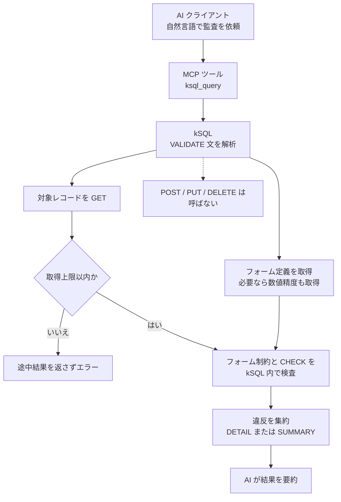

<!-- タイトル: AI にひと言。kSQL MCP で kintone 既存レコードのフォーム制約違反を一括監査 -->

kintone の保存済みレコードが「今のフォーム制約を満たしているか」を、AI クライアントからひと言で監査できる `VALIDATE` を紹介します。

リポジトリ:

- https://github.com/rex0220/kintone-sql-tools

関連記事

- [rex0220 kintone-sql-tools の紹介](https://qiita.com/rex0220/items/b604519f03ad1494f8be)
- [rex0220 kSQL プラグイン](https://qiita.com/rex0220/items/ed9e101cb28b0ed40869)
- [rex0220 kSQL 言語リファレンス](https://qiita.com/rex0220/items/e089fddf4229d74be699)
- [rex0220 kintone レコード制約チェッカー](https://qiita.com/rex0220/items/de02e64dc34f3362d1f8)

## フォーム設定を変えた後、既存レコードは大丈夫？

kintone でフォームの制約を変えても、保存済みレコードは自動で再点検されません。

たとえば、こんなときに古いデータが現在のルールに合わなくなります。

- 必須や文字数の制約を追加した
- 選択肢を変更・削除した
- 移行データを現在のルールで確認したい

kSQL の `VALIDATE` 文なら、既存レコードをまとめて監査できます。結果に出るのは、違反したレコードとその理由です。読み取り専用なので、レコードは変更しません。

この記事では、MCP サーバーを使って AI クライアントから実行します。同じ `VALIDATE` 文は CLI や kintone プラグインでも使えます。

## VALIDATE の仕組み

`VALIDATE` は、kintone からフォーム定義とレコードを読み取り、kSQL 内で制約を検査します。



フォーム定義との照合は kSQL 側で行うため、監査によってレコードが変更されることはありません。

標準で監査する主な制約は次のとおりです。

- 必須項目の未入力
- 文字列の最小・最大文字数
- 数値の最小値・最大値・整数部桁数
- ドロップダウン、ラジオボタン、チェックボックス、複数選択の選択肢
- サブテーブル内の子フィールドに設定された上記の制約

## AI クライアントからひと言で実行

> 本記事の例は、サブテーブル監査と `SUMMARY` に対応した **kintone-sql-tools v3.7.0 以降**が前提です。MCP サーバーの設定と、対象アプリを参照できる認証情報もあらかじめ用意してください。

kSQL を MCP サーバーとして登録済みなら、MCP 対応クライアントへの指示はこれだけです。`APP4221` の `4221` は対象アプリのIDに置き換えてください。

```text
kSQL で、VALIDATE APP4221
```

### Claude Desktop


### VS Code + Claude Code


### Codex


### Antigravity


どのクライアントでも、AI が MCP ツールの `ksql_query` を選び、`VALIDATE APP4221` を実行して結果を要約します。SQL の組み立てと結果の読み解きを自然言語で依頼できるのがポイントです。

## kSQL プラグインから直接実行（参考）

MCP を使わず、kintone アプリに導入した kSQL プラグインから同じ `VALIDATE` 文を直接実行することもできます。


## CLI から直接実行（参考）

CLI でも同じ `VALIDATE` 文を実行できます。

```powershell
node .\dist-cli\ksql.js --profile dev -e "VALIDATE APP4221"
```

`dev` は筆者環境のプロファイル名です。利用する設定に合わせて変更してください。

実行結果（主要列を抜粋して整形）:

```text
$id  $err_field    $err_code       $err_message                                           $err_subtable  $err_subrow  $err_count
1    文字列MIN     ERR_LENGTH_MIN  文字列MIN は 3 文字以上で指定してください                                             1
1    文字列MINMAX  ERR_LENGTH_MIN  文字列MINMAX は 3 文字以上で指定してください                                          1
...省略...
6    文字列T2      ERR_LENGTH_MIN  文字列T2 は 3 文字以上で指定してください（2行: 2,3）  テーブル       2,3          2
7    文字列T2      ERR_LENGTH_MIN  文字列T2 は 3 文字以上で指定してください（2行: 1,2）  テーブル       1,2          2
rowCount=10 errorRecords=6 errorCount=12
```

CLI の末尾にも、表示行数、違反レコード数、集約前の違反件数が表示されます。


## 結果の見方

`VALIDATE` の詳細出力は固定 9 列です。

| 列 | 内容 |
| --- | --- |
| `$id` | 違反レコードのレコード番号 |
| `$err_field` | 違反フィールドコード |
| `$err_code` | エラーコード（`ERR_REQUIRED`, `ERR_LENGTH_MIN`, `ERR_RANGE_MAX` など） |
| `$err_message` | 人間向けメッセージ |
| `$err_value` | 違反時の値 |
| `$err_subtable` | サブテーブル違反のときのテーブルコード |
| `$err_subrow` | サブテーブル内の該当行番号（1始まり、複数はカンマ区切り） |
| `$err_subrow_id` | 該当行の永続行 ID（複数はカンマ区切り） |
| `$err_count` | 同一メッセージの集約件数 |

各実行例で使用したアプリ（APP4221）では、こんな結果になっています。

- レコード 1〜4: `文字列MIN` / `文字列MINMAX` が空で「3 文字以上」違反
- レコード 6, 7: サブテーブル「テーブル」の `文字列T2` が 3 文字未満（該当行は `$err_subrow` に `2,3` のようにまとまる）
- 結果メタデータの `validateStats` は、エラー 6 レコード / 12 件

サブテーブルは違反行を 1 行ずつ出さず、同一メッセージを 1 行に集約して全該当行の行番号・行 ID をリストで持つので、結果行の増加を抑えられます。MCP の応答がコンパクトになり、AI が消費するコンテキストも節約できます。

結果に出るのは違反だけです。0 行なら「今回の対象範囲で、kSQL が検査する制約への違反は見つからなかった」という意味であり、権限・重複禁止・ルックアップ先の存在・JavaScript カスタマイズなどを含むアプリ全体の健全性を保証するものではありません。

## 対象を絞る・条件を付ける

`VALIDATE` は SQL 文なので、監査対象やスコープを構文で指定できます。

```sql
-- フィールドを絞る（サブテーブルは テーブル(子, ...) 形式）
VALIDATE APP100 (顧客コード, 明細(数量, 単価));

-- 最近のレコードだけ監査
VALIDATE APP100 WHERE 作成日時 >= '2026-01-01';

-- フォーム制約に加えて業務ルールも検査
VALIDATE APP100
CHECK WHEN 金額 < 0 THEN '金額が負です'
CHECK WHEN ステータス = '受注' AND 納期 = '' THEN '受注済みなのに納期が未入力';
```

`(fields)` を省略すると、制約を持つトップレベル／サブテーブル子フィールドと、全 `NUMBER` フィールド（整数部桁数チェック）が自動で対象になります。まずはフィールド指定なしで全体を監査し、必要に応じて対象を絞るのが基本です。

アプリ固有の業務ルールは `CHECK` で追加します。なお、`WHERE` と `CHECK` からサブテーブル子フィールドを直接参照することはできません。

## 大量データは SUMMARY で規模把握

違反が大量にありそうなアプリは、メッセージや値を含む詳細行を作らず、レコード・テーブル・フィールド・エラーコード単位で件数を集約する `SUMMARY` が便利です。

```sql
VALIDATE APP100 SUMMARY;
```

出力は `$id`, `$err_subtable`, `$err_field`, `$err_code`, `$err_count` の固定 5 列です。`$id` は残るためアプリ全体で1行にまとめる機能ではありませんが、サブテーブルの違反行を先に畳み込み、修正対象レコードと件数を軽量に把握できます。

## バッチで絞り込み・二次加工

複文バッチと一時テーブルを組み合わせると、監査結果を SQL で二次加工できます。

```sql
VALIDATE APP100 INTO #err;
SELECT $err_field, $err_code, COUNT(*) AS 件数
FROM #err
GROUP BY $err_field, $err_code
ORDER BY 件数 DESC;
```

この結果をさらに並べ替えたり、フィールド別の件数表を作ったりする処理も、AI に自然言語で依頼できます。

## 安全設計

既存データ監査という性質上、`VALIDATE` は安全側に倒しています。

- **完全 read-only**: フォーム定義・設定・レコードの読み取り API だけを使い、書き込み API は呼びません
- **監査の抜けを許さない**: 取得上限に達した場合は途中結果を返さずエラー（truncate 不可）。「途中まで監査して違反 0 件に見える」事故を防ぎます
- **書き込み前の検証は別文**: 新規登録・更新データの事前検証には DML 末尾の `VALIDATE ONLY` があり、こちらも書き込みゼロで検証だけ実行できます

全件監査で取得上限に達した場合は、上限を引き上げるか、`WHERE` で期間やレコード番号を分割して再実行します。失敗した実行の途中結果を監査結果として扱わないことが重要です。

## まとめ

- フォーム制約を変更しても、保存済みレコードの一括再点検は自動では行われない
- kSQL の `VALIDATE APP…` は、保存済みレコードをフォーム制約＋任意の `CHECK` で一括監査する read-only 文
- MCP 経由なら Claude Desktop / Claude Code / Codex / Antigravity などから「kSQL で、VALIDATE APP4221」のひと言で実行でき、結果の要約まで AI に任せられる
- `(fields)` / `WHERE` / `CHECK` / `SUMMARY` / `INTO #err` で、絞り込みから二次加工まで SQL として組み立てられる

制約を追加・変更したアプリの「棚卸し」に、まず 1 回流してみてください。

---
