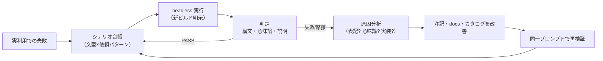

<!-- タイトル: AI に SQL 方言を使わせる検証ループ — 30 シナリオで見つけた「validate では捕まらない誤り」 -->

前編「[Claude への kSQL 構文の教え方](（公開後に URL を設定）)」では、AI が独自 SQL の構文を「発明」する問題を MCP instructions の構文カタログで解決しました。ただし記事はこう締めています——**「まだ 1 シナリオの成功でしかない」**。

本記事はその続きです。検証シナリオを 1 → 30 に増やしてループを回した結果、**構文の発明はゼロのまま**でしたが、代わりに**もっと厄介な誤り**——`ksql_validate` が通るのに意味がずれる SQL——を 1 件検出しました。見つけて、直して、同じ依頼の再検証で解消を実証するまでの記録と、そこから得た手法をまとめます。

リポジトリ:

- https://github.com/rex0220/kintone-sql-tools

関連記事

- 前編: Claude への kSQL 構文の教え方（公開後に URL を設定）
- [rex0220 kintone-sql-tools の紹介](https://qiita.com/rex0220/items/b604519f03ad1494f8be)
- [rex0220 kSQL 言語リファレンス](https://qiita.com/rex0220/items/e089fddf4229d74be699)

## 検証ループの作り方

仕組みは単純で、**headless の Claude Code に、ビルドしたての MCP サーバーを明示指定して、意図だけを日本語で依頼する**だけです。

```bash
claude -p "APP◯◯ の金額を 10% 引き上げる更新をしたいが、
引き上げ後に 100000 を超える行は更新せずエラー内容つきで隔離し、
正常な行だけ更新するバッチ SQL を書いて、ksql_validate で検証して。
実行はしないで。" \
  --mcp-config new-build-mcp.json --strict-mcp-config \
  --allowedTools "mcp__ksql__ksql_validate,mcp__ksql__ksql_docs,mcp__ksql__ksql_describe_app"
```

ポイントは 4 つ:

1. **構文を一切教えない**。意図だけを伝え、正しい構文へ到達できるかを見る（教えたら検証にならない）
2. **新ビルドを明示指定する**。常駐の MCP サーバーは古いビルドを掴み続けることがあり、改善が反映されていないものを検証してしまう
3. **read-only ツールだけ許可**。`ksql_validate`（構文検証）までで実行はさせない
4. **判定は「期待構文要素の一発出現」**。試行錯誤（ParseError→書き直し）の回数も記録する

シナリオは「文型 × 依頼パターン」の台帳として管理し、**実際の失敗が観測されたらその再現プロンプトを台帳へ追加**します。



## 30 シナリオの概況

5 ラウンド・計 30 シナリオを実施しました。

| ラウンド | 対象 | 結果 |
|---|---|---|
| 1 | DML 系 5（UPSERT / UPDATE FROM / APPLY / IMPORT / VALIDATE） | 5/5 PASS |
| 2 | 読み取り系 6（JOIN / CTE＋ウィンドウ / 統計×日付軸 / KLIKE / サブテーブル / 変数） | 6/6 PASS |
| 3 | バッチ 3（temp＋ASSERT / 複数 CTE / **UPDATE＋CHECK**） | 2 PASS・**1 意味論 FAIL** |
| 4 | 変数×5 文型／CHECK×4 文型の組合せ 8 | 8/8 PASS |
| 5 | 未カバー領域 8（REORDER / EXPLAIN / UNION ALL / 負性能力ほか） | 8/8 PASS |

**構文の発明は 30 件を通してゼロ**。前編のカタログは機能していました。問題は別の層で起きました。

## 唯一の本物の失敗: validate が通るのに意味が違う

ラウンド 3 の「金額を 10% 引き上げるが、**引き上げ後に** 10 万を超える行は隔離して」という依頼で、Claude はこう書きました。

```sql
UPDATE APP4221
SET 金額 = 金額 * 1.1
WHERE $id > 0
CHECK WHEN 金額 > 100000 THEN '引き上げ後の金額が 100000 を超過するため未更新'
ON ERROR SKIP INTO #err;
```

構文は完璧です。`ksql_validate` も `ok: true`。しかし kSQL の `UPDATE` の `CHECK` は**更新前の値**を評価するため、この SQL が隔離するのは「現在すでに 10 万を超えている行」——依頼とは**別物**です。正解は SET 式を CHECK に再掲する `CHECK WHEN 金額 * 1.1 > 100000` でした。

さらに厄介なことに、Claude はリファレンスの**別の文**（組み込み制約検証は SET 適用後の値を検証する、という記述）を CHECK に誤って当てはめ、「CHECK は更新後の値を評価します」と**根拠を引用しながら逆の説明**をしていました。もっともらしい引用つきの誤りは、人間のレビューでも見逃しやすい形です。

ここで分かるのは、保証には**三層**あるということです。

| 層 | 内容 | 守る手段 |
|---|---|---|
| 1 | カタログ（文書）が正しい | 機械 guard（カタログの構文例を全てパーサに通すテスト） |
| 2 | AI がカタログを正しく読める | 行動検証（表記の摩擦＝前編の括弧誤読など） |
| 3 | **AI が意味論まで正しく使える** | **行動検証のみ**。validate も構文 guard も無力 |

## 直して、同じ依頼で証明する

対策は「混同の発生源」に狙いを絞りました。

1. **instructions へ 1 文**（常時可視・約 16 語）: `UPDATE CHECK sees pre-update values; to test the new value, repeat the SET expression inside CHECK.`
2. **リファレンスの混同元の文へ相互参照**: 「これは組み込み制約検証。CHECK の評価行は別（UPDATE は更新前値・文種別一覧は §17.3）」
3. ついでに、検証で見つかった変数まわりの摩擦（`@x / 2` の算術・変数名の文字規則・`VALUES` への変数）に対応する**配置詳細表**をリファレンスへ追加。この表は**パーサの特性化テストと ID（A01〜A13／R01〜R05）で一対一対応**させ、「文書＝テスト＝実装」の三者一致を機械的に保ちます

そして**修正前とまったく同じ依頼文**で再検証しました。

| 項目 | Before | After |
|---|---|---|
| CHECK の意味論 | FAIL（更新前値で判定・逆の説明） | **PASS** — `金額 * 1.1 > 100000` を生成し、「`金額 > 100000` と書くと更新前値の判定になり業務ルールと一致しない」と**以前の誤りパターンを反例として説明** |
| 変数まわりの試行錯誤 | 計 5 回（ParseError→自己修正） | **計 1 回** |

「同一入力での before/after」が取れるのが、この検証ループのいちばん気持ちいいところです。

## AI が期待を超えてきた場面

30 シナリオの多くは「正しく書けるか」のテストですが、いくつかは**「できないことを、できないと言えるか」**（負性能力）のテストでした。結果は予想の上を行きました。

**相関サブクエリ（kSQL 非対応）を求める依頼** — 「同じカテゴリ内に自分より金額が大きいレコードがあるものだけ抽出。重複が出る結合は禁止」。Claude は相関 `EXISTS` が使えないことを正しく認識した上で、**要件と等価な非相関の再定式化**を返しました。

```sql
WITH r AS (
  SELECT レコード番号, ドロップダウン, 金額,
         RANK() OVER (PARTITION BY ドロップダウン ORDER BY 金額 DESC) AS rk
  FROM APP4221
)
SELECT レコード番号, ドロップダウン, 金額 FROM r WHERE rk > 1
```

「`rk > 1` ⟺ 厳密に大きい別レコードが存在（同額の最大タイは全員 rk=1 で正しく除外）」という**等価性の証明つき**です。

**GROUP_CONCAT の連結順（関数内 ORDER BY 非対応）** — 「取得順が変わっても必ず同じ連結順に」という依頼に、「非対応なので不可能」ではなく、**一時テーブルへ先にソートして実体化し、収集順そのものを固定する**手法を返してきました。DISTINCT が初出順を保つ仕様まで踏まえた、実際に有効な決定性エンジニアリングです。

**DELETE への業務ルール（CHECK 非対応）** — 「CHECK は DELETE に使えない」と根拠つきで正答した上で、保護条件の WHERE 直接埋め込み＋件数 ASSERT の二重ゲート＋非アトミック実行を前提にした整合チェックまで構成しました。

## 検証する側も間違える

もう一つ書いておくべき教訓があります。ラウンド 5 のシナリオ設計は別の AI（codex）に任せたのですが、その**提案に含まれる「判定基準」自体に誤りが 1 件**ありました。「空セルの除外に `IS NOT NULL` だけを使ったら FAIL」という基準です——実際の kSQL では `IS NULL` が空文字判定なので、`IS NOT NULL` は空セル除外として**正しい**書き方でした。

実行前に言語仕様と突合していなければ、**正答を FAIL と誤採点**するところでした。シナリオの提案も、判定基準も、検証対象です。

## まとめ: 検証ループの教訓

1. **構文カタログは「発明」を止める。しかし意味論の誤りは止められない**。保証は三層（カタログが正しい／AI が読める／意味論まで使える）で、三層目は行動検証でしか見つからない
2. **同一プロンプトの before/after が最強のエビデンス**。改善の効果を数値（FAIL 件数・自己修正回数）で示せる
3. **失敗は資産**。観測された失敗の再現プロンプトを検証台帳へ足し続けると、台帳がその方言の「AI がつまずく場所の地図」になる
4. **負性能力もテストする**。「できないと言えるか」を試すと、AI は時に「できない」ではなく「正しい代替」を返してくる——それが検証できるのもこのループの面白さ
5. **判定基準も裏取りする**。検証する側（人間も AI も）の思い込みが誤採点を生む

この検証で入った改善は kSQL v3.15.0 に含まれています。

- https://github.com/rex0220/kintone-sql-tools
