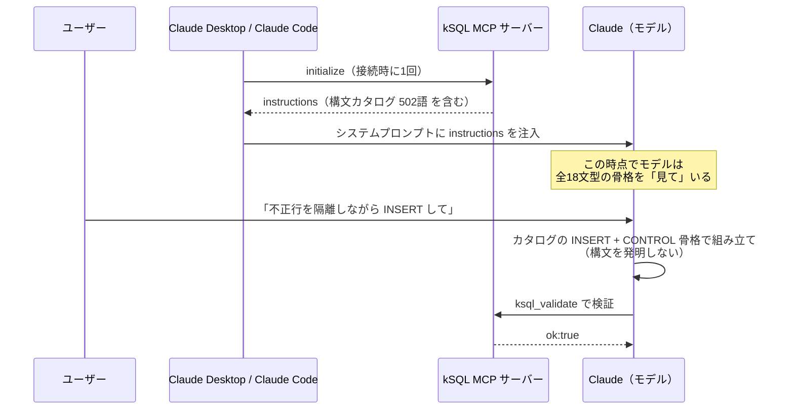
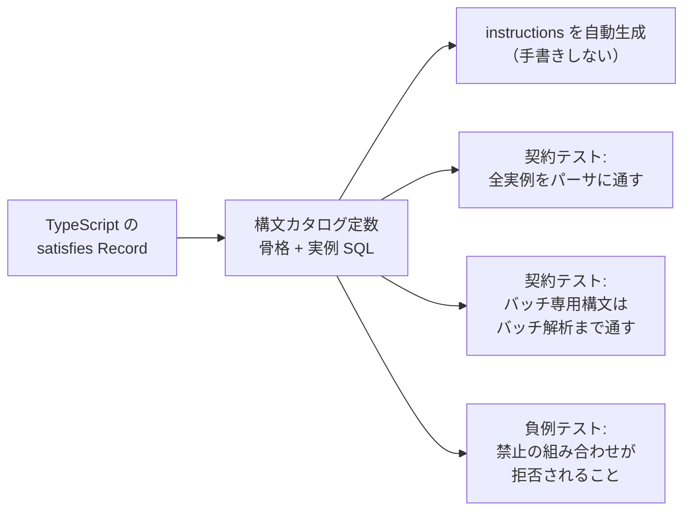

<!-- タイトル: Claude への MCP kSQL 構文の教え方 — AI は独自 SQL の構文を「発明」する -->

Claude（AI クライアント）に kintone 用の SQL 方言「kSQL」で DML を書かせたら、**存在しない構文を自信満々に組み立てた**——という実際に起きた問題と、それを MCP server instructions の「構文カタログ」で解決した話です。

記事の後半に、解決後の Claude Desktop の実際の回答と生成された SQL をそのまま載せています。独自の DSL や SQL 方言を AI に使わせたい人に向けて、うまくいった設計と検証方法をまとめます。

リポジトリ:

- https://github.com/rex0220/kintone-sql-tools

関連記事

- [rex0220 kintone-sql-tools の紹介](https://qiita.com/rex0220/items/b604519f03ad1494f8be)
- [rex0220 kSQL プラグイン](https://qiita.com/rex0220/items/ed9e101cb28b0ed40869)
- [rex0220 kSQL 言語リファレンス](https://qiita.com/rex0220/items/e089fddf4229d74be699)

## 起きたこと: Claude が INSERT の「ON ERROR」を知らなかった

kSQL には、INSERT のバッチで不正な行だけを隔離して有効な行だけを書き込む構文があります。

```sql
INSERT INTO APP100 (顧客コード, 金額)
SELECT 顧客コード, 金額 FROM #source
ON ERROR SKIP INTO #err REJECT LIMIT 100;

SELECT * FROM #err;
```

ところが Claude Desktop（MCP 経由）に「不正行を隔離しながら INSERT して」と頼んだとき、この `ON ERROR SKIP INTO #err` を知らず、**それらしい別の構文を発明**して組み立てました。当然パースエラーになります。

興味深いのは、Claude は **`ON ERROR SKIP` という機能の存在自体は知っていた**ことです。それでも書けなかった。なぜでしょうか。

## なぜ起きるのか: 「名前」と「意味」はあるが「文法」がない

当時 MCP サーバーが AI に渡していた情報を整理すると、きれいに 1 層だけ抜けていました。

| 層 | 提供していた情報 | 例 |
|---|---|---|
| 機能名 | ✅ instructions に列挙 | 「ON ERROR SKIP をサポートする」 |
| 意味論 | ✅ ツール説明に散文で記載 | 「検証に落ちた行を隔離し有効行だけ書き込む」 |
| **文法骨格** | ❌ **どこにもない** | **文のどこに、どう書くのか** |

名前と意味だけ知っていて文法を知らない場合、LLM は SQL の一般常識から「それらしい構文」を推論します。これが**構文の発明**です。他の RDB 方言の知識が豊富なほど、もっともらしく間違えます。

実はこのサーバーでは、同じ構造の問題を一度解決していました。以前は「**関数の存在**を知らない → 検証ツールに関数名を総当たりで流して推定する」という AI の行動が観測され、instructions に全量の関数カタログ（「このリストが完全。他方言の関数は存在しない」と明言）を載せたところ、総当たり行動が消えました。

今回はその**構文版**です。解決策も同じ方針でいけるはずです。

## 解決: Statement syntax catalog（v3.14.0）

MCP server instructions に、**全 18 文型の構文骨格を圧縮表記で常時提示**する段落を追加しました。実物の抜粋です。

```text
Statement templates: CHECKS := [CHECK WHEN cond THEN 'msg' [WHEN ...] ]...
CONTROL := [VALIDATE ONLY [INTO #err] | ON ERROR SKIP INTO #err [REJECT LIMIT n]].
SELECT: SELECT[DISTINCT] cols [FROM APPn|APPn$tbl|#t ...][WHERE][GROUP BY]...;
INSERT: INSERT INTO APPn(cols){VALUES(...)...|SELECT...} CHECKS CONTROL;
UPSERT: UPSERT INTO APPn(cols){VALUES...|SELECT...} ON DUPLICATE(key[,key]...) CHECKS CONTROL;
...
CHECKS precedes CONTROL. VALIDATE ONLY and ON ERROR SKIP are mutually exclusive.
INTO #err requires a multi-statement batch.
These are all supported top-level statement families. Do not invent other
statement families or clause orders.
```

設計のポイントは 4 つです。

1. **共通記法を先に一度だけ定義する**: `CHECKS` / `CONTROL` のような末尾句は多くの文型で共通なので、記法として定義してから各文型を 1 行で書く。instructions は常時 AI に渡るテキストなので、トークン量との戦いです（この段落込みで全体 502 語に収めています）
2. **句順・併用規則も明示する**: 「CHECKS は CONTROL の前」「VALIDATE ONLY と ON ERROR SKIP は択一」「INTO #err はバッチ専用」——今回の失敗の再発防止に直結する制約です
3. **completeness を宣言する**: 「これが全文型。他の文型や句順を発明するな」。関数カタログで効いた「発明禁止の明言」の構文版です
4. **行動規範を足す**: 「初めて使う文型は、組み立てる前に `ksql_docs`（ドキュメント取得ツール）で該当章を確認する」

## カタログはどうやって Claude に届くのか（MCP の仕組み）

「instructions に載せる」と書きましたが、これがどう Claude に伝わるのかを見ておきます。ここを理解すると「なぜ instructions を選んだのか」が明確になります。

### initialize 応答の instructions フィールド

MCP では、クライアント（Claude Desktop / Claude Code）がサーバーへ接続すると、最初に `initialize` というハンドシェイクが行われます。サーバーはこの応答に **`instructions` フィールド**（MCP 仕様で定義された文字列）を含めることができ、kSQL サーバーは構文カタログをここに載せています。



重要なのは、クライアントが instructions を**モデルのシステムプロンプトへ注入する**ことです。つまりモデルは、ユーザーが何か頼む前から——**ツールを1つも呼ばないうちから——カタログを「見て」います**。「AI が構文を調べに行ってくれるか」に賭ける必要がありません。

手元で確認するのも簡単で、サーバーを直接起動して `initialize` を送ると、応答の `instructions` にカタログ段落がそのまま入っているのが見えます。

### なぜ instructions なのか: 4 つの伝達経路の使い分け

MCP サーバーからモデルへ情報を渡す経路は 1 つではありません。kSQL サーバーでは特性に応じて使い分けています。

| 経路 | モデルに届くタイミング | 特性 | kSQL での用途 |
|---|---|---|---|
| **instructions** | **接続時から常時** | 全会話で必ず見える。ただし毎会話トークンを消費 | **構文カタログ・関数カタログ・行動規範**（発明を防ぐには常時可視が必須） |
| tool description | ツール一覧として常時 | ツールを選ぶ瞬間に効く | `ksql_mutate` に DML 末尾句のテンプレート |
| tool 呼び出し（`ksql_docs`） | モデルが読みに行ったとき | 詳細を必要なだけ。ただし「読みに行く」行動が前提 | IMPORT の全オプションなど長大な文法の詳細 |
| resources | クライアント依存 | **Claude Desktop のリモート接続経路では中継されない**（実測） | 補助（当てにしない） |

この使い分けが今回の設計の芯です。**「構文を発明させない」ためには、骨格が常に視界に入っている必要がある**——だから常時可視の instructions。一方で全文法を instructions に書くとトークンを浪費するので、**骨格だけを 502 語に圧縮して常時提示し、詳細は `ksql_docs` へ読みに行かせる**（そのための行動規範）という 2 段構えにしています。

実際、前章の Claude Desktop の回答をもう一度見ると、この 2 段構えのとおりに動いています。カタログで `INSERT ... ON ERROR SKIP INTO #err` の骨格を知った上で、組み立て前に `ksql_docs` で隔離パターンの章（R6）を読みに行っています。

## 信頼性の担保: 「カタログに載る構文は必ずパーサを通る」

構文カタログには特有のリスクがあります——**カタログ自体が間違っていたら、AI に間違いを教える装置になる**。

実際、それは起きかけました。仕様レビュー（別の AI にコードとの突合レビューをさせています）で、**「構文の発明を禁止する仕様」の草案自身に発明された構文が 2 つ**見つかったのです。

- `UPDATE ... FROM` の骨格に必須のソース別名が抜けていた
- `UPSERT` を「先頭列がキー」と書いていたが、実際は `ON DUPLICATE (キー列...)` が必須

人間（と AI）が書くカタログは間違える。だから機械で守ります。



- カタログは `{ 骨格, 実例 SQL }` のペアを持つ TypeScript 定数で、instructions の段落は**この定数から自動生成**します（手書きの二重管理をしない）
- **全実例を実際にパーサへ通す契約テスト**を置きます。「カタログに載っている構文は必ず受理される」が機械的に保証されます
- `ON ERROR SKIP` のようなバッチ専用構文はパーサ単体では受理されてしまうので、**バッチ解析まで通します**。逆に「単文での ON ERROR SKIP」「VALIDATE ONLY と ON ERROR SKIP の併用」などの**負例が拒否されること**もテストで固定します
- 文型一覧そのものは `satisfies Record<StatementSyntaxId, Entry>` で型レベルに保証し、うっかり 1 文型消してもコンパイルエラーになります

## 解決後の実際の回答（Claude Desktop・一次資料）

カタログ入りの v3.14.0 をインストールした Claude Desktop に、発端と同じ趣旨の依頼をした実録です。

### 指示

> APP4149 に一時テーブルから INSERT するバッチを書いて。不正な行があっても全体を失敗させず、不正行を隔離して有効行だけ書き込む形にして、ksql_validate で検証まで。実行はしないで

### Claude Desktop の回答（全文）

> kintone プラグイン開発の文脈ですね。APP4149 への一時テーブルからの INSERT バッチを、不正行を隔離しつつ書くという依頼を承りました。まず kSQL の仕様と APP4149 のスキーマを確認します。
>
> まず必要なツールを読み込みます。kSQL のドキュメント索引と APP4149 のスキーマを確認します。中核となる R6（不良データ隔離）、INSERT、バッチ・一時テーブルのドキュメントを読みます。一時テーブルの作り方（R5）と、APP4149 の書き込み可能フィールドの制約（必須・選択肢）を確認します。APP4149（案件アプリ）のスキーマと制約、R6（不良行隔離）パターンを把握しました。書き込み可能な代表フィールドと、隔離を実演できるバッチを組み立てます。まずタスクを登録します。Validate with `ksql_validate`（実行はしません）。検証は通過しました（`ok:true`、INSERT 文が `targetAppId:4149` / `isOnErrorSkip:true` / `#err` 生成 / `tempOnlySource:true`）。念のため実行計画も確認します（read-only）。検証・実行計画とも `ok:true`。バッチは完成しました。ファイルを納品します。できました。バッチの構成と注意点をまとめます。
>
> 構成は5文です。まず取込元を一時テーブル `#staging` に実体化（R5 の `SELECT … UNION ALL` 形式。実データは6行入れてあり、うち2行が正常、4行が意図的に不正)、次に `ASSERT` で件数ゲート、続く `INSERT INTO APP4149 … SELECT … FROM #staging ON ERROR SKIP INTO #err REJECT LIMIT 100` が本体で、ローカル検証に落ちた行だけを `#err` に隔離し合格行だけを登録します。最後に `#err` を業務キー（案件名）単位で `GROUP_CONCAT($err_message)` により1行へ要約し、隔離行と理由を返します（0行なら全件正常）。`ksql_validate` は `ok:true`／INSERT 文が `targetAppId:4149`・`isOnErrorSkip:true`・`#err` 生成・`tempOnlySource:true`、`ksql_explain` も `ok:true` でした。ご指示どおり実行はしていません。
>
> APP4149 のスキーマに合わせた検証観点として、意図的に不正な4行を入れてあります。商談フェーズ='契約済'（選択肢外）、売上='未定'（数値でない）、確度='50%'（選択肢外）、案件名が64文字超（maxLength違反）で、いずれも `ON ERROR SKIP` の対象（型・選択肢・文字列長・必須・キーのローカル検証＝Tier 0）です。
>
> 重要な注意が二点あります。ひとつは、隔離できるのは kSQL が API 送信前にローカル判定できるエラーだけで、kintone API 実行時のエラーは従来どおり fail-fast になり行単位で隔離されません。APP4149 では特に、案件名が unique 制約付きなので既存レコードと重複する案件名はローカルでは弾けず実行時に落ちます。もうひとつは、主担当・アクション担当者などの USER_SELECT や会社名の LOOKUP はコード/値の実在チェックが実行時であるため、隔離対象外です。今回のフィールドセットからは主担当を外し、ローカル検証で完結する列に絞ってあります。
>
> 実行する場合は DML を含むバッチなので `ksql_query` ではなく `ksql_mutate`（プラグイン UI／CLI `--allow-dml`）が必要で、最終 SELECT が隔離行の一覧を返します。実運用では `#staging` の `UNION ALL` 部分を実データ（別アプリからの `SELECT … FROM APPxxx` など）に差し替えてください。ソースをアプリに変えると、隔離結果をソース側に書き戻す R6 の `UPDATE … FROM #err_summary` パターンも使えます。必要なら、その書き戻し版や `ksql_mutate` 実行用の手順も用意します。

### 生成された SQL（全文）

```sql
-- ============================================================================
-- APP4149（案件アプリ）: 一時テーブル → INSERT バッチ
--   不良行を隔離（ON ERROR SKIP INTO #err）し、合格行だけを書き込む
--   ※ このファイルは ksql_validate 済み。実行は未実施。
--   前提: ON ERROR SKIP / REJECT LIMIT = kSQL v2.13.0 以降、
--          GROUP_CONCAT($err_message) と #err 列型伝播 = v2.15.0 以降
-- ============================================================================

-- 1) 取込元を一時テーブルに実体化（外部/CSV 由来の固定リストを想定・R5）
--    値は文字列で統一（型・選択肢・文字列長チェックは INSERT 時に判定される）。
--    ↓ 実運用では、この SELECT ... UNION ALL 部分を実データに差し替える。
CREATE TEMP TABLE #staging AS
              SELECT '新規案件アルファ'      AS 案件名, '株式会社アルファ' AS 会社名, '1001' AS 顧客No_, '500000'  AS 売上, '提案中'   AS 商談フェーズ, '60%' AS 確度, '商品A'  AS 提案商品, '2026-08-31' AS 受注予定日, '2026-07-01' AS 初回商談日
    UNION ALL SELECT '新規案件ベータ',        'ベータ商事',       '1002',        '1200000',                '商談予定',              '40%',       '商品B',        '2026/09/15',            '2026/07/10'
    UNION ALL SELECT '不正フェーズ案件',      'ガンマ工業',       '1003',        '300000',                 '契約済',                '80%',       '商品C',        '2026-08-20',            '2026-07-05'  -- 商談フェーズが選択肢外 → 隔離
    UNION ALL SELECT '金額不正案件',          'デルタ流通',       '1004',        '未定',                   '提案中',                '20%',       'その他',       '2026-10-01',            '2026-07-08'  -- 売上が数値でない → 隔離
    UNION ALL SELECT '確度不正案件',          'イプシロン',       '1005',        '750000',                 '内示',                  '50%',       '商品A',        '2026-09-30',            '2026-07-12'  -- 確度が選択肢外 → 隔離
    UNION ALL SELECT 'これは非常に長い案件名でありmaxLength64文字の制限を超過するためローカル検証で隔離される想定の行です0123456789ABCDEFG', 'ゼータ電機', '1006', '90000', '受注', '100%', '商品B', '2026-08-15', '2026-07-03';  -- 案件名が64文字超 → 隔離

-- 2) 事前ゲート: 取込件数の上限を確保前に確認（想定外の巨大入力を止める）
ASSERT (SELECT COUNT(*) FROM #staging) BETWEEN 1 AND 10000;

-- 3) 本処理: ローカル検証 NG 行だけ #err へ隔離し、合格行だけ APP4149 へ登録。
--    隔離が 100 行を超えたら「上流異常」とみなし、1 行も書かず停止（部分書き込みなし）。
INSERT INTO APP4149 (案件名, 会社名, 顧客No_, 売上, 商談フェーズ, 確度, 提案商品, 受注予定日, 初回商談日)
SELECT 案件名, 会社名, 顧客No_, 売上, 商談フェーズ, 確度, 提案商品, 受注予定日, 初回商談日
FROM #staging
ON ERROR SKIP INTO #err REJECT LIMIT 100;

-- 4) 隔離行の要約: 業務キー（案件名）単位に全エラーメッセージを 1 行へ連結
CREATE TEMP TABLE #err_summary AS
SELECT 案件名, GROUP_CONCAT($err_message SEPARATOR ' / ') AS エラー内容
FROM #err
GROUP BY 案件名;

-- 5) 最終結果: 隔離された行と理由を返す（MCP は最後の結果セットのみ表示）。
--    0 行なら全行が正常に書き込まれたことを意味する。
SELECT 案件名, エラー内容 FROM #err_summary ORDER BY 案件名;
```

### 何が変わったか

Before（カタログなし）は構文を発明してパースエラーでした。After は:

- **`ON ERROR SKIP INTO #err REJECT LIMIT 100` を一発で正しい位置に配置**（ソースの後・バッチ内・後続で `#err` を参照＝「INTO #err はバッチ専用」の制約どおり）
- **行動規範どおり、ドキュメントを読んでから組み立てている**（回答冒頭で索引→INSERT→バッチ→レシピの章を読む行動が見える）
- 依頼していないのに `ASSERT` の件数ゲート・`GROUP_CONCAT($err_message)` の隔離サマリまで構成し、**「隔離できるのはローカル検証（Tier 0）だけで、unique 制約や USER_SELECT の実在チェックは実行時エラーのまま」という機能の限界まで正確に説明**——構文を「知っている」を超えて「使いこなしている」状態です

## おまけ: AI 検証は「表記のデバッグ」にも使える

リリース前の検証は Claude Desktop だけでなく、headless の Claude Code に**ビルド直後の MCP サーバーを明示指定**して自動化しました。

```bash
claude -p "一時テーブルから APP◯◯ へ INSERT するバッチを書いて。不正行は隔離して。
ksql_validate で検証まで。実行はしないで" \
  --mcp-config new-build-mcp.json --strict-mcp-config
```

この 1 回目で、Claude が `CREATE TEMP TABLE #t AS ( SELECT ... )` と**括弧付き**で書いてパースエラー→自己修正する場面がありました。原因はカタログの表記 `AS(SELECT...|WITH...)`——**グルーピングのつもりの括弧が、リテラルの括弧に見えた**のです（CTE の括弧はリテラルなので、なおさら紛らわしい）。

表記を `AS SELECT...|AS WITH...` に直して再検証したところ、2 回目は最初から括弧なしで正解。**「AI に読ませて、つまずいた箇所を直す」というドキュメント改善ループ**がそのまま成立しました。

## 今後の課題: まだ 1 シナリオの成功でしかない

正直に書いておくと、AI 行動レベルで検証できたのは「INSERT＋ON ERROR SKIP」という **1 シナリオだけ**です（2 クライアント・計 3 回成功していますが、シナリオとしては 1 つ）。

カタログには 18 文型ありますが、`UPSERT` の `ON DUPLICATE`、`UPDATE ... FROM` のソース別名、`APPLY`、`IMPORT` などを AI が正しく読めるかは、まだ行動レベルでは確かめていません。ここには非対称があります。

- 機械 guard が保証するのは「**カタログが正しい**」ことまで
- 「**AI がカタログを正しく読める**」ことは保証されない——`AS(SELECT...)` の括弧誤読がまさにそれで、**同種の表記の摩擦は他の文型にも潜在している**と考えるべきです

1 例が通ったからといって全体が大丈夫だとは言えない、というのはテスト一般の教訓と同じです。そこで、この仕組みは「作って終わり」ではなく次のループで運用します。

1. **シナリオを文型ごとに増やす**: 「重複キーは更新にして」（UPSERT）・「別アプリの値で更新して」（UPDATE FROM）・「CSV を取り込んで」（IMPORT）のような依頼パターンを検証セット化する
2. **失敗が観測されたら、その再現プロンプトを検証セットへ追加する**: 今回の `ON ERROR SKIP` がまさに「実際の失敗 → 恒久的な検証シナリオ」になった第 1 号です
3. **リリースゲートとして回し続ける**: headless CLI での AI 行動検証は自動化済みなので、カタログや instructions を変えるたびに再実行します

## 独自 DSL を AI に使わせる人への 5 つの教訓

1. **機能名の列挙では足りない。文法骨格を常時可視の場所（MCP なら instructions）に置く**。名前と意味だけ与えられた LLM は、文法を一般常識から発明します
2. **カタログは実装と機械同期する**。「載っている構文は必ず通る」をテストで保証しないと、カタログ自体が誤りを教える装置になります（実際、書いた本人がまず間違えました）
3. **completeness と発明禁止を明言する**。「このリストが全部」「発明するな」の一文は、関数・構文の両方で観測可能なレベルで効きました
4. **AI 行動検証をリリースゲートにする**。headless CLI＋ビルド成果物の明示指定で自動化でき、表記の分かりにくさの発見にも使えます
5. **1 例の成功で完了と考えない**。「カタログが正しい」と「AI が正しく読める」は別の保証で、後者は行動検証の積み重ねでしか担保できません。観測された失敗を検証セットへ足し続けるループが本体です

この仕組みは kSQL v3.14.0 に入っています。MCP サーバーの導入手順はリポジトリの README を参照してください。

- https://github.com/rex0220/kintone-sql-tools
