# SQL 実行フロー解説

SQL文字列が入力されてから結果が画面に表示されるまでの処理を、実際に呼ばれるコードと対応させて説明します。
(v1.1.2 版より) 

例として次のSQLを使います。

```sql
SELECT 顧客名, SUM(金額) AS 合計
FROM APP100 AS a
JOIN APP200 AS b ON a.顧客ID = b.顧客ID
WHERE b.ステータス = '完了'
GROUP BY 顧客名
ORDER BY 合計 DESC
LIMIT 20;
```

---

## 全体の流れ

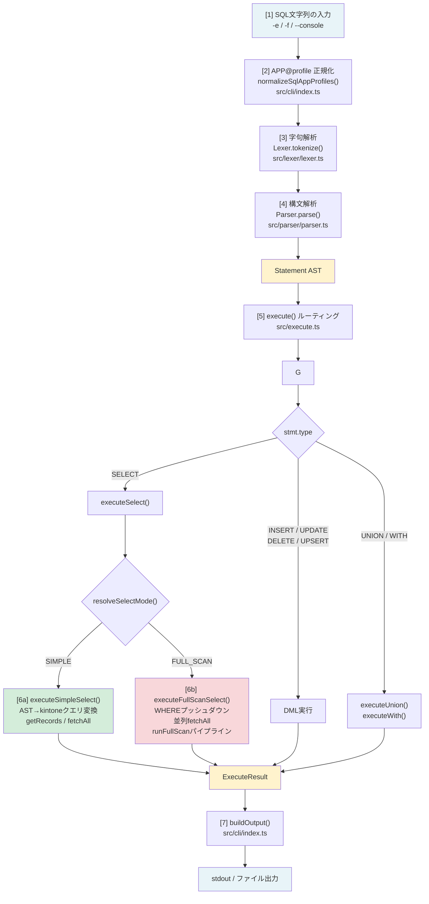

上の例はJOIN + GROUP BY を含むため **FULL_SCAN モード** で実行されます。

---

## [1] SQL文字列の入力

CLI で `-e` オプションが指定されると、[src/cli/index.ts:1519](../src/cli/index.ts#L1519) で文字列が `sql` 変数に格納されます。

```typescript
// src/cli/index.ts
sql = args.executeSql;
if (!sql && args.filePath) sql = readFileSync(args.filePath, "utf-8");
```

`-f` の場合は `readFileSync` でファイルを読み込みます。コンソールモード（`--console`）では `runConsole()` が入力を受け取り、内部で `run()` に渡します。

---

## [2] APP@profile 正規化

[src/cli/index.ts:1526](../src/cli/index.ts#L1526) で `normalizeSqlAppProfiles()` を呼び出します。

```typescript
// src/cli/index.ts
const normalized = normalizeSqlAppProfiles(sql, profileName);
sql = normalized.normalizedSql;
```

`APP100@prod` のような `@profile` サフィックスを処理します。同一AppIdに複数プロファイルが混在する場合は仮想AppId（900,000,000〜）に置き換えてSQL文字列を書き換えます。通常のSQLでは変換なしで通過します。

---

## [3] 字句解析（Lexer）

[src/lexer/lexer.ts](../src/lexer/lexer.ts) の `Lexer` クラスがSQL文字列をトークン列に変換します。

`parseSqlStatement()` → `execute()` の内部どちらからも `new Lexer(sql).tokenize()` が呼ばれます。

```typescript
// src/core/sql.ts
export function parseSqlStatement(sql: string): Statement {
  const tokens = new Lexer(sql).tokenize();
  return new Parser(tokens).parse();
}
```

`tokenize()` は `nextToken()` を繰り返し、EOF トークンが来るまでトークンを配列に積みます。

### nextToken() の処理分岐

[src/lexer/lexer.ts:57](../src/lexer/lexer.ts#L57)

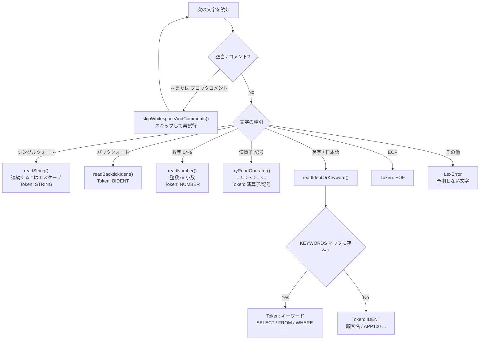

### 例: トークン列

入力 `SELECT 顧客名 FROM APP100` は次のトークン列になります。

| pos | kind | value |
|---|---|---|
| 0 | SELECT | `SELECT` |
| 7 | IDENT | `顧客名` |
| 11 | FROM | `FROM` |
| 16 | IDENT | `APP100` |
| 22 | EOF | `` |

- `''` （シングルクォート2つ）は文字列内のエスケープとして `'` 1文字に変換されます
- 識別子は ASCII英数字・`_`・`$`・日本語Unicode（U+3040〜U+9FFF）を許容します
- `--` と `/* */` コメントは `skipWhitespaceAndComments()` でスキップされます

---

## [4] 構文解析（Parser）

[src/parser/parser.ts](../src/parser/parser.ts) の `Parser` クラスがトークン列を AST に変換します。再帰下降法で実装されており、`parse()` が `Statement` を返します。

```typescript
// src/parser/parser.ts
parse(): Statement {
  const stmt = this.parseStatement();
  if (this.peek().kind === TokenKind.SEMICOLON) this.advance();
  this.expect(TokenKind.EOF);
  return stmt;
}
```

`parseStatement()` は先頭トークンの種別で処理を振り分けます。

```typescript
private parseStatement(): Statement {
  switch (tok.kind) {
    case TokenKind.SELECT:  return this.tryParseUnionChain(this.parseSelect());
    case TokenKind.INSERT:  return this.parseInsert();
    case TokenKind.UPDATE:  return this.parseUpdate();
    case TokenKind.DELETE:  return this.parseDelete();
    case TokenKind.WITH:    return this.parseWith();
    // ...
  }
}
```

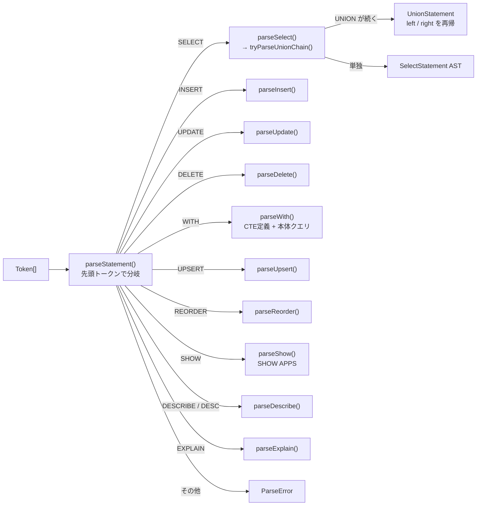

### parseSelect() の処理順

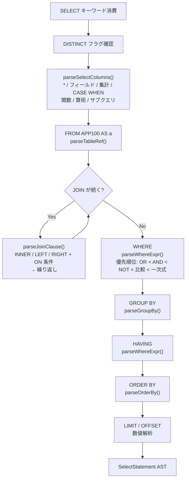

### 例: 生成されるAST（抜粋）

```typescript
{
  type: "SELECT",
  distinct: false,
  columns: [
    { type: "FIELD", field: "顧客名", alias: null },
    { type: "AGGREGATE", func: "SUM", arg: { type: "FIELD_REF", field: "金額" }, alias: "合計" }
  ],
  from: { appId: 100, alias: "a", cteName: null },
  joins: [{
    type: "INNER",
    table: { appId: 200, alias: "b" },
    on: { left: { tableAlias: "a", field: "顧客ID" },
          right: { tableAlias: "b", field: "顧客ID" } }
  }],
  where: {
    type: "BINARY", op: "=",
    left: { type: "FIELD", tableAlias: "b", field: "ステータス" },
    right: { type: "STRING", value: "完了" }
  },
  groupBy: [{ type: "FIELD_NAME", name: "顧客名" }],
  orderBy: [{ key: { type: "FIELD_NAME", name: "合計" }, direction: "DESC" }],
  limit: 20, offset: null
}
```

---

## [5] execute() ルーティング

[src/execute.ts:177](../src/execute.ts#L177) の `execute()` が AST の `type` フィールドで処理を振り分けます。

```typescript
// src/execute.ts
export async function execute(sql, client, options = {}) {
  const stmt = parseSql(sql);       // Lexer + Parser
  switch (stmt.type) {
    case "SELECT":  return executeSelect(stmt, client, options, cacheContext);
    case "UNION":   return executeUnion(stmt, client, options, cacheContext);
    case "WITH":    return executeWith(stmt, client, options, cacheContext);
    case "INSERT":  return executeInsert(stmt, client, cacheContext);
    case "UPDATE":  return executeUpdate(stmt, client, options, cacheContext);
    case "DELETE":  return executeDelete(stmt, client, options, cacheContext);
    // ...
  }
}
```

---

## [6] SELECT の実行モード判定

[src/execute.ts:208](../src/execute.ts#L208) の `executeSelect()` が呼ばれ、まず `resolveSelectMode()` でモードを決定します。

```typescript
// src/execute.ts
async function executeSelect(stmt, client, options, cacheContext) {
  if (isNoFromSelect(stmt)) return executeNoFromSelect(stmt); // FROM なし（SELECT 'ABC'）
  const mode = resolveSelectMode(stmt);                       // SIMPLE / FULL_SCAN
  await validateSelectFieldCodes(stmt, mode, client, cacheContext);  // フィールドコード検証
  if (mode === "SIMPLE") return executeSimpleSelect(...);
  else                   return executeFullScanSelect(...);
}
```

### FULL_SCAN になる条件

[src/converter/selectToKintone.ts:59](../src/converter/selectToKintone.ts#L59) `resolveSelectMode()` より。

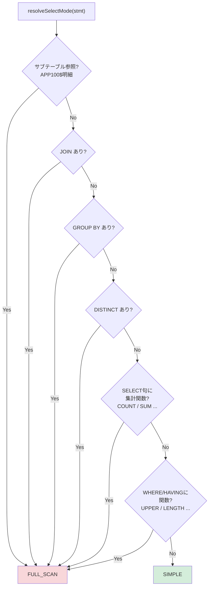

| 条件 | 理由 |
|---|---|
| JOIN が1件以上ある | kintone APIは複数テーブルを結合できない |
| GROUP BY がある | kintone APIは集計をサポートしない |
| DISTINCT がある | kintone APIにDISTINCTがない |
| SELECT句に集計関数（COUNT/SUM等） | 同上 |
| WHERE/HAVINGに関数（UPPER等） | kintone APIは関数を評価できない |
| サブテーブル（`APP100$明細`） | 展開処理が必要 |

例のSQLはJOIN + GROUP BY + 集計関数を含むため **FULL_SCAN** になります。

---

## [6b] FULL_SCAN モードの実行詳細

[src/execute.ts:376](../src/execute.ts#L376) `executeFullScanSelect()` の処理を順番に追います。

### ステップ1: サブクエリの事前実行

```typescript
await resolveSubqueries(stmt.where, client, options, cacheContext);
await resolveSubqueries(stmt.having, client, options, cacheContext);
```

`IN (SELECT ...)` や `EXISTS (SELECT ...)` があれば先に実行し、`ResolvedSubqueryInList.resolved` に値セットを格納します。後段の `evalWhere()` はこの解決済み値を参照します。

### ステップ2: WHERE プッシュダウン条件の抽出

[src/core/optimization/wherePredicatePushdown.ts](../src/core/optimization/wherePredicatePushdown.ts) `extractTableCondition()` を各テーブルエイリアスに対して呼び出します。

```typescript
// src/execute.ts
if (stmt.where !== null) {
  if (stmt.from.alias) {
    const cond = extractTableCondition(stmt.where, stmt.from.alias); // "a"
    if (cond) tableConditions.set(stmt.from.alias, cond);
  }
  for (const join of stmt.joins) {
    const cond = extractTableCondition(stmt.where, join.table.alias); // "b"
    if (cond) tableConditions.set(join.table.alias, cond);
  }
}
```

例のSQL `WHERE b.ステータス = '完了'` はテーブル `b` (APP200) だけを参照するため、`extractTableCondition(where, "b")` が条件をそのまま返します。これを APP200 の `getRecords` クエリに付与することで、全件取得前にサーバー側で絞り込みます（**WHEREプッシュダウン最適化**）。

テーブル `a` (APP100) に対してはプッシュダウン可能な条件がないため `null` が返ります。

### ステップ3: テーブルの並列フェッチ

プッシュダウン条件ありのテーブルはメインと並列でフェッチを開始します。

```typescript
// src/execute.ts
// メインテーブル(APP100)のフェッチを非同期で開始
const mainFetch = fetchTableRecordsForFullScan(stmt, stmt.from, client, ...);

// b はプッシュダウン条件あり → 並列で開始
parallelJoins.push({ join, promise: fetchTableRecordsForFullScan(..., jCond) });

// メイン完了を待機
const mainRecords = await mainFetch;
tables.set("a", mainRecords);

// 並列 JOIN の結果を回収
for (const { join, promise } of parallelJoins) {
  tables.set(join.table.alias, await promise);
}
```

`fetchTableRecordsForFullScan()` の内部では [src/api/fetchAll.ts](../src/api/fetchAll.ts) の `fetchAll()` を呼び出します。

### ステップ3a: fetchAll() のページング

[src/api/fetchAll.ts:66](../src/api/fetchAll.ts#L66)

kintone の1リクエスト上限500件、offset上限10,000件を自動で処理します。

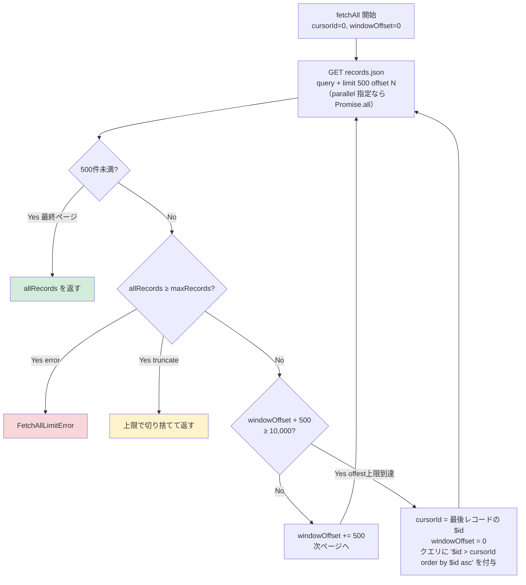

`parallel` オプションが2以上の場合は複数ページを `Promise.all` で同時取得します。

### ステップ4: runFullScan パイプライン

[src/engine/process.ts](../src/engine/process.ts) `runFullScan()` が9ステップのパイプラインを実行します。

```typescript
// src/execute.ts
const { rows, columns } = runFullScan({ tables, stmt, scalarCache, optionOrders, sortKinds });
```

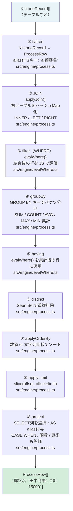

#### 4-1. flatten — KintoneRecord → ProcessRow

[src/engine/process.ts:59](../src/engine/process.ts#L59)

```typescript
export function flatten(record: KintoneRecord, alias: string | null): ProcessRow {
  const row: ProcessRow = {};
  for (const [field, fv] of Object.entries(record)) {
    const val = fv.value;
    const strVal = typeof val === "string" ? val : JSON.stringify(val ?? "");
    if (alias) {
      row[`${alias}.${field}`] = strVal;  // "a.顧客名": "田中商事"
      row[field]               = strVal;  // "顧客名": "田中商事"（非修飾フォールバック）
    } else {
      row[field] = strVal;
    }
  }
  return row;
}
```

kintone APIのレスポンス `{ 顧客名: { value: "田中商事" } }` を `{ "a.顧客名": "田中商事", "顧客名": "田中商事" }` に変換します。配列・オブジェクト型のフィールドは `JSON.stringify` で文字列化されます。

#### 4-2. JOIN

[src/engine/process.ts:88](../src/engine/process.ts#L88)

```typescript
export function applyJoin(leftRows, rightRows, join): ProcessRow[] {
  // 右テーブルを結合キーでインデックス化（O(n+m)）
  const rightIndex = new Map<string, ProcessRow[]>();
  for (const rRow of rightRows) {
    const k = rRow[rightKey] ?? "";
    rightIndex.get(k)?.push(rRow) ?? rightIndex.set(k, [rRow]);
  }
  // 左テーブルを走査してマッチする右行をマージ
  for (const lRow of leftRows) {
    const matched = rightIndex.get(lRow[leftKey] ?? "") ?? [];
    if (matched.length > 0) {
      for (const rRow of matched) result.push({ ...lRow, ...rRow });
    } else if (joinType === "LEFT") {
      // LEFT JOIN: 右が存在しない場合は空文字で埋める
      result.push({ ...lRow, ...emptyRight });
    }
  }
}
```

INNER / LEFT / RIGHT JOIN に対応。右テーブルをハッシュマップでインデックス化することで O(n+m) の結合を実現します。

#### 4-3. filter（JS側WHERE評価）

JOIN後の行に [src/engine/evalWhere.ts](../src/engine/evalWhere.ts) `evalWhere()` を適用します。

```typescript
rows = rows.filter((row) => evalWhere(stmt.where, row));
```

`evalWhere()` は `WhereExpr` を再帰的に評価します。

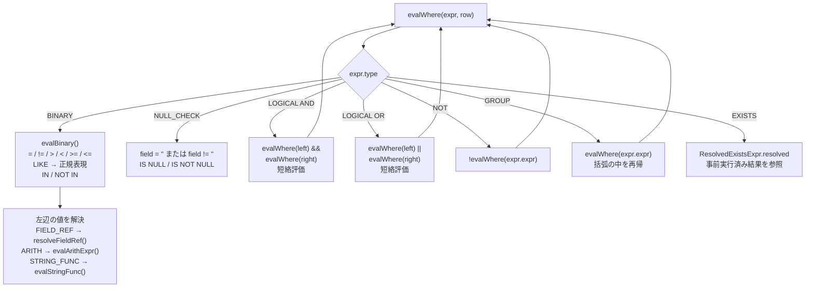

LIKE演算は `%` を `.*` に変換した正規表現で評価します。

算術式（`金額 * 1.1 > 10000`）は [src/engine/evalFunc.ts](../src/engine/evalFunc.ts) `evalArithExpr()` が評価します。

```typescript
// src/engine/evalFunc.ts
export function evalArithExpr(expr: ArithNode, row: ProcessRow): number {
  if (expr.type === "NUMBER")      return expr.value;
  if (expr.type === "FIELD_REF")   return Number(resolveFieldRef(row, expr.field));
  if (expr.type === "STRING_FUNC") return Number(evalStringFunc(expr, row));
  const l = evalArithExpr(expr.left, row);
  const r = evalArithExpr(expr.right, row);
  switch (expr.op) {
    case "+": return l + r;  case "-": return l - r;
    case "*": return l * r;  case "/": return r !== 0 ? l / r : NaN;
    case "%": return r !== 0 ? l % r : NaN;
  }
}
```

#### 4-4. groupBy — GROUP BY + 集計

```typescript
// src/engine/process.ts（groupBy 内）
const groups = new Map<string, ProcessRow[]>();
for (const row of rows) {
  const key = groupKeys.map((k) => resolveGroupKey(k, row)).join("\0");
  groups.get(key)?.push(row) ?? groups.set(key, [row]);
}
// 各グループを1行に集約（SUM / COUNT / AVG / MAX / MIN）
const aggregated = [...groups.values()].map((group) => aggregateGroup(group, stmt.columns, ...));
```

各グループの行をまとめて集計関数を適用し、1行に縮約します。

#### 4-5. having — HAVING フィルタ

```typescript
rows = stmt.having ? rows.filter((row) => evalWhere(stmt.having!, row)) : rows;
```

集計後の行に対して `evalWhere()` を適用します。

#### 4-6. distinct — 重複除去

```typescript
const seen = new Set<string>();
rows = rows.filter((row) => {
  const key = columns.map((c) => row[c] ?? "").join("\0");
  return seen.has(key) ? false : (seen.add(key), true);
});
```

#### 4-7. applyOrderBy — ソート

[src/engine/process.ts](../src/engine/process.ts) `applyOrderBy()`

```typescript
rows.sort((a, b) => {
  for (const item of orderBy) {
    const av = resolveOrderKey(item.key, a);
    const bv = resolveOrderKey(item.key, b);
    const cmp = compareValues(av, bv, sortKind);  // 数値/文字列で比較方法を切り替え
    if (cmp !== 0) return item.direction === "ASC" ? cmp : -cmp;
  }
  return 0;
});
```

`sortKind` はフィールド定義（`getFields()` の結果）から判断し、NUMBER/RECORD_NUMBER/CALC(数値)は数値比較、それ以外は文字列比較を使います。

#### 4-8. applyLimit — LIMIT / OFFSET

```typescript
export function applyLimit(rows, limit, offset) {
  const start = offset ?? 0;
  const end   = limit !== null ? start + limit : undefined;
  return rows.slice(start, end);
}
```

`LIMIT 20` の場合、先頭20件を返します。

#### 4-9. project — SELECT列プロジェクション

```typescript
export function project(rows, columns): { rows: ProcessRow[]; columns: string[] } {
  // 各行を SELECT 列に従ってリシェイプ
  const projectedRows = rows.map((row) => {
    const out: ProcessRow = {};
    for (const col of columns) {
      const alias = resolveAlias(col);
      out[alias] = resolveColumnValue(col, row);  // CASE WHEN / 関数 / 算術 も評価
    }
    return out;
  });
  return { rows: projectedRows, columns: resolvedColumnNames };
}
```

`SELECT 顧客名, SUM(金額) AS 合計` の場合、各行が `{ 顧客名: "田中商事", 合計: "15000" }` の形になります。

---

## [6a] SIMPLE モードの実行詳細（参考）

JOINもGROUP BYも含まない単純なSELECT（例: `SELECT * FROM APP100 WHERE ステータス = '完了'`）は SIMPLE モードで実行されます。

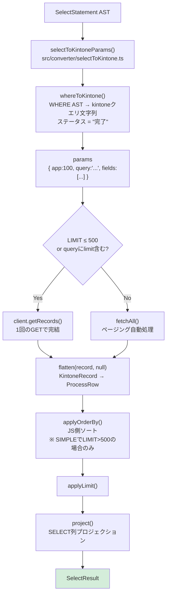

```typescript
// src/execute.ts executeSimpleSelect()
const params = selectToKintoneParams(stmt);
// params.query = 'ステータス = "完了" order by $id asc limit 500 offset 0'

if (useSingleGet) {
  // LIMIT ≤ 500: 1回のGETで完結
  const res = await client.getRecords({ app: params.app, query: params.query, fields: params.fields });
  records = res.records;
} else {
  // LIMIT なし or 500超: fetchAll でページング
  records = await fetchAll(client.getRecords, params.app, baseQuery, params.fields, { ... });
}

const rows = records.map((r) => flatten(r, null));
// ORDER BY と LIMIT はサーバー側クエリに含まれるため JS 側では不要
const { rows: projected, columns } = project(rows, stmt.columns);
```

`selectToKintoneParams()` がAST → kintoneクエリ文字列の変換を行います。WHERE節は `whereToKintone()` が変換します。

```typescript
// src/converter/whereToKintone.ts
export function whereToKintone(expr: WhereExpr): string {
  case "BINARY":    return convertBinary(expr);
  // { op: "=", left: {field:"ステータス"}, right: {value:"完了"} }
  // → 'ステータス = "完了"'
  case "NULL_CHECK": return `${field} ${not ? "!=" : "="} ""`;
  case "LOGICAL":   return `(${whereToKintone(left)}) ${op} (${whereToKintone(right)})`;
  case "NOT":       // pushDownNot() でド・モルガン変換してから再帰
}
```

---

## [7] 結果整形・出力

`execute()` が `SelectResult` を返すと、CLI の `run()` に戻ります。

### buildOutput() — テキスト整形

[src/cli/index.ts:791](../src/cli/index.ts#L791)

```typescript
// src/cli/index.ts
const output = buildOutput(result, format, noHeader, pretty, displayOptions);
if (outputPath) writeFileSync(outputPath, `${output}\n`, "utf-8");
else if (output) process.stdout.write(`${output}\n`);
if (!quiet) process.stderr.write(`rowCount=${result.rowCount}\n`);
```

`buildOutput()` は `format` に応じて整形します。

```typescript
export function buildOutput(result, format, noHeader, pretty, display): string {
  if (format === "json") {
    return JSON.stringify({ columns, rowCount, warnings, rows }, null, pretty ? 2 : 0);
  }
  if (format === "jsonl") {
    return result.rows.map((r) => JSON.stringify(r)).join("\n");
  }
  if (format === "markdown") {
    lines.push(`| ${cols.map(markdownEscapeCell).join(" | ")} |`);
    lines.push(`| ${cols.map(() => "---").join(" | ")} |`);
    for (const row of result.rows) {
      lines.push(`| ${cols.map((c) => markdownEscapeCell(toCellText(row[c], display))).join(" | ")} |`);
    }
    return lines.join("\n");
  }
  if (format === "csv") { /* ... */ }
  // table（デフォルト）: タブ区切り
  if (!noHeader) lines.push(cols.join("\t"));
  for (const row of result.rows) lines.push(cols.map((c) => toCellText(row[c], display)).join("\t"));
  return lines.join("\n");
}
```

### toCellText() → formatDisplayText()

各セル値は [src/core/displayFormat.ts](../src/core/displayFormat.ts) `formatDisplayText()` で最終整形されます。

```typescript
function toCellText(v: unknown, display: DisplayOptions): string {
  return formatDisplayText(v, display);
}
```

`DisplayOptions` によるフィールド別整形:

| フィールド種別 | full（デフォルト） | 変換後 |
|---|---|---|
| ユーザー選択 | `[{"code":"user1","name":"田中"}]` | `name` → `"田中"`、`code` → `"user1"` |
| 配列（チェックボックス等） | `["A","B","C"]` | `join` → `"A, B, C"` |
| サブテーブル | `[{...},{...}]` | `count` → `"2 行"` |
| 日時 | `"2024-01-15T09:00:00Z"` | `local` → ローカルタイムゾーンの文字列 |

### 標準出力への書き込み

整形されたテキストが `process.stdout.write()` で出力されます。`--output` が指定された場合は代わりに `writeFileSync()` でファイルに書き込みます。

`rowCount` は常に `process.stderr` に出力されます（`--quiet` で抑制可能）。

---

## DML（INSERT / UPDATE / DELETE）の実行フロー

SELECT と異なり、DMLは2〜3フェーズで実行されます。

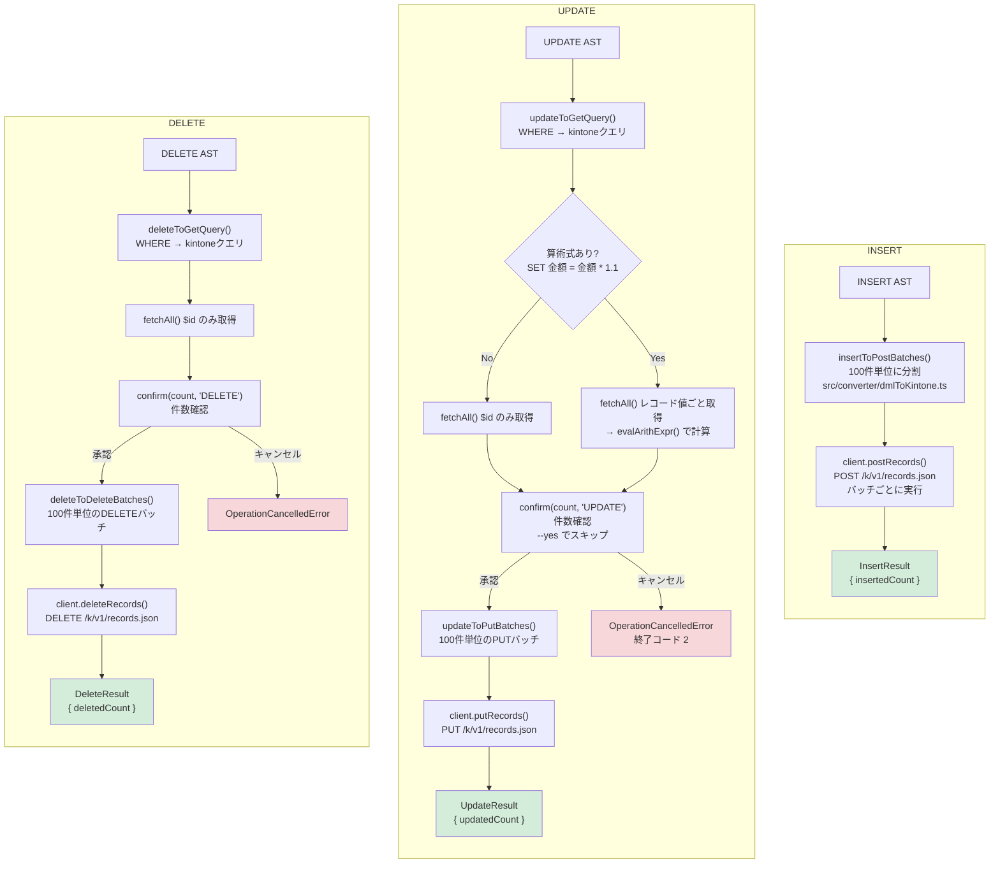

算術式（`SET 金額 = 金額 * 1.1`）の場合は更新前の値が必要なため、`fetchAll` でレコード値も取得し `evalArithExpr()` で計算してからPUTします。

---

## エラーハンドリングと終了コード

`execute()` を呼び出す `run()` は `try/catch` でエラーを捕捉し、終了コードを決定します。

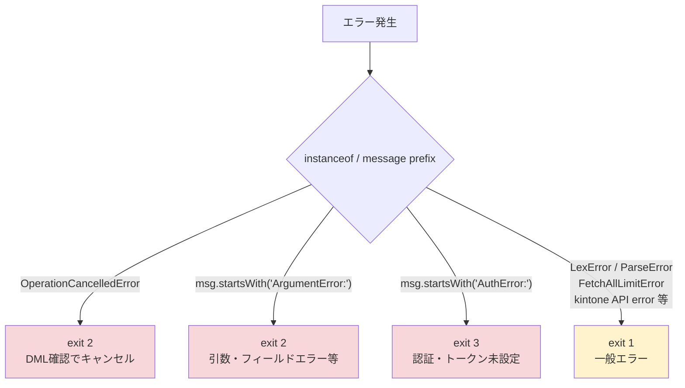

```typescript
// src/cli/index.ts
} catch (err) {
  if (err instanceof OperationCancelledError) {
    process.stderr.write(`${err.message}\n`);
    return 2;  // DMLキャンセル
  }
  process.stderr.write(`${err instanceof Error ? err.message : String(err)}\n`);
  return toExitCodeFromError(err);
}

function toExitCodeFromError(err: unknown): number {
  const msg = err instanceof Error ? err.message : String(err);
  if (msg.startsWith("ArgumentError:")) return 2;
  if (msg.startsWith("AuthError:"))     return 3;
  return 1;
}
```

| 例外クラス/メッセージ | 発生箇所 | 終了コード |
|---|---|---|
| `LexError` | Lexer | 1 |
| `ParseError` | Parser | 1 |
| `KintoneQueryError` | whereToKintone | 1 |
| `FetchAllLimitError` | fetchAll | 1 |
| `ArgumentError:` プレフィックス | 各所 | 2 |
| `AuthError:` プレフィックス | クライアント生成 | 3 |
| `OperationCancelledError` | DML確認 | 2 |
