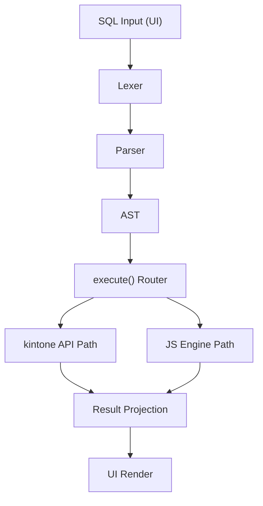
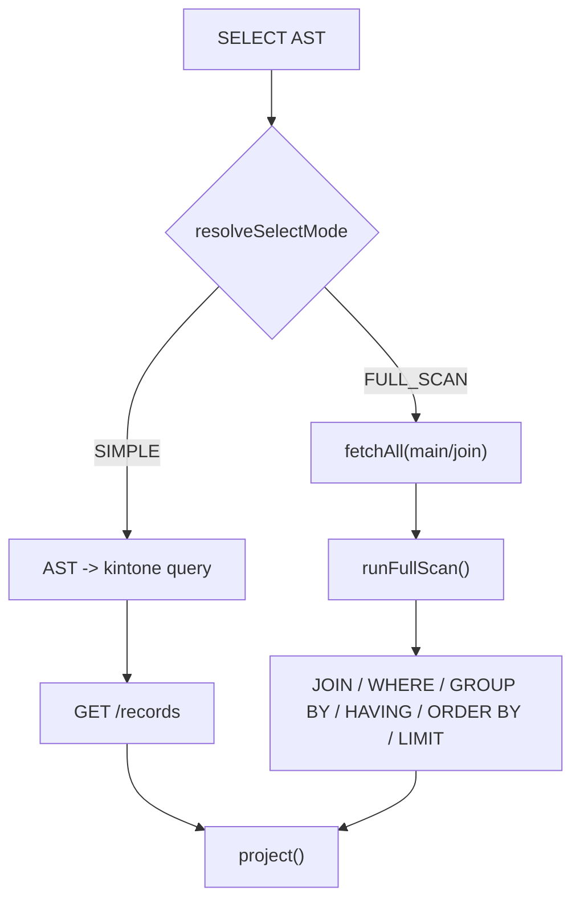
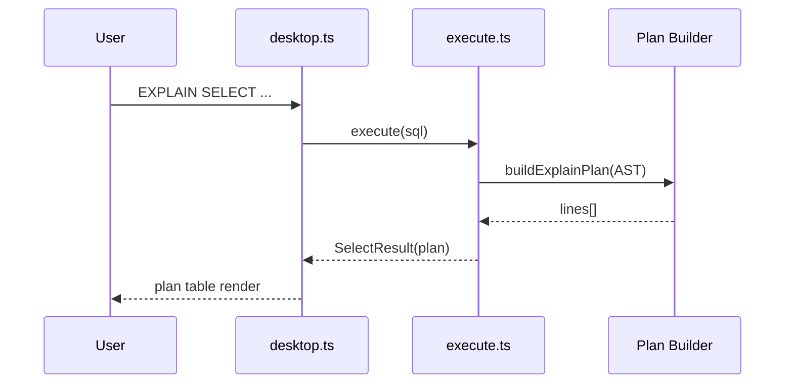

# kSQL のしくみ解説

このドキュメントは、kSQL が SQL を受け取って kintone API を実行し、結果を返すまでの内部処理を実装ベースで説明します。

---

## 1. 全体像

```text
SQL入力（UI）
  -> Lexer（字句解析）
  -> Parser（構文解析）
  -> AST（構文木）
  -> 実行ルータ（Statement type で分岐）
  -> kintone API 実行 or JSエンジン処理
  -> 結果整形（project / render）
  -> 画面表示
```



---

## 2. 主要モジュール

| 役割 | ファイル |
|---|---|
| UI（実行ボタン、オプション、結果表示） | `src/ui/desktop.ts` |
| 実行エントリ（SQL -> 実行） | `src/execute.ts` |
| 字句解析 | `src/lexer/lexer.ts`, `src/lexer/tokens.ts` |
| 構文解析（AST生成） | `src/parser/parser.ts` |
| AST型定義 | `src/types/ast.ts` |
| SELECT変換（AST -> kintone query） | `src/converter/selectToKintone.ts`, `src/converter/whereToKintone.ts` |
| DML変換（INSERT/UPDATE/DELETE/UPSERT） | `src/converter/dmlToKintone.ts` |
| 全件取得（ページング/並列/上限） | `src/api/fetchAll.ts` |
| JS側実行（JOIN/GROUP BY/ORDER BYなど） | `src/engine/process.ts`, `src/engine/evalWhere.ts`, `src/engine/evalFunc.ts` |
| サブテーブル展開 | `src/converter/subtableAdapter.ts` |

---

## 3. SQL 実行の流れ

### 3.1 UI から実行

1. ユーザーが SQL を入力して実行。
2. `runSql()` が `execute(sql, client, options)` を呼ぶ。
3. オプション（最大取得件数、上限到達時動作、並列数など）を渡す。

### 3.2 パース

1. `Lexer` が SQL をトークン列へ分解。
2. `Parser` がトークン列から AST を生成。
3. 構文エラーは `LexError` / `ParseError` として返す。

### 3.3 実行ルーティング

`execute.ts` は AST の `type` で分岐します。

- `SELECT`
- `UNION`
- `WITH`
- `INSERT` / `INSERT_SELECT`
- `UPDATE`
- `DELETE`
- `UPSERT` / `UPSERT_SELECT`
- `REORDER`
- `SHOW_APPS`
- `DESCRIBE`
- `EXPLAIN`

---

## 4. SELECT のコア設計（SIMPLE / FULL_SCAN）

kSQL の中核は `SELECT` の実行モード判定です。

### SIMPLE

可能な限り kintone query に変換して API 側で絞り込み・並び替え・件数制御を行うモード。

- `WHERE` を `whereToKintone()` で変換
- `ORDER BY`（フィールド単純指定）を変換
- `LIMIT/OFFSET` を変換

### FULL_SCAN

kintone query で表現できない機能を JS 側で処理するモード。

例:
- JOIN
- GROUP BY / HAVING
- DISTINCT
- 集計関数
- 関数を含む WHERE
- 式 ORDER BY
- サブテーブル仮想テーブル

FULL_SCAN では `fetchAll()` で必要テーブルを取得し、`runFullScan()` パイプラインで以下を処理します。

- flatten / JOIN
- WHERE / HAVING 評価
- GROUP BY / 集計
- DISTINCT
- ORDER BY
- LIMIT/OFFSET
- SELECT 列投影



---

## 5. fetchAll の仕組み

`src/api/fetchAll.ts` は全件取得専用の共通ロジックです。

- 500件単位でページング
- `parallel` による並列取得
- offset 上限（10000）を超える場合は `$id` カーソル方式に切替
- `maxRecords` 上限を厳守
- `onLimit = "error" | "truncate"` を選択可能

この実装により、API 制約を吸収しながら安定して大量レコードを扱えます。

---

## 6. UPDATE / DELETE / UPSERT の基本パターン

### UPDATE / DELETE

1. WHERE で対象を `GET` 取得（主に `$id` 抽出）
2. 確認ダイアログ（必要時）
3. `PUT` / `DELETE` を 100 件単位で実行

### UPSERT

1. 入力行ごとに重複判定条件を作成
2. 既存有無で `POST`（新規）か `PUT`（更新）を振り分け
3. バッチ実行

---

## 7. サブテーブル仮想テーブル（APP100$明細）

サブテーブルは通常テーブルと違い、親レコード内の配列です。

kSQL では以下の流れで扱います。

1. 親レコードを取得
2. `expandSubtableRecords()` で明細行に展開
3. `_pid` / `_rid` / `_idx` などの仮想列を付与
4. SELECT/UPDATE/DELETE/REORDER を行う

---

## 8. キャッシュ戦略

代表的なキャッシュ:

- フィールド定義（`getFields` の結果）
- フィールド型マップ
- 選択肢順序マップ（`optionOrder`）
- ソート種別マップ（`sortKind`）

目的は API 呼び出しの抑制と、ORDER BY・型変換の安定化です。

---

## 9. EXPLAIN で何を見るか

`EXPLAIN` は実行計画を文字列で返します。

- `mode: SIMPLE/FULL_SCAN`
- FULL_SCAN になった理由
- 発行する kintone query
- サブクエリ実行計画
- DML の API 実行段取り

複雑な SQL で「なぜ遅いか」「どこが JS 評価か」を確認するための機能です。



---

## 10. まとめ

kSQL は次の思想で作られています。

- パーサーは自作（日本語識別子対応、外部依存なし）
- できる処理は kintone API 側へ pushdown（SIMPLE）
- API でできない処理は JS パイプラインで補完（FULL_SCAN）
- 大量データは `fetchAll` で安全に制御

この構成により、kintone の制約を保ちながら SQL ライクな操作性を実現しています。
