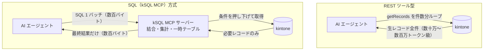

# AIエージェントにkintoneを操作させるにはSQLが最適解である

<!-- 投稿時タグ案: kintone, MCP, AIエージェント, SQL, 生成AI -->

> **結論（3 行）**
>
> - 単一レコードの操作やアプリ設定の変更は、REST ツール型（公式 MCP サーバーなど）で十分です
> - しかし**複数アプリの結合・集計・一括処理**を AI エージェントに任せるなら、SQL を宣言的なインターフェースとして渡す方が、トークン効率・安全性・再現性のすべてで優れています
> - 成立条件は、kintone の実挙動に合わせた「方言」として誠実に定義することです

## はじめに

MCP（Model Context Protocol）の普及で、Claude などの AI エージェントから kintone を直接操作する構成が現実的になりました。

このとき最初に思いつくのは「kintone REST API をそのままツール化して渡す」方式です。
`getRecords` / `updateRecords` をツールにして、あとはエージェントに任せる。

私もこの方式から運用を始めましたが、試行錯誤の結果、現在は
**データの結合・集計・一括処理を SQL（kintone 方言）で行う**構成に落ち着いています。

なお、kintone 公式のローカル MCP サーバー
（[kintone/mcp-server](https://github.com/kintone/mcp-server)）とは役割分担の関係です。
公式 MCP サーバーの守備範囲は、アプリの作成、フィールドやフォームレイアウトの変更、
添付ファイルのダウンロードといった「アプリを作り、整える」操作であり、
これは SQL では表現できない領域です。私も併用しています。
本記事が扱うのはその先、
**「複数アプリにまたがるデータの結合・集計・一括処理」というワークロードを、
どんなインターフェースでエージェントに渡すべきか**という設計論です。

私は kintone を SQL 風構文で操作する
[`kintone-sql-tools`](https://github.com/rex0220/kintone-sql-tools)（kSQL）を開発しており、
本記事はその MCP サーバーを AI エージェント（Claude / codex）で日常運用した経験に基づいています。

## REST ツール型に結合・集計・一括処理を載せると何が起きるか

単一レコードの参照・更新、アプリ設定の操作、添付ファイルの取得——
この種の「操作対象が 1 つに定まる」タスクなら、REST ツール型で何も問題ありません。
問題が出るのは、次のようなデータワークロードを載せたときです。

### 1. JOIN も GROUP BY もないので、エージェントが自分でやり始める

kintone のクエリ構文は単一アプリの絞り込み専用です。結合も集計もありません。

「顧客アプリと案件アプリを突き合わせて、ランク A 顧客の受注合計を出して」と頼むと、
エージェントはこう動きます。

1. 顧客アプリを全件取得（1 リクエスト最大 500 件なので、件数分ループ）
2. 案件アプリも全件取得
3. **自分のコンテキストウィンドウ内で**結合と集計をやる

問題は 2 つあります。

- **トークンを大量に消費する。** 中間データ（使い捨てのレコード全件）が
  会話コンテキストに乗ります。1 万件規模なら約 6 MB＝概算 200 万トークンに達します
  （理由 3 に実測を載せました）。
- **LLM の手集計は信用できない。** 数百行の足し算を言語モデルにやらせるのは、
  電卓の代わりに作文させるようなものです。桁が揃っていると文字列比較でも
  偶然正答する、といった「静かに間違う」挙動を私は実際に何度も踏みました。

### 2. 意図がツール呼び出しの列に分散する

「未処理レコードを完了に更新して」という 1 つの意図が、
実行ログ上は数十回の `updateRecords` 呼び出しに分解されます。

- 事後に「何をしたのか」をレビューするには、呼び出し列を全部読んで意図を復元するしかない
- 途中で失敗したら、どこまで反映されたか不定
- 同じ操作をもう一度やる方法が「同じ会話をもう一度やる」しかない

### 3. 実行前に確認する手段がない

REST API 自体には、書き込み内容をそのまま事前検証する dry-run 機能がありません。
エージェントが「多分大丈夫」と判断したら、その場で PUT が飛びます。人間がレビューを挟む余地は、
エージェントの善意（確認してから実行してね、というプロンプト）にしかありません。

## SQL が最適解である 5 つの理由

### 理由 1: LLM が最も得意なデータ操作言語だから

SQL は LLM の学習コーパスに大量に含まれる代表的なデータ操作言語で、
text-to-SQL は長年の研究・実用化が積み重なったタスクです。

独自の JSON DSL やツール引数の組み合わせを設計しても、
エージェントはそれを「初見の API」として扱います。
SQL なら、JOIN・GROUP BY・HAVING・CTE といった概念の説明は一切不要です。
少なくとも基本的な構文は、追加説明なしでもかなり安定して書けます。

### 理由 2: 1 文 = 1 意図。実行前に読んでレビューできるから

SQL は宣言的です。「何をするか」が 1 文に凝縮されるので、
**実行せずに読んで監査できます**。

```sql
UPDATE APP100 SET 処理ステータス = '完了' WHERE 処理ステータス IN ('未処理');
```

この 1 行を見れば、対象と変更内容が全部わかります。
40 回の `updateRecords` 呼び出しログとの差は歴然です。

さらに kSQL では、実行前の確認を言語機能として持っています。

- `EXPLAIN` — 実際にどんな kintone API 呼び出しに翻訳されるか（何件取得するか、
  どの条件が kintone 側に押し下げられるか）を実行せずに確認
- `VALIDATE ONLY` — 書き込み DML を**1 件も書き込まずに**全行検証し、
  エラーを一時テーブルに収集

```sql
-- 反映候補を一時テーブルへ確保
CREATE TEMP TABLE #tgt AS
SELECT 顧客コード, 顧客名 FROM APP100 WHERE 処理ステータス IN ('未処理');

-- 書き込まずに全行検証。エラーは #err に 1 行 = 1 エラーで収集される
UPSERT INTO APP200 (顧客コード, 顧客名)
SELECT 顧客コード, 顧客名 FROM #tgt
ON DUPLICATE (顧客コード)
VALIDATE ONLY INTO #err;

SELECT * FROM #err;
```

エージェントに「まず VALIDATE ONLY、結果を見てから本実行」という手順を踏ませると、
更新系の事故はほぼ入口で止まります。

### 理由 3: 実行がサーバー側で完結し、コンテキストを汚さないから

先に種明かしをすると、kintone 本体に JOIN が無いのに SQL で JOIN できるのは、
**kSQL の MCP サーバーが各アプリから必要なレコードを REST API で取得し、
サーバー内のインメモリエンジンで結合・集計を完結させている**ためです
（安全に絞り込める条件は kintone 側へ押し下げ、その内訳は `EXPLAIN` で確認できます）。



つまり SQL の実行はすべて MCP サーバー側で行われ、エージェントには**最終結果だけ**が返ります。

「顧客別受注合計」なら、返るのは集計後の数十行だけです。
中間の生レコード数千件はエージェントのコンテキストを一切通りません。

さらに一時テーブルを使うと、中間結果そのものをサーバー内に置いたまま
複数ステップの処理を進められます。

```sql
-- 中間結果はサーバー内の #high に保持。エージェントには件数確認だけ返せばよい
CREATE TEMP TABLE #high AS
SELECT a.顧客No, a.会社名, SUM(b.売上) AS 合計
FROM APP4148 AS a
INNER JOIN APP4149 AS b ON a.顧客No = b.顧客No_
WHERE b.商談フェーズ IN ('受注')
GROUP BY a.顧客No, a.会社名
HAVING SUM(b.売上) >= 1000000;

SELECT COUNT(*) AS 件数 FROM #high;
```

（APP4148 / APP4149 は手元の実環境にあるデモアプリです。
記事中の APP100 / 200 / 300 は説明用の架空 ID として使い分けています。）

実際に、エージェントが受け取るデータ量を両方式で実測してみました。
上の JOIN（顧客 215 件・案件 20 件）に加えて、規模を一桁上げた例として、
売上明細アプリ（1,500 件）に対する
`SELECT 地域, 商品カテゴリ, SUM(金額), COUNT(*) ... GROUP BY 地域, 商品カテゴリ`
という集計 1 文も比較しています。

| 処理 | REST ツール型（全件転送） | SQL（kSQL MCP）の返却 | 差 |
|---|---|---|---|
| 顧客×案件 JOIN（235 件 → 結果 6 行） | **実測 149 KB**（概算 5 万トークン） | **実測 328 バイト** | **465 倍** |
| 売上明細の集計（1,500 件 → 結果 96 行） | **実測 972 KB**（概算 33 万トークン） | **実測 9.8 KB**（概算 3 千トークン） | **99 倍** |

数値はフィールド値を平坦化した JSON の実測値
（ksql CLI の `--format json` 出力をファイル保存してバイト数を計測）で、
トークン概算は 1 トークン≒3 バイト換算です。実際の REST レスポンスは
フィールドごとに `{type, value}` の包みが付くため、さらに大きくなります。

なお、倍率そのものは結果行数次第で上下します（結果 6 行なら 465 倍、96 行なら 99 倍）。
本質は倍率ではなく、SQL 側の返却が**入力件数に依存しない**ことです。

REST 側の転送量はレコード数に線形に比例します（実測単価は
顧客アプリ 567 バイト/件・売上明細アプリ 663 バイト/件・
フィールド数が多くテキストの長い案件アプリで 1.5 KB/件）。
SQL 側の返却は結果行数だけで決まるため、1,500 件を集計しても
エージェントが受け取るのは 96 行＝約 3 千トークンです。
線形換算すると 1 万件規模の生データは約 6 MB（案件アプリ並みの単価なら 15 MB）＝
概算 200 万〜500 万トークンで、そもそもコンテキストウィンドウに収まりません。

これはコストの話であると同時に、
**コンテキストが浅いままなのでエージェントが最後まで賢い**という品質の話でもあります。

### 理由 4: ガードを言語そのものに書けるから

「エージェントが慎重に振る舞うこと」に依存する安全策は、いつか破られます。
SQL なら、ガードを**文の中に**書けて、破ると実行系が拒否します（fail-closed）。

```sql
-- 対象を確保
CREATE TEMP TABLE #tgt AS
SELECT 顧客コード, 顧客名 FROM APP100 WHERE 処理ステータス IN ('未処理');

-- 想定外の件数なら、ここでバッチ全体が停止する
ASSERT (SELECT COUNT(*) FROM #tgt) BETWEEN 1 AND 10000;

INSERT INTO APP300 (顧客コード, 顧客名) SELECT 顧客コード, 顧客名 FROM #tgt;
```

kSQL が言語・実行系として持つガードの例です。

| ガード | 内容 |
|---|---|
| `ASSERT` | 件数などの実行時ゲート。不成立ならバッチ停止 |
| `CHECK WHEN ... THEN 'msg'` | DML に行単位の業務ルール検査を付与 |
| `ON ERROR SKIP INTO #err REJECT LIMIT n` | エラー行をスキップ収集、n 件超で全体停止 |
| `dmlMaxRows` | MCP 側設定による 1 文あたりの更新件数上限 |
| read-only / mutate のツール分離 | 更新系は別ツール（`ksql_mutate`）でしか実行できない |

最後の点は重要です。照会用ツール（`ksql_query`）には書き込み能力がそもそも無いので、
「エージェントがうっかり UPDATE」は**ツールの権限レベルで**起きません。

### 理由 5: 再現性があり、人間に引き継げるから

エージェントが書いた SQL は、そのまま

- 人間が読んでレビューできる
- 保存クエリとして登録し、次回から名前で呼べる
- `DECLARE @param` で変数化して、CLI・CI から同じ文を再実行できる

つまり **AI の成果物が、AI 抜きで回る運用資産に変換できます**。
ツール呼び出しログはこの性質を持ちません。「あのとき AI がやった処理」を
再現する方法が会話の再演しかない運用は、資産が何も残りません。

### 5 つの理由を 1 表にまとめると

| 比較項目 | REST ツール型（レコード操作を直接呼ぶ） | SQL（kSQL MCP）方式 |
| :--- | :--- | :--- |
| **複数アプリ結合（JOIN）** | LLM が自前突合（トークン爆発＋計算ミス） | **サーバー側インメモリで 1 文解決** |
| **コンテキスト消費** | 生データ全件（1,500 件で実測 33 万トークン） | **集計・抽出後の最小限データのみ（同 3 千トークン）** |
| **更新の安全性** | プロンプト頼み（即 PUT 事故のリスク） | **ASSERT / VALIDATE ONLY / read-only 分離** |
| **事前レビュー** | 手段なし | **EXPLAIN と 1 文 = 1 意図の SQL を読むだけ** |
| **運用の再現性** | 会話ログを追うしかない | **SQL 資産として保存クエリ・CI に流用可能** |

## ただし「汎用 SQL のふり」をしてはいけない

ここまで SQL を推してきましたが、重要な留保があります。
**kintone は SQL データベースではない**ので、素直に標準 SQL を被せると嘘をつきます。

実測で判明している例をいくつか挙げます。

- **テキストソートは Unicode コードポイント順。** たとえば `a, A, あ, ア, 亜` の昇順は
  kintone では `A → a → あ → ア → 亜`（コードポイント順）ですが、
  `localeCompare('ja')` では `a → A → あ → ア → 亜` となり一致しません
  （kSQL の `ORDER BY` で実測。サロゲートペアを含む文字列では
  JavaScript の既定ソートともずれます）。
- **数値は 10 進厳密比較が必要。** IEEE-754 の浮動小数点で比較すると、
  桁数の大きい NUMBER フィールドで kintone 本体と結果がずれます。
- **空セルの扱い**（数値演算では 0、比較では別扱い）や、
  **`like` の意味論**（kintone ネイティブの like と一般的な LIKE は別物）。

kSQL はこれらを「kintone 方言」として明示的に定義しています。
たとえば `ORDER BY`（型付き正準順）と `KORDER BY`（kintone 固有順）、
`LIKE`（JavaScript 意味論で統一）と `KLIKE`（kintone ネイティブ like へ素通し）を
**別の構文として分けて**います。曖昧に「だいたい SQL と同じ」にせず、
どちらの意味論かをエージェントに選ばせる設計です。

そして方言仕様そのものを、エージェントが自分で読めるようにしています。
kSQL MCP には `ksql_docs` という read-only ツールがあり、
言語リファレンスとレシピ集を章単位で取得できます。
エージェントは構文を発明する代わりに、まずドキュメントを引きます。

## 実装例: kSQL MCP サーバー

`@rex0220/kintone-sql-tools` は npm で公開しており、
CLI・kintone プラグイン・MCP サーバー（Claude Desktop 用 MCPB 同梱）を含みます。

```bash
npm install -g @rex0220/kintone-sql-tools
```

### 最小セットアップと最初の 1 クエリ

動作確認環境: kintone-sql-tools v3.66.1 / Node.js 18 以上 / Claude Code・Claude Desktop

接続情報は `ksql.config.json` に書きます（最小構成の例）。

```json
{
  "defaultProfile": "dev",
  "profiles": {
    "dev": {
      "baseUrl": "https://example.cybozu.com",
      "auth": "token",
      "tokenMap": { "APP123": "env:KSQL_TOKEN_123" }
    }
  }
}
```

Claude Code なら、MCP サーバーの登録は 1 コマンドです。

```bash
claude mcp add ksql --env KSQL_CONFIG=/path/to/ksql.config.json -- ksql-mcp
```

Claude Desktop の場合は、同梱の MCPB ファイルを拡張機能画面から読み込み、
設定画面で `ksql.config.json` の絶対パスを指定します
（手順はリポジトリの `docs/ksql_mcpb_claude_desktop_install.md`）。

あとはエージェントに「`ksql_show_apps` でアプリ一覧を見せて」と頼めば動作確認は完了です。

### ツール構成と運用手順

MCP ツールは役割分離しています。

| ツール | 役割 |
|---|---|
| `ksql_query` | read-only 実行（SELECT / WITH / UNION / 一時テーブルバッチ / VALIDATE ONLY） |
| `ksql_validate` | 構文・スキーマ検証（実行しない） |
| `ksql_explain` | 実行計画（kintone API 呼び出しへの翻訳）を表示 |
| `ksql_mutate` | 書き込み DML（件数ガード付き。既定は無効側に倒す） |
| `ksql_describe_app` / `ksql_show_apps` | スキーマ探索 |
| `ksql_docs` | 言語リファレンス・レシピの取得 |
| `ksql_save_query` ほか | 保存クエリの管理・実行 |

実運用でエージェントに踏ませている手順はシンプルです。

1. `ksql_describe_app` でフィールドコードを確認
2. `ksql_validate` で構文検証
3. 更新系なら `VALIDATE ONLY` → 結果確認 → `ksql_mutate`

たとえば「未処理の顧客を別アプリに反映して」という依頼は、
最終的にこの 1 バッチに落ちます。

```sql
CREATE TEMP TABLE #tgt AS
SELECT 顧客コード, 顧客名 FROM APP100 WHERE 処理ステータス IN ('未処理');

ASSERT (SELECT COUNT(*) FROM #tgt) BETWEEN 1 AND 10000;

UPSERT INTO APP200 (顧客コード, 顧客名)
SELECT 顧客コード, 顧客名 FROM #tgt
ON DUPLICATE (顧客コード)
CHECK WHEN 顧客名 = '' THEN '顧客名が空です';
```

このバッチは、実行前に人間が 10 秒で読めます。
同じ処理を REST ツール呼び出しの列でレビューすることを想像してみてください。

### この記事自体が、この方式で検証されている

本記事に掲載した SQL はすべて AI エージェント（Claude）が
`ksql_validate` で検証し、実在アプリを使う例は実行まで確認したものです。

執筆中、JOIN 例に実在しないフィールドコードが紛れ込みましたが、
`ksql_describe_app` → 検証 → 実行という手順がそれを検出しました。
「エージェントの善意ではなく実行系の検査で守る」という本文の主張は、
この記事の執筆プロセス自体でも機能しています。

## もちろん万能ではない — 制約と割り切り

SQL 方式にも適用限界があります。隠さず書いておきます。

### 適用規模: インメモリ実行の上限は明示的に管理する

結合・集計は MCP サーバー内のインメモリ実行なので、
現実的な守備範囲は「業務アプリの数千〜数万件規模」です。
ただし上限を超えたとき静かに壊れる（メモリ枯渇や部分結果）のではなく、
**取得候補行数の上限 `maxRecords`（MCP 既定 500 件、設定で引き上げ可）に
到達した時点でエラーとして停止**します（fail-closed）。
一時テーブルの実体化にも別枠の上限（既定 10,000 件）があり、
安全に絞り込める WHERE 条件は kintone 側へ押し下げて転送量自体を減らします。
どこまで押し下がり何件走査する見込みかは `EXPLAIN` が表示するので、
上限を引き上げる判断も見積もりに基づいて行えます。

「LLM のコンテキスト節約のツケを、サーバーの通信・メモリに回しているだけでは？」
という見方は半分正しくて、ツケは確かにサーバー側へ移ります。
ただし、サーバー側の負荷は上限値で明示的に制御できるのに対し、
コンテキストに乗った中間データは取り消せません。
どちらで払うかを選べるなら、制御できる側で払うべきです。

### トランザクション: kintone API にロールバックはない

kintone REST API には、複数リクエストを跨ぐロールバックがありません。
したがって kSQL の DML も完全な ACID にはなりえず、
1 文の一括更新が内部で複数 API 呼び出しに分かれる以上、
途中失敗時に部分適用が残る可能性は原理的に消せません。

kSQL はこれを「事前に全行検証し、実行中は早期停止し、事後に異常検知する」
設計で割り切っています。

- **事前**: `VALIDATE ONLY` で 1 件も書かずに全行検証、`ASSERT` で件数ゲート
- **実行中**: DML バッチは常に fail-fast（エラーで即停止）。
  行単位で継続したい場合だけ `ON ERROR SKIP INTO #err` を明示する
- **事後**: `#err` のエラー行確認。更新前の値を一時テーブルへ退避しておけば、
  復旧の材料になる

全体ロールバックが本当に必要な処理は、そもそも kintone に載せるべきではありません。
これは SQL 方式の限界ではなく、プラットフォームの前提条件です。

### 添付ファイル: どちらの MCP でもアップロードはできない

添付ファイルのアップロードは、公式 MCP サーバー・kSQL とも守備範囲外です
（公式はダウンロードのみ対応で、レコード追加・更新時に添付ファイルフィールドは
指定できません）。現状はブラウザ操作やカスタマイズ側の領域です。

## 想定される反論

**「公式の kintone MCP サーバーがあるのに、別方式が必要？」**

用途が違うので、対立ではなく**棲み分け**です。公式 MCP サーバーは、アプリ作成・
フィールド設定・フォームレイアウト変更・添付ファイルのダウンロードなど
「アプリを作り、整える」操作を広くカバーしており、SQL はこの領域を代替できません。
一方、複数アプリの結合・集計・一括処理をレコード操作ツールの繰り返し呼び出しに
載せると、本文で述べた問題が出ます。
**構築・設定は公式 MCP サーバー、データの照会・集計・一括処理は SQL** と
棲み分けて併用するのが自然だと考えています。

**「エージェントが賢くなれば REST 直叩きでも困らないのでは？」**

トークン消費と fail-closed のガードは、モデルの賢さと独立の問題です。
どれだけ賢くても、dry-run の無い API に dry-run は生えません。

**「用途ごとに Function calling を細かく設計すれば良いのでは？」**

「顧客別集計ツール」「月次反映ツール」…と作っていくと、ツール数が用途の数だけ増えます。
SQL は有限の構文で無限の組み合わせを表現できる、圧縮率の高いインターフェースです。
新しい依頼のたびにツールを追加開発する必要がありません。

**「独自方言なら、結局 LLM は方言を学び直す必要があるのでは？」**

日常のクエリの大半——SELECT / JOIN / GROUP BY / HAVING / CTE / UNION——は
ごく普通の SQL で、追加の学習なしに書けます。
方言構文（`KORDER BY` / `KLIKE` / `ASSERT` / `VALIDATE ONLY` など）は、
kintone 固有の意味論や安全ゲートを明示的に使いたいときだけのオプトインです。
仕様は `ksql_docs` で章単位のオンデマンド取得にしているため、
方言の学習コストは「必要になった章だけ読む」程度に収まります。

**「個人 OSS に依存するリスクは？」**

`kintone-sql-tools` は MIT ライセンスの OSS で、SQL エンジンは
単体ライブラリ（ESM / CJS / UMD）としても公開しています。
フォークも自前ホストも自由です。
そして本記事の主張の本体は kSQL そのものではなく、
「エージェントには宣言的で検証可能なインターフェースを渡すべき」という設計論です。
同じ設計論に立つ実装であれば、kSQL でなくても結論は変わりません。

## まとめ

AI エージェントに kintone を操作させるインターフェースとして、SQL は

1. LLM が基本構文なら追加説明なしで安定して書ける
2. 1 文 = 1 意図で、実行前にレビューできる（EXPLAIN / VALIDATE ONLY）
3. 実行がサーバー側で完結し、コンテキストを消費しない（一時テーブル）
4. ガードを言語に埋め込める（ASSERT / CHECK / 件数上限 / read-only 分離）
5. 成果物が再現可能な運用資産として残る

という点で、**結合・集計・一括処理というデータワークロードに関しては**、
レコード操作ツールの繰り返し呼び出しにも用途別ツール群にも勝ります。
ただし成立条件は「kintone の実挙動に合わせた方言として誠実に定義すること」、
そしてアプリの構築・設定といった SQL の外側の領域は、
公式 MCP サーバーなど適した道具に任せることです。

---

リポジトリ・ドキュメント:

- https://github.com/rex0220/kintone-sql-tools
- npm: `@rex0220/kintone-sql-tools`（CLI / プラグイン / MCP サーバー同梱）
