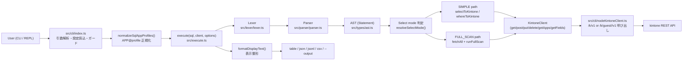
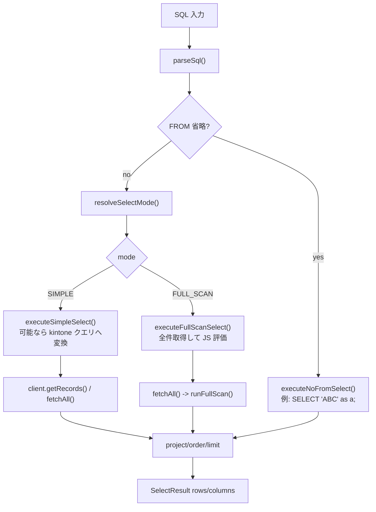

# cli-ksql のしくみ（内部構成）

`cli-ksql` は、SQL文字列を AST に変換し、kintone API 実行計画へ落として実行する構成です。  
実装上は `src/cli`（CLI層）と `src/execute.ts`（実行エンジン）を中心に動きます。

## 全体構成

## SELECT 実行フロー

## モジュールごとの役割

- `src/cli/index.ts`
  - `parseArgs()` で引数を解析
  - config/profile を解決
  - `normalizeSqlAppProfiles()` で `APP@profile` を正規化
  - DML ガード（`--allow-dml`, `--allow-without-where`, `--dml-max-rows`）
- `src/execute.ts`
  - `execute()` が文種別ごとに処理をルーティング
  - `SELECT/UNION/WITH/INSERT/UPDATE/DELETE/UPSERT/REORDER/SHOW APPS/DESCRIBE/EXPLAIN` を処理
- `src/converter/*`
  - SQL AST を kintone API パラメータへ変換
- `src/engine/*`
  - FULL_SCAN 時の式評価、WHERE 評価、JOIN/GROUP BY/HAVING/ORDER BY 処理
- `src/api/fetchAll.ts`
  - ページングしながら全件取得
- `src/cli/nodeKintoneClient.ts`
  - Node.js から kintone REST API を呼び出す薄いクライアント

## `APP@profile` の流れ

1. CLI で SQL 中の `APP4148@dev` などを検出  
2. `@profile` を外した正規化SQLを実行エンジンへ渡す  
3. 実行時の app->profile 束縛を保持し、対応する接続先 client に振り分ける  
4. 同一SQL内で同一APPに複数profileが混在しても、内部仮想 appId で衝突回避

## まとめ

- CLI は「入力と実行環境の解決」
- execute は「SQLの意味解釈と実行制御」
- converter/engine は「kintone API に寄せる層」と「JSで補完する層」

という分担です。  
この分離によって、プラグインUIとCLIが同じコアロジックを共有できます。
